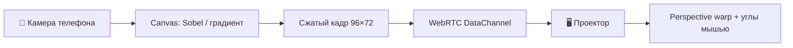

**Proof of Concept:** телефон смотрит на объект через камеру, извлекает **контуры** (или **градиент поля яркости**) и в реальном времени передаёт их на второй экран — ноутбук с проектором. На проекторе контуры отображаются с **перспективной подгонкой**: четыре угла тянутся мышью, чтобы совместить наложение с физической поверхностью.

Связь — **WebRTC data channel** через [PeerJS](https://peerjs.com/) (сигнализация в облаке, без своего сервера). Подходит для демо на проекторе в аудитории: QR-код на экране, телефон сканирует и подключается.

---

## Архитектура

| Компонент | Роль |
|-----------|------|
| Телефон (`?role=phone`) | `getUserMedia`, обработка кадра, ~12 fps |
| Проектор (`?role=projector`) | Приём кадров, отрисовка, drag углов |
| PeerJS | Сигнализация + P2P между браузерами |
| Комната | 6-символьный ID в URL; QR для телефона |

**Почему WebRTC, а не WebSocket:** для PoC на статическом Jekyll-сайте не нужен бэкенд. Data channel с `reliable: false` допускает потерю кадров — для контуров это нормально, зато ниже задержка.

**Почему не одна страница на обоих:** разные UI — на телефоне превью камеры и кнопка «Старт», на проекторе полноэкранный чёрный холст и ручки углов.

---

## Как запустить

1. На ноутбуке с проектором откройте **[полноэкранное демо](/vairl/camera-projector-poc.html?role=projector)** (или встроенный виджет ниже).
2. На экране появится **QR** и код комнаты.
3. На телефоне отсканируйте QR (или откройте ссылку с `role=phone&room=…`).
4. На телефоне — **Старт** (разрешите камеру).
5. На проекторе **тяните углы** синей рамки, пока контуры не лягут на нужную поверхность.

Режимы на телефоне:

| Режим | Что видно на проекторе |
|-------|------------------------|
| Контуры (Sobel) | Бинарные границы объектов |
| Градиент поля | RGB-кодировка ∂I/∂x, ∂I/∂y и magnitude |

---

## Интерактив (режим проектора)

  

    <header class="cps-header">
      
Откройте эту же страницу на телефоне по QR. Углы сохраняются в <code>localStorage</code> для комнаты.

    </header>
    

      <aside class="cps-sidebar">
        
Комната

        
—

        <canvas class="cps-qr" width="160" height="160" aria-label="QR для телефона"></canvas>
        
Ссылка для телефона

        <a class="cps-join-link" href="#" target="_blank" rel="noopener">—</a>
        

          <button type="button" data-cps-reset-corners>Сброс углов</button>
          <button type="button" data-cps-fullscreen>На весь экран</button>
        

        
Загрузка…

      </aside>
      

        <canvas class="cps-projector-canvas"></canvas>
      

    

  

Полноэкранно (удобно для проектора): [camera-projector-poc.html]({{ '/camera-projector-poc.html' | relative_url }}?role=projector).

---

## Обработка на телефоне

Кадр с камеры масштабируется до **96×72**, переводится в grayscale, затем:

- **Sobel** — magnitude градиента, порог отсекает слабые края;
- **Градиент поля** — отдельные каналы для горизонтальной и вертикальной производной.

Кадр упаковывается в `ArrayBuffer` (~7 KB) и шлётся по data channel. На проекторе — `ImageData` и **bilinear warp** на четырёх углах (сетка 16×16 аффинных патчей).

---

## Ограничения PoC

- Нужен **HTTPS** (или localhost) для камеры и WebRTC.
- PeerJS cloud — внешняя зависимость; для продакшена — свой TURN/STUN или локальный signaling.
- Задержка 100–300 ms в зависимости от Wi‑Fi.
- Нет калибровки «объект ↔ проекция» — только ручной warp.
- Один телефон на комнату.

---

## Куда развивать

- **ArUco / AprilTag** на проекторе для автоматической гомографии.
- **Обратный канал**: проектор рисует паттерн, телефон оценивает pose.
- **Closed loop**: контуры сравниваются с целевым силуэтом, телефон подсказывает сдвиг.
- Свой signaling-сервер на edge (Cloudflare Workers / WebSocket).

---

*PoC для статьи VAIRL · WebRTC + Canvas · без установки приложений.*
