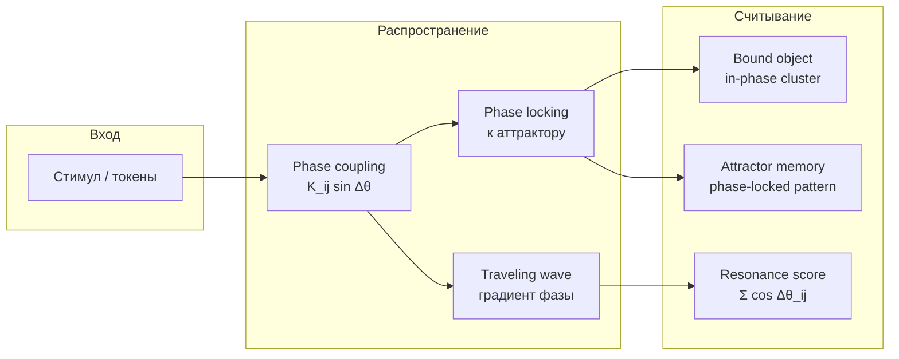
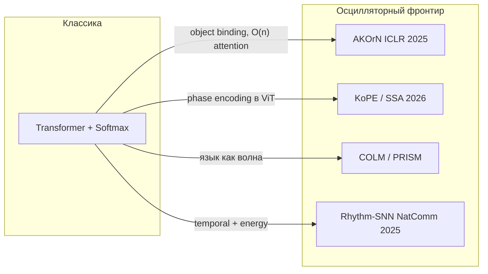
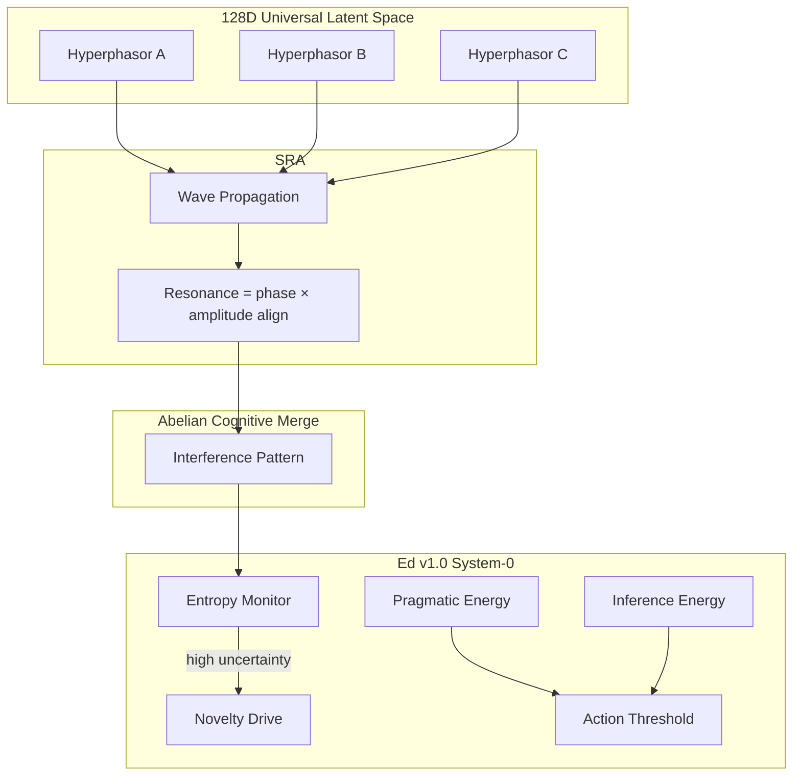

Стандартный нейрон — пороговый переключатель: входы суммируются, проходят через нелинейность, выход — скаляр. Но в биологии нейроны часто ведут себя как **осцилляторы**: у них есть фаза, частота, амплитуда, и смысл кодируется не только «сколько сработало», но и **когда** и **в какой фазе** относительно соседей. Последние два года это перестало быть только нейробиологической метафорой: появились масштабируемые архитектуры, где синхронизация Курамото, комплексные фазоры и волновое внимание конкурируют с softmax-attention на реальных задачах.

Ниже — принципы, **как именно распространяется информация** в осцилляторных сетях, связь с **world models и V-JEPA**, варианты реализации, текущая обстановка (SOTA), ссылки на ключевые статьи, перечень решаемых задач и отдельный раздел про **генерацию текста**. В конце — архитектура [**Edward**](https://www.linkedin.com/in/edward2006/): Project Omega (гиперфазоры в 128D latent space, Spectral Resonance Attention) и биологический слой Ed v1.0.

Связанные материалы: [Mamba и world models](/vairl/blog/2026/07/06/mamba-world-models-ru/), [фазовый портрет агента](/vairl/blog/2026/06/29/agent-control-loop-stability-ru/), [критичность и фазовые переходы](/vairl/blog/2026/07/04/criticality-neurons-jamming-phase-transitions-ru/).

<figure style="margin: 2em auto; text-align: center;">
  
  <figcaption style="font-size: 0.9em; color: #666; max-width: 720px; margin: 0 auto;">От комплексного представления (амплитуда + фаза) к линейному по памяти вниманию через резонанс и phase locking</figcaption>
</figure>

---

## Зачем вообще осцилляции в ML

Три мотивации, которые сходятся в одной точке:

1. **Binding (связывание признаков).** Когда несколько нейронов синхронизируются по фазе, система «склеивает» их в один объект или концепт. Это альтернатива slot-attention и object-centric learning.
2. **Динамические представления.** Вектор в ℝⁿ — снимок. Осциллятор — траектория во времени; фаза несёт относительные отношения (порядок, синтаксис, причинность) без явного pairwise-сравнения всех пар.
3. **Энергия и железо.** Softmax-attention требует экспонент и глобальной редукции — дорого на von Neumann и неестественно на физических осцилляторных субстратах (сверхпроводники, механика, оптика). Синхронизация Курамото — это **релаксация к равновесию**, а не матричное умножение n×n.

---

## Математический каркас

### Модель Курамото

Классическая система связанных фазовых осцилляторов:

$$\dot{\theta}_i = \omega_i + \frac{K}{N}\sum_{j=1}^{N} \sin(\theta_j - \theta_i)$$

где $\omega_i$ — собственная частота, $K$ — сила связи, $\theta_i$ — фаза. При достаточном $K$ осцилляторы **фазово синхронизируются** — это и есть механизм «внимания через синхронизацию».

Оригинал: [Kuramoto, 1984](https://doi.org/10.1016/0378-4371(84)90039-X).

**Демо 1. Фазовое кольцо Курамото.** Точки на окружности — фазы $\theta_i$, цвет — собственная частота $\omega_i$. Стрелка в центре — order parameter $r e^{i\psi}$. Двигайте $K$: при малом $K$ фазы разбегаются ($r \to 0$), при большом — слипаются в сгусток ($r \to 1$). Это фазовый переход синхронизации.

<div class="od-widget od-kuramoto-ring">
  <div class="od-controls">
    <label>K = <span data-k-val>1.5</span>
      <input type="range" data-k min="0" max="4" step="0.1" value="1.5" />
    </label>
    <button type="button" data-reset>↺ Перемешать фазы</button>
  </div>
  <div class="od-host"></div>
  <p class="od-caption">Order parameter $r$ измеряет глобальную согласованность: $r=1$ — полная синхронизация, $r\approx 0$ — хаос.</p>
</div>

### Гиперфазоры (hyperphasors)

Вместо скалярного нейрона — комплексный осциллятор $z = r \cdot e^{i\theta}$ в $d$-мерном пространстве (часто $d = 128$). Амплитуда $r$ кодирует «силу» признака, фаза $\theta$ — его **контекстуальное положение** в семантическом поле. Несколько измерений дают **гиперфазор** — обобщение фазора на многомерный latent space.

Комплексные сети давно изучаются для фазовых данных (радар, МРТ, оптика); обзор инструментов: [Complex-Valued Neural Networks for Signal Processing (arXiv:2309.07948)](https://arxiv.org/abs/2309.07948).

### Резонанс вместо dot-product

В классическом attention вес $a_{ij} \propto \exp(q_i \cdot k_j)$. В осцилляторном подходе «похожесть» — это **выравнивание фаз и согласованность амплитуд**:

$$\text{resonance}(z_i, z_j) = |z_i| \cdot |z_j| \cdot \cos(\theta_i - \theta_j)$$

Интерференция волн заменяет квадратичный тензор внимания. Сложность по памяти может оставаться **O(n)** при потоковой передаче волны вдоль последовательности — принцип Spectral Resonance Attention (SRA), описанный ниже.

**Демо 2. Интерференционное поле.** Каждый концепт — источник круговых волн (своя частота и фаза). Поле складывает волны: светлые полосы — конструктивная интерференция, тёмные — гашение. Клик добавляет источник. Порядок добавления не меняет итоговый узор — это визуальная суть **Abelian Cognitive Merge**.

<div class="od-widget od-interference">
  <div class="od-controls">
    <button type="button" data-add>+ источник</button>
    <button type="button" data-reset>↺ Сброс</button>
  </div>
  <div class="od-host"></div>
  <p class="od-caption">Клик по полю — добавить осциллятор. Согласованные источники дают устойчивый узор, рассинхронизированные — шум.</p>
</div>

### Интерактив: текст через осцилляторную сеть (p5.js)

Каждое слово — гиперфазор; слова по одному входят в сеть (**поток**), связываются по Курамото, вдоль цепочки бежит волна SRA, внизу появляются **phase-locked** кластеры. Наведите на слово — мини-комплексная плоскость. Полноэкранно: [oscillatory-text-network.html]({{ '/oscillatory-text-network.html' | relative_url }}).

<div id="oscillatory-network-demo" class="oscillatory-network-widget phase-portrait-widget">
  <p class="onn-intro">Введите фразу или выберите пример. Увеличьте <strong>K</strong>, чтобы ускорить синхронизацию фаз.</p>
  <div class="onn-pipeline" aria-hidden="true">
    <span data-onn-stage class="onn-stage-on">① Ввод</span>
    <span data-onn-stage>② Гиперфазоры</span>
    <span data-onn-stage>③ Coupling</span>
    <span data-onn-stage>④ SRA волна</span>
    <span data-onn-stage>⑤ Phase lock</span>
  </div>
  <div class="onn-controls">
    <input type="text" data-onn-input value="нейросеть синхронизирует фазы слов" maxlength="80" aria-label="Текст для осцилляторной сети" />
    <select data-onn-preset aria-label="Пример фразы">
      <option value="">Пример…</option>
      <option value="осциллятор резонирует с текстом">Резонанс</option>
      <option value="курамото фаза волна внимание">Курамото</option>
      <option value="active inference phase locking">Active inference</option>
      <option value="project omega hyperphasor latent">Project Omega</option>
    </select>
    <button type="button" data-onn-play class="active">⏸ Пауза</button>
    <button type="button" data-onn-reset>↺ Сброс</button>
    <label>K = <span data-onn-k-val>1.4</span>
      <input type="range" data-onn-k min="0.2" max="3" step="0.1" value="1.4" />
    </label>
    <label>Скорость
      <input type="range" data-onn-speed min="0.3" max="2.5" step="0.1" value="1" />
    </label>
  </div>
  <div class="onn-sketch-host" aria-label="Визуализация осцилляторной сети"></div>
  <div class="onn-legend" aria-hidden="true">
    <span class="leg-inp">● ввод / активация</span>
    <span class="leg-phase">● фаза θ</span>
    <span class="leg-res">● резонанс cos(Δθ)</span>
    <span class="leg-wave">● волна SRA</span>
  </div>
  <p class="phase-portrait-caption">p5.js · Kuramoto coupling · Spectral Resonance Attention · наведите на слово для фазора в ℂ</p>
</div>

<script src="{{ '/assets/js/oscillatory-text-network.js' | relative_url }}"></script>
<script src="{{ '/assets/js/oscillatory-demos.js' | relative_url }}"></script>

| Этап | Что видно на демо |
|------|-------------------|
| **Поток** | Слова активируются по одному — как токены, входящие в latent |
| **Coupling** | Зелёные связи — сильный резонанс; соседние слова связаны сильнее |
| **SRA** | Фиолетовая волна — сумма осцилляторов без матрицы attention |
| **Phase lock** | Группы слов с выровненной фазой (binding без slots) |

---

## Как распространяется информация

В feedforward-сети сигнал проходит **слой за слоем**: $h^{(l+1)} = \sigma(W h^{(l)})$. В осцилляторной сети информация — это не скаляр на выходе нейрона, а **эволюция фазового состояния** всей системы. Распространение — физический процесс на многообразии фаз $(S^1)^N$ или $\mathbb{C}^d$.

### Три механизма передачи

| Механизм | Уравнение / идея | Что несёт | Аналог в ML |
|----------|------------------|-----------|-------------|
| **Фазовое стягивание** | $\dot\theta_i \propto \sum_j K_{ij}\sin(\theta_j - \theta_i)$ | «Похожие» узлы выравнивают фазу → binding | Softmax attention, slot binding |
| **Частотная селекция** | Осцилляторы с близкими $\omega_i$ синхронизируются первыми | Кластеризация по «ритму» признака | KuramotoGNN frequency sync |
| **Бегущие волны** | Градиент фазы $\nabla\theta$ по пространству/слоям | Направленная передача без all-to-all | Causal conv, SSM scan |



### Пошаговая динамика (один forward pass)

1. **Инициализация.** Каждый узел $i$ получает $(r_i, \theta_i, \omega_i)$ из входа: пиксель, токен, latent-вектор проецируется в амплитуду и фазу (KoPE, AKOrN) или в гиперфазор $z_i \in \mathbb{C}^d$.

2. **Локальное coupling.** Соседи тянут фазы друг к другу через $\sin(\theta_j - \theta_i)$. Сила $K_{ij}$ learnable (матрица связей, attention-mask, граф). Информация **не телепортируется** за один шаг — она **диффундирует** по сети, как тепло по решётке.

3. **Релаксация к равновесию.** Вместо фиксированного числа слоёв — интеграция ОДУ до steady state (SSA даёт **closed-form** этого равновесия, обходя дорогой ODE-solver). Смысл: сеть **релаксирует** к конфигурации минимальной «энергии» связей — прямой родственник [Hopfield network](https://arxiv.org/abs/1410.3831) и oscillatory Hopfield ([Kuramoto associative memory](https://www.arxiv.org/pdf/2604.01469)).

4. **Считывание.** После сходимости:
   - **кластеры in-phase** → связанные признаки (object);
   - **разность фаз** $\Delta\theta_{ij}$ → отношение между концептами;
   - **амплитуда** $r_i$ → salience / confidence.

### Что кодируется: не rate, а отношение

В классической нейронауке firing rate кодирует «сколько». В ONN ключевой канал — **межфазовая корреляция**:

- два осциллятора **in-phase** ($\Delta\theta \approx 0$) → «принадлежат одному объекту»;
- **anti-phase** ($\Delta\theta \approx \pi$) → конкуренция, взаимное подавление;
- **phase lag** $\Delta\theta = \text{const}$ → упорядоченная последовательность (синтаксис, причинность).

Это **относительное** кодирование: абсолютная фаза не важна (gauge symmetry), важны **разности** — как в фазовом пространстве ОДУ важны не координаты, а траектория и attractor geometry.

### Скорость и дальность распространения

| Параметр | Эффект |
|----------|--------|
| $K$ (сила связи) | Выше $K$ → быстрее sync, но риск **over-smoothing** (все фазы слиплись) |
| Число шагов интеграции | Больше шагов → дальше по графу «доходит» сигнал |
| $\omega_i$ dispersion | Разброс частот → selective sync только похожих; сохраняет различимость |
| Asymmetric $K_{ij}$ | Направленный поток (AKOrN: symmetry-breaking term $\mathbf{C}$) |
| Top-down feedback | KomplexNet, predictive coding — медленная волна «предсказания» модулирует быструю «ошибку» |

**Order parameter** Курамото $r e^{i\psi} = \frac{1}{N}\sum_j e^{i\theta_j}$: при $r \to 1$ информация **глобально** согласована; при $r \ll 1$ — распределённая, локальная. Это измеримый аналог «насколько контекст слипся» — родственник метрик coherence в [agent control loops](/vairl/blog/2026/06/29/agent-control-loop-stability-ru/).

### Отличие от Transformer forward pass

| | Transformer | Осцилляторная сеть |
|---|-------------|-------------------|
| **Один шаг** | $O(n^2)$ attention over all pairs | Локальный coupling; глобальность через итерации |
| **Память** | KV-cache растёт с $n$ | Фазовое состояние фиксированного размера $N$ |
| **Семантика связи** | $\exp(q \cdot k)$ | $\cos(\theta_i - \theta_j)$, phase-lock |
| **Динамика** | Feedforward depth = discrete layers | Continuous relaxation / equilibration |
| **Аттракторы** | Неявные в весах | Явные phase-locked patterns (память) |

---

## Связь с world models, V-JEPA и фазовым пространством

Осцилляторные сети и [V-JEPA](https://ai.meta.com/vjepa/) решают **смежные** задачи на разных координатах одного и того же фазового портрета.

### Общая постановка

Любая модель мира ищет координаты $s$, в которых динамика **маркoва**:

$$s_{t+1} = F(s_t, a_t) \quad \text{или} \quad \dot{s} = f(s, u)$$

| Парадигма | Что такое $s$ | Как учится $F$ |
|-----------|---------------|----------------|
| **Takens / delay embedding** | $(y_t, y_{t-\tau}, \ldots)$ | Теорема, не learn |
| **Neural ODE** | $z \in \mathbb{R}^n$ | $\dot{z} = f_\theta(z)$ |
| **V-JEPA** | ViT embedding patches | Mask-prediction в rep. space |
| **Neural operator (FNO)** | Latent field on grid | Operator $G: u \mapsto v$ |
| **ONN / Kuramoto** | $(r_i, \theta_i)$ на торе | Phase coupling → attractor |

Все — попытки **сжать** высокомерное наблюдение в пространство, где **траектория предсказуема**. Подробнее про линию Takens → JEPA: раздел JEPA в [Mamba и world models](/vairl/blog/2026/07/06/mamba-world-models-ru/).

### V-JEPA = амплитуда; ONN = фаза

**V-JEPA 2** (Meta FAIR, LeCun et al.) строит **«глаза»**: encoder выучивает representation video-patches, predictor — динамику в embedding space без реконструкции пикселей. Это world model в **слабом** смысле: есть $z_{t+1} \approx P(z_t)$, но координаты $z$ — скалярные векторы в $\mathbb{R}^D$, без явной **фазовой** структуры.

**Осцилляторные сети** добавляют вторую ось: $z_i = r_i e^{i\theta_i}$. Фаза $\theta_i$ кодирует **положение на attractor** относительно соседей — binding, порядок, синхронизацию. В терминах [фазового портрета](/vairl/blog/2026/06/29/agent-control-loop-stability-ru/):

- V-JEPA latent — точка в $\mathbb{R}^D$ (положение на многообразии наблюдений);
- ONN state — точка на **торе** $(S^1)^N$ (относительные углы между компонентами).

### KoPE: прямой мост ViT ↔ Курамото

**KoPE** ([Microsoft, arXiv:2604.07904](https://arxiv.org/html/2604.07904)) — буквально вставляет Kuramoto dynamics **внутрь ViT**: фазы токенов эволюционируют с data-dependent coupling и модулируют attention через комплексные вращения. Backbone V-JEPA — тоже ViT. Стек:

```
Video → ViT patches (V-JEPA encoder) → embeddings z_i
              ↓ + KoPE / phase head
        (r_i, θ_i) с Kuramoto coupling → binding + propagation
              ↓
        V-JEPA 2-AC predictor → planning в latent
```

«Eyes» (V-JEPA) дают **что** видно; фазовый слой (KoPE/ONN) — **как связаны** части сцены во времени и пространстве.

### Predictive coding: одна иерархия, два ритма

В [predictive coding с осцилляциями](https://journals.plos.org/ploscompbiol/article?id=10.1371/journal.pcbi.1013469) медленные ритмы (theta/alpha) несут **top-down prediction**, быстрые (gamma) — **prediction error**. Это изоморфно JEPA:

| Predictive coding | JEPA / V-JEPA |
|-------------------|---------------|
| Медленное предсказание | Predictor $P_\phi$ в latent |
| Быстрая ошибка | Loss на masked / unpredicted regions |
| Phase-amplitude coupling | Взвешивание precision ошибки |
| Free energy minimization | Stop-gradient + EMA target (anti-collapse) |

Информация в такой иерархии распространяется **волнами**: prediction спускается сверху (медленная фаза), error поднимается снизу (быстрая). ONN формализует этот message passing как **coupled oscillators**; V-JEPA — как **masked representation prediction** на web-scale video.

### Neural ODE vs Kuramoto ODE

[JEPA + Neural ODE](https://arxiv.org/html/2508.10489) (Ulmen et al., 2025): predictor внутри ODE-integrator, contractive loss на latent — **гладкое** фазовое пространство для маятника из images.

Kuramoto — другой vector field на том же многообразии:

$$\dot{\theta}_i = \omega_i + \sum_j K_{ij} \sin(\theta_j - \theta_i)$$

Оба — **continuous-time dynamics** в latent; Kuramoto добавляет **синхронизацию** как attractor mechanism, Neural ODE — произвольный $f_\theta$. Гибрид: amplitude dynamics (Neural ODE / V-JEPA-AC) + phase binding (Kuramoto layer).

### Ассоциативная память и world model rollout

Oscillatory Hopfield ([arXiv:2604.01469](https://www.arxiv.org/pdf/2604.01469)): память = **stable phase-locked configuration**; noisy input **релаксирует** к ближайшему attractor — как retrieval в Hopfield, но на торе фаз.

V-JEPA 2-AC rollout в latent для robot MPC — **forward dynamics** в embedding space. ONN retrieval — **inverse**: по частичному наблюдению найти attractor (полный pattern). Вместе:

- **rollout** (V-JEPA-AC): «что будет, если действую так»;
- **phase relaxation** (ONN): «к какому знакомому состоянию это относится».

**Демо 8. Ассоциативная память на фазах.** Три паттерна (T, O, X) хранятся как phase-locked конфигурации. Выберите паттерн — на вход подаётся зашумлённая версия, и сеть **релаксирует** к ближайшему аттрактору. Retrieval здесь — скатывание фаз в устойчивое равновесие, как в Hopfield, но на торе фаз.

<div class="od-widget od-assoc-memory">
  <div class="od-controls">
    <button type="button" data-p0>Паттерн «T»</button>
    <button type="button" data-p1>Паттерн «O»</button>
    <button type="button" data-p2>Паттерн «X»</button>
    <button type="button" data-reset>Очистить</button>
  </div>
  <div class="od-host"></div>
  <p class="od-caption">Яркость клетки = фаза (in-phase → светлая). Шум исчезает по мере сходимости к запомненному паттерну.</p>
</div>

### Сводная карта экосистемы

```mermaid
flowchart TB
  subgraph observe ["Наблюдение"]
    VID[Video / sensors]
  end
  subgraph latent ["Latent / фазовое пространство"]
    VJEPA[V-JEPA encoder\nz ∈ ℝ^D]
    PHASE[KoPE / Kuramoto\nθ on S¹]
  end
  subgraph dynamics ["Динамика"]
    NODE[Neural ODE\nẋ = f_θ]
    VAC[V-JEPA 2-AC\nz_t+1 = P(z_t,a_t)]
    KUR[Kuramoto coupling\nphase relaxation]
  end
  subgraph act ["Действие"]
    MPC[MPC planning]
    BIND[Object binding]
  end
  VID --> VJEPA --> PHASE
  VJEPA --> VAC --> MPC
  PHASE --> KUR --> BIND
  VJEPA --> NODE
```

### Практический вывод

Осцилляторные сети — не конкурент V-JEPA, а **комplement**: world model учит **предсказуемую динамику** в amplitude-latent; ONN учит **как информация связывается и распространяется** через phase coupling. Для агентного стека 2026 разумная схема:

| Слой | Технология | Функция |
|------|------------|---------|
| Perception | V-JEPA encoder | «Глаза», $z_t$ из video |
| Binding / context | KoPE, AKOrN, SSA | Phase propagation, object glue |
| Dynamics | V-JEPA 2-AC / Mamba / Neural ODE | Rollout, «что будет» |
| Reasoning | LLM | Язык, цели, decomposition |
| Control | MPC + FSM | Безопасное исполнение |

Связь с [критичностью](/vairl/blog/2026/07/04/criticality-neurons-jamming-phase-transitions-ru/): сеть осцилляторов у **критической** силы связи $K \approx K_c$ максимизирует дальность корреляций — тот же принцип, что у коры на границе фазового перехода и у agent control loop на границе устойчивости.

---

## Подходы и варианты реализации

| Подход | Идея | Сложность | Где применяется |
|--------|------|-----------|-----------------|
| **AKOrN** | Нейрон = осциллятор Курамото; обновление через ОДУ | Зависит от числа шагов интеграции | CV, object discovery, reasoning |
| **KomplexNet** | Комплексные слои + Kuramoto на входе | Как CNN + dynamics | Object-centric vision |
| **KuramotoGNN** | Фазовая синхронизация ↔ over-smoothing в GNN | O(edges) | Графовые задачи |
| **KoPE** | Дополнительное фазовое состояние в ViT | Как ViT + phase head | Сегментация, ARC-AGI |
| **SSA / OSN** | Attention = steady-state Курамото, closed-form | O(n²) но без softmax/exp | Drop-in замена Transformer block |
| **Oscillator Attention** | Fixed-query Kuramoto-Lohe dynamics | Equilibration | Keyword spotting, LM |
| **Rhythm-SNN** | Внешние осцилляции модулируют спайки | Event-driven | Временные ряды, аудио |
| **COLM / PRISM** | Язык как волна в ℂ | O(n) recurrence | Генерация текста |
| **SRA (Project Omega)** — [Edward](https://www.linkedin.com/in/edward2006/) | Волновое распространение + резонанс | O(n) память | Мультимодальный reasoning |

---

## Что решают осцилляторные сети

### Компьютерное зрение и object discovery

**Artificial Kuramoto Oscillatory Neurons (AKOrN)** — главный прорыв 2024–2025: осцилляторные нейроны масштабируются до **натуральных изображений** и улучшают:

- unsupervised object discovery (сравнимо со slot-based моделями);
- adversarial robustness;
- calibrated uncertainty;
- reasoning в self-attention слоях.

Статья: [AKOrN (ICLR 2025, arXiv:2410.13821)](https://arxiv.org/abs/2410.13821) · [код](https://github.com/autonomousvision/akorn) · [project page](https://takerum.github.io/akorn_project_page/).

**Демо 3. Binding через синхронизацию.** Сетка осцилляторов поверх простой сцены из нескольких фигур. Coupling локальный: соседи внутри одной фигуры тянут фазы друг к другу, между фигурами — отталкиваются. Цвет = фаза. Объекты «проявляются» разными цветами **без разметки** — так AKOrN находит объекты без slots.

<div class="od-widget od-binding">
  <div class="od-controls">
    <label>K = <span data-k-val>1.2</span>
      <input type="range" data-k min="0.2" max="3" step="0.1" value="1.2" />
    </label>
    <button type="button" data-reset>↺ Новая сцена</button>
  </div>
  <div class="od-host"></div>
  <p class="od-caption">Каждая клетка — осциллятор. Синхронные (одинаковый цвет) = один объект. Это object discovery как самоорганизация фаз.</p>
</div>

**KomplexNet** добавляет иерархию комплексных слоёв с Kuramoto-синхронизацией на первом уровне и top-down feedback для уточнения фаз: [arXiv:2502.21077](https://arxiv.org/abs/2502.21077).

### Графы и GNN

**KuramotoGNN** интерпретирует over-smoothing как **фазовую синхронизацию** и заменяет её frequency synchronization, сохраняя различимость узлов: [AISTATS 2024, PMLR 238](https://proceedings.mlr.press/v238/nguyen24c.html).

### Внимание в Transformer: KoPE и SSA

**KoPE (Kuramoto Oscillatory Phase Encoding)** — дополнительное эволюционирующее фазовое состояние в ViT; фазы обновляются через Kuramoto dynamics с data-dependent coupling, а в attention модулируют токены через комплексные вращения. Улучшает data/parameter efficiency, сегментацию, ARC-AGI: [arXiv:2604.07904](https://arxiv.org/html/2604.07904) · [код Microsoft](https://github.com/microsoft/Neuro-inspired_Phase_Encoding).

**Selective Synchronization Attention (SSA)** — closed-form оператор из steady-state Курамото; каждый токен — осциллятор с learnable $\omega_i$ и $\theta_i$; естественная sparsity из phase-locking condition: [arXiv:2602.14445](https://arxiv.org/html/2602.14445) · [OSN implementation](https://github.com/HasiHays/OSN).

**Демо 4. Softmax O(n²) против резонанса O(n).** Слева матрица attention заполняется квадратично: $n^2$ ячеек и памяти. Справа волна SRA пробегает линейно: $n$ операций, память константна. Двигайте длину последовательности $n$ — левая панель растёт квадратично, правая линейно.

<div class="od-widget od-attn-compare">
  <div class="od-controls">
    <label>n = <span data-n-val>8</span>
      <input type="range" data-n min="3" max="20" step="1" value="8" />
    </label>
  </div>
  <div class="od-host"></div>
  <p class="od-caption">Наглядно, почему осцилляторное внимание привлекательно для длинных последовательностей и энергоограниченного железа.</p>
</div>

**Attention by Synchronization** — fixed-query oscillator attention для energy-constrained hardware; на keyword spotting и subject-verb agreement обгоняет softmax при $d_{osc}=2$: [arXiv:2606.12059](https://arxiv.org/html/2606.12059).

### Спайковые сети и временная обработка

**Rhythm-SNN** (Nature Communications, 2025) модулирует динамику нейронов **внешними осцилляциями** разных частот — улучшает long-sequence processing, энергоэффективность и робастность: [s41467-025-63771-x](https://www.nature.com/articles/s41467-025-63771-x).

**Демо 9. Детектор аномалий во временном ряде.** Сверху — сигнал (регулярный синус + шум). Осцилляторы захватывают его фазу, order parameter $r$ (снизу) держится высоким. Нажмите «Вбросить аномалию» — синхронизация рвётся, $r$ резко падает ниже порога. Детектор аномалий **без обучения и без порогов на сырых данных**.

<div class="od-widget od-anomaly">
  <div class="od-controls">
    <button type="button" data-inject>⚡ Вбросить аномалию</button>
    <button type="button" data-reset>↺ Сброс</button>
  </div>
  <div class="od-host"></div>
  <p class="od-caption">Пока ряд регулярен — фазовый захват (r высокий); сбой рвёт синхронизацию (r падает).</p>
</div>

**SpikeVideoFormer** — spike-driven video Transformer с Hamming attention, линейная сложность по времени O(T): [PMLR 267](https://proceedings.mlr.press/v267/zou25b.html).

### Predictive coding и Active Inference

В нейробиологии осцилляции — не побочный эффект, а **сигнатура иерархического message passing**: медленные ритмы (alpha/theta) несут top-down predictions, быстрые (gamma) — prediction errors. Phase-amplitude coupling взвешивает ошибку по precision.

- Модель predictive coding с осцилляциями: [PLOS Comp Biol, 2024](https://journals.plos.org/ploscompbiol/article?id=10.1371/journal.pcbi.1013469)
- Alpha traveling waves как след predictive coding: [PLOS Biology](https://journals.plos.org/plosbiology/article?id=10.1371/journal.pbio.3000487)
- Active inference и free energy: [Friston et al.](https://arxiv.org/pdf/2304.07094)

**Обучение через phase locking** (без backprop в reasoning loop) — это минимизация variational free energy: внутренние осцилляторы подстраивают фазу под входящий стимул (текст, зрение, код), снижая «энтропию» представления.

**Демо 5. Phase locking как обучение.** Оранжевая стрелка — стимул (сенсор) с фиксированной фазой. Голубые осцилляторы постепенно захватывают его фазу; график свободной энергии (рассогласования) падает. Кнопка «Сменить стимул» — система переучивается **без backprop**, просто перезахватывая фазу.

<div class="od-widget od-phase-learn">
  <div class="od-controls">
    <button type="button" data-stim>⟳ Сменить стимул</button>
    <button type="button" data-reset>↺ Сброс</button>
  </div>
  <div class="od-host"></div>
  <p class="od-caption">Active inference: минимизация $F$ через синхронизацию внутренних осцилляторов с входом.</p>
</div>

---

## Текущая обстановка (SOTA, 2024–2026)



**Что уже доказано эмпирически:**

- AKOrN на ImageNet-масштабе — object binding через синхронизацию работает **без** явных slots.
- KoPE и SSA — drop-in улучшения для ViT/Transformer с marginal overhead (~9 параметров у OSN block).
- Rhythm-SNN — SOTA среди SNN на temporal benchmarks.
- COLM — coherent text generation с **<500k параметров** без attention и без `nn.Linear` в core blocks.

**Что ещё открыто:**

- Масштабирование осцилляторных LM до уровня GPT/LLaMA — COLM и PRISM показывают proof-of-concept, но не закрывают разрыв с softmax на больших корпусах.
- Стабильное обучение глубоких Kuramoto-ОДУ без дорогой интеграции по времени — SSA и closed-form решения обходят это.
- Единый стандарт для комплексных фреймворков (PyTorch native `cfloat` vs custom ops).

---

## Генерация текста: отдельный раздел

Трансформеры доминируют в NLP, потому что dot-product attention — универсальный differentiable поиск. Но для языка есть альтернативная гипотеза: **текст — это интерференция волн**, а семантика — не координата в ℝᵈ, а **резонансная частота** в ℂᵈ.

### Проблема «Semantic Alignment Tax»

Стандартный Transformer тратит огромный compute budget на выравнивание семантического пространства. PRISM (Phase-Resonant Intelligent Spectral Model) формулирует это как structural mismatch: Euclidean attention ищет отношения в «хаотической карте», тогда как phase-locking **синхронизирует** уже резонирующие концепты за линейное время.

Статья: [Language as a Wave Phenomenon (arXiv:2512.01208)](https://arxiv.org/html/2512.01208).

PRISM достигает до **96% acquisition** новых концептов через rapid phase-locking без деградации pre-trained competencies — в отличие от rigid Euclidean Transformer.

### COLM: Complex Oscillating Language Model

**COLM** — autoregressive LM полностью в комплексной плоскости:

- **Нет self-attention**, нет `nn.Linear` в core blocks.
- Нейрон: $f(z) = \sin(\omega \odot z + \phi) \cdot \tanh(z) + b$, где $\omega, \phi, b \in \mathbb{C}$.
- Последовательность обрабатывается **O(N) causal scanner**; cross-dimension routing — фиксированные unitary matrices.
- **498 214 параметров** — coherent philosophical prose на сложных темах после 8.7 ч обучения на consumer GPU.

Репозиторий: [Eden-Eldith/COLM](https://github.com/Eden-Eldith/COLM) · Zenodo: [10.5281/zenodo.20118033](https://doi.org/10.5281/zenodo.20118033).

### Oscillator Attention для LM

[Attention by Synchronization](https://arxiv.org/html/2606.12059) на WikiText-2 и TinyStories: при $d_{osc}=32$ разрыв с softmax сжимается до **+0.57 PPL** на TinyStories — oscillator attention догоняет, не обгоняя, но доказывает viability для causal LM.

### Сравнение подходов к тексту

| Модель | Механизм | Параметры | Attention | Статус |
|--------|----------|-----------|-----------|--------|
| GPT / LLaMA | Softmax Q·Kᵀ | миллиарды | O(n²) | production SOTA |
| Mamba / SSM | Selective scan | миллионы–миллиарды | O(n) | production-ready |
| PRISM | Phase-locking в ℂᵈ | research | линеаритмический sync | plasticity SOTA |
| COLM | Complex oscillators | ~500k | нет (recurrence) | proof-of-concept |
| SSA/OSN | Steady-state Kuramoto | как Transformer | closed-form | drop-in block |
| SRA + Hyperphasors ([Edward](https://www.linkedin.com/in/edward2006/)) | Wave propagation | agent-scale | O(n) memory | research (Project Omega) |

**Практический вывод для NLP:** осцилляторные модели сегодня сильны в **sample efficiency**, **concept plasticity** и **малых моделях**; для frontier-scale LM пока выигрывает softmax + scale. Но тренд ясен: phase как первоклассная величина наряду с amplitude/rate.

### Демо 7. Кластеризация текста без эмбеддингов

Слова — осцилляторы; coupling выше между словами с общим корнем и близкой частотой. Синхронизировавшиеся слова получают одинаковую фазу (цвет) — темы возникают как **phase-locked группы**, без предобученных эмбеддингов. Введите свой текст.

<div class="od-widget od-text-cluster">
  <div class="od-controls">
    <input type="text" data-input value="фаза волна резонанс синхронизация фаза волна нейрон спайк частота нейрон спайк" maxlength="120" aria-label="Текст для кластеризации" />
    <label>K = <span data-k-val>1.6</span>
      <input type="range" data-k min="0.3" max="3.5" step="0.1" value="1.6" />
    </label>
    <button type="button" data-reset>↺ Пересобрать</button>
  </div>
  <div class="od-host"></div>
  <p class="od-caption">Зелёные линии — in-phase пары. Topic clustering как физический процесс синхронизации.</p>
</div>

### Демо 10. Осцилляторный секвенсор: текст → звук

Самое буквальное представление резонанса: фазы и частоты слов озвучиваются через Web Audio. Синхронизация слышна как **консонанс**, рассинхрон — как **биения**. Detune каждой ноты пропорционален отклонению её фазы от средней. Нажмите «Играть» (нужен звук).

<div class="od-widget od-sequencer">
  <div class="od-controls">
    <input type="text" data-input value="осциллятор резонанс фаза волна синхрон" maxlength="80" aria-label="Текст для секвенсора" />
    <button type="button" data-play>▶ Играть</button>
    <label>K = <span data-k-val>1.2</span>
      <input type="range" data-k min="0" max="3" step="0.1" value="1.2" />
    </label>
    <button type="button" data-reset>↺ Пересобрать</button>
  </div>
  <div class="od-host"></div>
  <p class="od-caption">Резонанс становится слышимым: при высоком K ноты сближаются по фазе → чище звучание.</p>
</div>

---

## Project Omega и Ed v1.0 — архитектура Edward

Концепции ниже — **авторская разработка [Edward](https://www.linkedin.com/in/edward2006/)** (Project Omega, Ed v1.0). Это не peer-reviewed публикация, а инженерный стек, который собирает осцилляторные принципы (Курамото, active inference, волновое внимание) в агентную систему. Ниже — изложение по материалам автора.

### The Mechanism: Kuramoto Synchronization & Hyperphasors

Система живёт в **128D Universal Latent Space**. Каждый концепт — не статический вектор, а **гиперфазор**: комплексный осциллятор с амплитудой и фазой.

**Spectral Resonance Attention (SRA).** Вместо квадратичных attention-тензоров мышление моделируется как **волновое распространение**. Резонанс вычисляется по выравниванию фаз и амплитуд между концептами. Масштабируется линейно и работает с **постоянной памятью** — прямой ответ на O(n²) bottleneck трансформеров. Близкий родственник: SSA/KoPE на уровне блока, но SRA идёт дальше — полная замена reasoning loop на interference pattern.

**Abelian Cognitive Merge.** В Project Omega выходы агентов объединяются **независимо от порядка** (коммутативно). Последовательность мыслей не ломает состояние системы — она лишь добавляет к картине волновой интерференции. Это формализация идеи, что синхронизация Курамото инвариантна к перестановке слабо связанных осцилляторов в mean-field приближении.

**Learning via Phase Locking.** В reasoning loop нет backpropagation. Обучение — через **Active Inference**: система минимизирует внутреннюю неопределённость, phase-locking внутренних осцилляторов с входящим стимулом (текст, зрение, код). Связь с Friston free energy principle и осцилляторным predictive coding ([PLOS Comp Biol 2024](https://journals.plos.org/ploscompbiol/article?id=10.1371/journal.pcbi.1013469)).

### The Anatomy: Ed v1.0 (System-0 Core)

**Ed** (v1.0, System-0 Core) — биологический слой (Motor Cortex + Homeostasis), который Edward описывает как локально работающий «моторный» контур агента.

**Homeostatic LifeLoop.** Ed мониторит внутреннюю энтропию. Когда запрос создаёт «слепое пятно» в knowledge graph, растущая неопределённость запускает **Novelty Drive** — аналог curiosity-driven exploration в active inference.

**Energy Breakdown (Action Selection).** Действия не маршрутизируются промптом. Они возникают, когда конкретный инструмент достигает **критического энергетического порога**. Два источника:

1. **Pragmatic Energy** — прямой рефлекс на вопрос.
2. **Inference Energy** — инновация из цикла рассуждения, независимая от начального входа.

Это переносит winner-take-all динамику Курамото на уровень **action selection**: «синхронизировавшийся» инструмент побеждает и исполняется.

**Демо 6. Action selection по энергии.** Пять инструментов копят энергию: синяя часть — Pragmatic (мгновенный рефлекс от запроса), оранжевая — Inference (капает из цикла рассуждения). Кто первым перешёл красный порог — «срабатывает» (вспышка) и обнуляется. Никакого промпт-роутинга: чистый winner-take-all.

<div class="od-widget od-action-energy">
  <div class="od-controls">
    <button type="button" data-query>+ Новый запрос</button>
    <button type="button" data-reset>↺ Сброс</button>
  </div>
  <div class="od-host"></div>
  <p class="od-caption">Ed v1.0: действие эмерджентно возникает при достижении энергетического порога, а не выбирается роутером.</p>
</div>



---

## Ключевые статьи (шпаргалка)

| Статья | Год | Ссылка |
|--------|-----|--------|
| Kuramoto model (original) | 1984 | [doi:10.1016/0378-4371(84)90039-X](https://doi.org/10.1016/0378-4371(84)90039-X) |
| AKOrN — Artificial Kuramoto Oscillatory Neurons | 2025 | [arXiv:2410.13821](https://arxiv.org/abs/2410.13821) |
| KomplexNet — CV + Kuramoto | 2025 | [arXiv:2502.21077](https://arxiv.org/abs/2502.21077) |
| KuramotoGNN | 2024 | [PMLR 238](https://proceedings.mlr.press/v238/nguyen24c.html) |
| KoPE — Phase Encoding for ViT | 2026 | [arXiv:2604.07904](https://arxiv.org/html/2604.07904) |
| SSA / OSN — Selective Synchronization Attention | 2026 | [arXiv:2602.14445](https://arxiv.org/html/2602.14445) |
| Attention by Synchronization | 2026 | [arXiv:2606.12059](https://arxiv.org/html/2606.12059) |
| Rhythm-SNN | 2025 | [Nature Communications](https://www.nature.com/articles/s41467-025-63771-x) |
| SpikeVideoFormer | 2025 | [PMLR 267](https://proceedings.mlr.press/v267/zou25b.html) |
| PRISM — Language as Wave | 2025 | [arXiv:2512.01208](https://arxiv.org/html/2512.01208) |
| COLM — Complex Oscillating LM | 2026 | [GitHub](https://github.com/Eden-Eldith/COLM) |
| CVNN for Signal Processing | 2023 | [arXiv:2309.07948](https://arxiv.org/abs/2309.07948) |
| V-JEPA 2 — world model Meta FAIR | 2025 | [arXiv:2506.09985](https://arxiv.org/abs/2506.09985) |
| JEPA + Neural ODE state-space | 2025 | [arXiv:2508.10489](https://arxiv.org/html/2508.10489) |
| Oscillatory Hopfield / Kuramoto memory | 2026 | [arXiv:2604.01469](https://www.arxiv.org/pdf/2604.01469) |
| Computing with oscillators (обзор) | 2024 | [npj Unconventional Computing](https://www.nature.com/articles/s44335-024-00015-z) |
| Predictive coding oscillations | 2024 | [PLOS Comp Biol](https://journals.plos.org/ploscompbiol/article?id=10.1371/journal.pcbi.1013469) |
| Alpha waves & predictive coding | 2019 | [PLOS Biology](https://journals.plos.org/plosbiology/article?id=10.1371/journal.pbio.3000487) |
| Project Omega, Ed v1.0, SRA, Hyperphasors | — | [Edward (LinkedIn)](https://www.linkedin.com/in/edward2006/) |

---

## Выводы

Осцилляторные нейросети — не маргинальная ветвь, а **перезагрузка примитива нейрона**: от порога к фазе. Информация здесь распространяется не матричным умножением, а **phase coupling, relaxation к attractor и интерференцией** — механизм, который на стыке с [V-JEPA](/vairl/blog/2026/07/06/mamba-world-models-ru/) и [фазовым пространством динамических систем](/vairl/blog/2026/06/29/agent-control-loop-stability-ru/) даёт полный agent stack: perception (amplitude-latent) + binding (phase) + dynamics (rollout) + reasoning (LLM).

Главные преимущества: binding без slots, линейная или линеаритмическая сложность, естественная sparsity, совместимость с физическими вычислителями, связь с predictive coding и active inference.

Главные риски: интеграция ОДУ в deep training, масштабирование LM, фрагментированная экосистема комплексных ops.

Архитектура [**Edward**](https://www.linkedin.com/in/edward2006/) — Project Omega (SRA + hyperphasors + phase locking) и Ed v1.0 — показывает, как эти принципы собираются в **агентную систему**, где мышление моделируется не матричным умножением, а **синхронизацией и интерференцией** — ближе к тому, как мозг, по ряду гипотез, реально обрабатывает информацию.

---

*Статья подготовлена для блога VAIRL. Для публикации на сайт после ревью: `python scripts/publish_article.py publications/public/2026-07-08-oscillatory-neural-networks-ru.md`*
