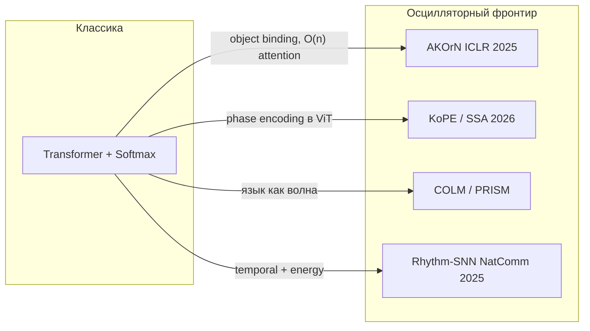
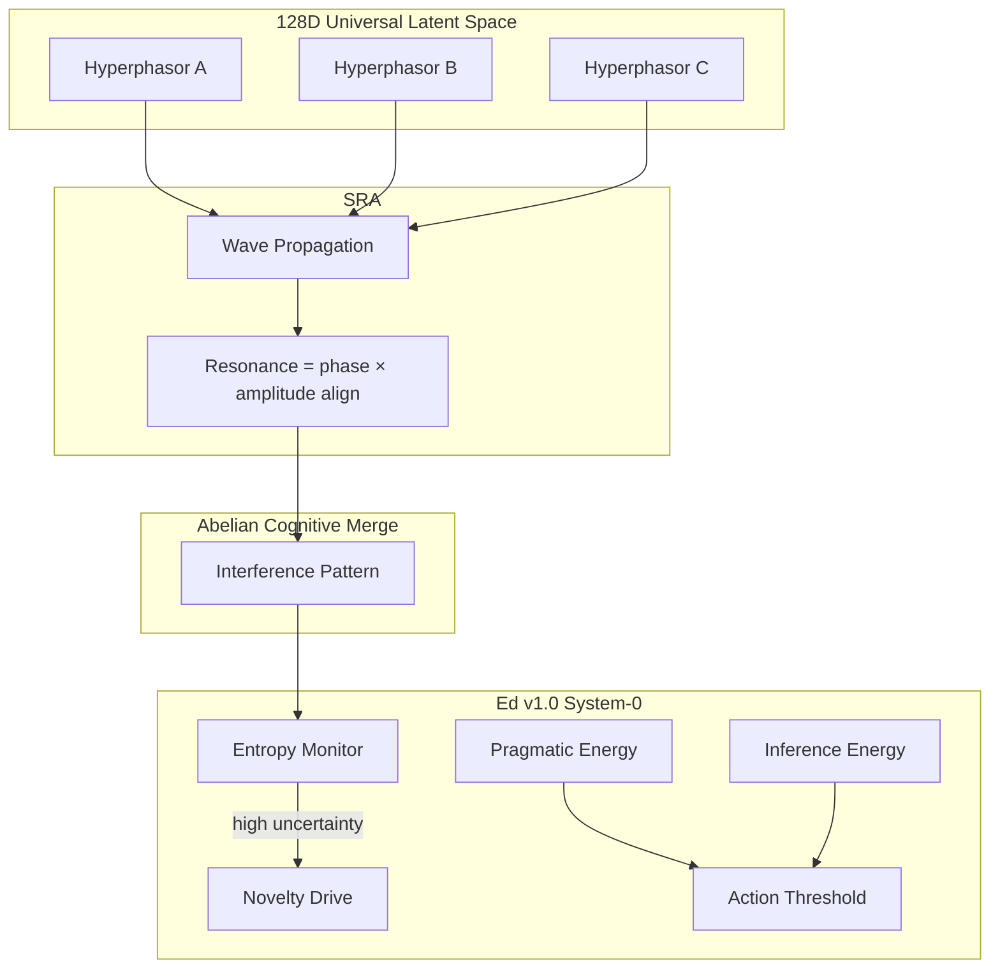

Стандартный нейрон — пороговый переключатель: входы суммируются, проходят через нелинейность, выход — скаляр. Но в биологии нейроны часто ведут себя как **осцилляторы**: у них есть фаза, частота, амплитуда, и смысл кодируется не только «сколько сработало», но и **когда** и **в какой фазе** относительно соседей. Последние два года это перестало быть только нейробиологической метафорой: появились масштабируемые архитектуры, где синхронизация Курамото, комплексные фазоры и волновое внимание конкурируют с softmax-attention на реальных задачах.

Ниже — принципы, варианты реализации, текущая обстановка (SOTA), ссылки на ключевые статьи, перечень решаемых задач и отдельный раздел про **генерацию текста**. В конце — архитектура [**Edward**](https://www.linkedin.com/in/edward2006/): Project Omega (гиперфазоры в 128D latent space, Spectral Resonance Attention) и биологический слой Ed v1.0.

<figure style="margin: 2em auto; text-align: center;">
  
  <figcaption style="font-size: 0.9em; color: #666; max-width: 720px; margin: 0 auto;">От комплексного представления (амплитуда + фаза) к линейному по памяти вниманию через резонанс и phase locking</figcaption>
</figure>

---

## Зачем вообще осцилляции в ML

Три мотивации, которые сходятся в одной точке:

1. **Binding (связывание признаков).** Когда несколько нейронов синхронизируются по фазе, система «склеивает» их в один объект или концепт. Это альтернатива slot-attention и object-centric learning.
2. **Динамические представления.** Вектор в ℝⁿ — снимок. Осциллятор — траектория во времени; фаза несёт относительные отношения (порядок, синтаксис, причинность) без явного pairwise-сравнения всех пар.
3. **Энергия и железо.** Softmax-attention требует экспонент и глобальной редукции — дорого на von Neumann и неестественно на физических осцилляторных субстратах (сверхпроводники, механика, оптика). Синхронизация Курамото — это **релаксация к равновесию**, а не матричное умножение n×n.

---

## Математический каркас

### Модель Курамото

Классическая система связанных фазовых осцилляторов:

$$\dot{\theta}_i = \omega_i + \frac{K}{N}\sum_{j=1}^{N} \sin(\theta_j - \theta_i)$$

где $\omega_i$ — собственная частота, $K$ — сила связи, $\theta_i$ — фаза. При достаточном $K$ осцилляторы **фазово синхронизируются** — это и есть механизм «внимания через синхронизацию».

Оригинал: [Kuramoto, 1984](https://doi.org/10.1016/0378-4371(84)90039-X).

### Гиперфазоры (hyperphasors)

Вместо скалярного нейрона — комплексный осциллятор $z = r \cdot e^{i\theta}$ в $d$-мерном пространстве (часто $d = 128$). Амплитуда $r$ кодирует «силу» признака, фаза $\theta$ — его **контекстуальное положение** в семантическом поле. Несколько измерений дают **гиперфазор** — обобщение фазора на многомерный latent space.

Комплексные сети давно изучаются для фазовых данных (радар, МРТ, оптика); обзор инструментов: [Complex-Valued Neural Networks for Signal Processing (arXiv:2309.07948)](https://arxiv.org/abs/2309.07948).

### Резонанс вместо dot-product

В классическом attention вес $a_{ij} \propto \exp(q_i \cdot k_j)$. В осцилляторном подходе «похожесть» — это **выравнивание фаз и согласованность амплитуд**:

$$\text{resonance}(z_i, z_j) = |z_i| \cdot |z_j| \cdot \cos(\theta_i - \theta_j)$$

Интерференция волн заменяет квадратичный тензор внимания. Сложность по памяти может оставаться **O(n)** при потоковой передаче волны вдоль последовательности — принцип Spectral Resonance Attention (SRA), описанный ниже.

---

## Подходы и варианты реализации

| Подход | Идея | Сложность | Где применяется |
|--------|------|-----------|-----------------|
| **AKOrN** | Нейрон = осциллятор Курамото; обновление через ОДУ | Зависит от числа шагов интеграции | CV, object discovery, reasoning |
| **KomplexNet** | Комплексные слои + Kuramoto на входе | Как CNN + dynamics | Object-centric vision |
| **KuramotoGNN** | Фазовая синхронизация ↔ over-smoothing в GNN | O(edges) | Графовые задачи |
| **KoPE** | Дополнительное фазовое состояние в ViT | Как ViT + phase head | Сегментация, ARC-AGI |
| **SSA / OSN** | Attention = steady-state Курамото, closed-form | O(n²) но без softmax/exp | Drop-in замена Transformer block |
| **Oscillator Attention** | Fixed-query Kuramoto-Lohe dynamics | Equilibration | Keyword spotting, LM |
| **Rhythm-SNN** | Внешние осцилляции модулируют спайки | Event-driven | Временные ряды, аудио |
| **COLM / PRISM** | Язык как волна в ℂ | O(n) recurrence | Генерация текста |
| **SRA (Project Omega)** — [Edward](https://www.linkedin.com/in/edward2006/) | Волновое распространение + резонанс | O(n) память | Мультимодальный reasoning |

---

## Что решают осцилляторные сети

### Компьютерное зрение и object discovery

**Artificial Kuramoto Oscillatory Neurons (AKOrN)** — главный прорыв 2024–2025: осцилляторные нейроны масштабируются до **натуральных изображений** и улучшают:

- unsupervised object discovery (сравнимо со slot-based моделями);
- adversarial robustness;
- calibrated uncertainty;
- reasoning в self-attention слоях.

Статья: [AKOrN (ICLR 2025, arXiv:2410.13821)](https://arxiv.org/abs/2410.13821) · [код](https://github.com/autonomousvision/akorn) · [project page](https://takerum.github.io/akorn_project_page/).

**KomplexNet** добавляет иерархию комплексных слоёв с Kuramoto-синхронизацией на первом уровне и top-down feedback для уточнения фаз: [arXiv:2502.21077](https://arxiv.org/abs/2502.21077).

### Графы и GNN

**KuramotoGNN** интерпретирует over-smoothing как **фазовую синхронизацию** и заменяет её frequency synchronization, сохраняя различимость узлов: [AISTATS 2024, PMLR 238](https://proceedings.mlr.press/v238/nguyen24c.html).

### Внимание в Transformer: KoPE и SSA

**KoPE (Kuramoto Oscillatory Phase Encoding)** — дополнительное эволюционирующее фазовое состояние в ViT; фазы обновляются через Kuramoto dynamics с data-dependent coupling, а в attention модулируют токены через комплексные вращения. Улучшает data/parameter efficiency, сегментацию, ARC-AGI: [arXiv:2604.07904](https://arxiv.org/html/2604.07904) · [код Microsoft](https://github.com/microsoft/Neuro-inspired_Phase_Encoding).

**Selective Synchronization Attention (SSA)** — closed-form оператор из steady-state Курамото; каждый токен — осциллятор с learnable $\omega_i$ и $\theta_i$; естественная sparsity из phase-locking condition: [arXiv:2602.14445](https://arxiv.org/html/2602.14445) · [OSN implementation](https://github.com/HasiHays/OSN).

**Attention by Synchronization** — fixed-query oscillator attention для energy-constrained hardware; на keyword spotting и subject-verb agreement обгоняет softmax при $d_{osc}=2$: [arXiv:2606.12059](https://arxiv.org/html/2606.12059).

### Спайковые сети и временная обработка

**Rhythm-SNN** (Nature Communications, 2025) модулирует динамику нейронов **внешними осцилляциями** разных частот — улучшает long-sequence processing, энергоэффективность и робастность: [s41467-025-63771-x](https://www.nature.com/articles/s41467-025-63771-x).

**SpikeVideoFormer** — spike-driven video Transformer с Hamming attention, линейная сложность по времени O(T): [PMLR 267](https://proceedings.mlr.press/v267/zou25b.html).

### Predictive coding и Active Inference

В нейробиологии осцилляции — не побочный эффект, а **сигнатура иерархического message passing**: медленные ритмы (alpha/theta) несут top-down predictions, быстрые (gamma) — prediction errors. Phase-amplitude coupling взвешивает ошибку по precision.

- Модель predictive coding с осцилляциями: [PLOS Comp Biol, 2024](https://journals.plos.org/ploscompbiol/article?id=10.1371/journal.pcbi.1013469)
- Alpha traveling waves как след predictive coding: [PLOS Biology](https://journals.plos.org/plosbiology/article?id=10.1371/journal.pbio.3000487)
- Active inference и free energy: [Friston et al.](https://arxiv.org/pdf/2304.07094)

**Обучение через phase locking** (без backprop в reasoning loop) — это минимизация variational free energy: внутренние осцилляторы подстраивают фазу под входящий стимул (текст, зрение, код), снижая «энтропию» представления.

---

## Текущая обстановка (SOTA, 2024–2026)

**Что уже доказано эмпирически:**

- AKOrN на ImageNet-масштабе — object binding через синхронизацию работает **без** явных slots.
- KoPE и SSA — drop-in улучшения для ViT/Transformer с marginal overhead (~9 параметров у OSN block).
- Rhythm-SNN — SOTA среди SNN на temporal benchmarks.
- COLM — coherent text generation с **<500k параметров** без attention и без `nn.Linear` в core blocks.

**Что ещё открыто:**

- Масштабирование осцилляторных LM до уровня GPT/LLaMA — COLM и PRISM показывают proof-of-concept, но не закрывают разрыв с softmax на больших корпусах.
- Стабильное обучение глубоких Kuramoto-ОДУ без дорогой интеграции по времени — SSA и closed-form решения обходят это.
- Единый стандарт для комплексных фреймворков (PyTorch native `cfloat` vs custom ops).

---

## Генерация текста: отдельный раздел

Трансформеры доминируют в NLP, потому что dot-product attention — универсальный differentiable поиск. Но для языка есть альтернативная гипотеза: **текст — это интерференция волн**, а семантика — не координата в ℝᵈ, а **резонансная частота** в ℂᵈ.

### Проблема «Semantic Alignment Tax»

Стандартный Transformer тратит огромный compute budget на выравнивание семантического пространства. PRISM (Phase-Resonant Intelligent Spectral Model) формулирует это как structural mismatch: Euclidean attention ищет отношения в «хаотической карте», тогда как phase-locking **синхронизирует** уже резонирующие концепты за линейное время.

Статья: [Language as a Wave Phenomenon (arXiv:2512.01208)](https://arxiv.org/html/2512.01208).

PRISM достигает до **96% acquisition** новых концептов через rapid phase-locking без деградации pre-trained competencies — в отличие от rigid Euclidean Transformer.

### COLM: Complex Oscillating Language Model

**COLM** — autoregressive LM полностью в комплексной плоскости:

- **Нет self-attention**, нет `nn.Linear` в core blocks.
- Нейрон: $f(z) = \sin(\omega \odot z + \phi) \cdot \tanh(z) + b$, где $\omega, \phi, b \in \mathbb{C}$.
- Последовательность обрабатывается **O(N) causal scanner**; cross-dimension routing — фиксированные unitary matrices.
- **498 214 параметров** — coherent philosophical prose на сложных темах после 8.7 ч обучения на consumer GPU.

Репозиторий: [Eden-Eldith/COLM](https://github.com/Eden-Eldith/COLM) · Zenodo: [10.5281/zenodo.20118033](https://doi.org/10.5281/zenodo.20118033).

### Oscillator Attention для LM

[Attention by Synchronization](https://arxiv.org/html/2606.12059) на WikiText-2 и TinyStories: при $d_{osc}=32$ разрыв с softmax сжимается до **+0.57 PPL** на TinyStories — oscillator attention догоняет, не обгоняя, но доказывает viability для causal LM.

### Сравнение подходов к тексту

| Модель | Механизм | Параметры | Attention | Статус |
|--------|----------|-----------|-----------|--------|
| GPT / LLaMA | Softmax Q·Kᵀ | миллиарды | O(n²) | production SOTA |
| Mamba / SSM | Selective scan | миллионы–миллиарды | O(n) | production-ready |
| PRISM | Phase-locking в ℂᵈ | research | линеаритмический sync | plasticity SOTA |
| COLM | Complex oscillators | ~500k | нет (recurrence) | proof-of-concept |
| SSA/OSN | Steady-state Kuramoto | как Transformer | closed-form | drop-in block |
| SRA + Hyperphasors ([Edward](https://www.linkedin.com/in/edward2006/)) | Wave propagation | agent-scale | O(n) memory | research (Project Omega) |

**Практический вывод для NLP:** осцилляторные модели сегодня сильны в **sample efficiency**, **concept plasticity** и **малых моделях**; для frontier-scale LM пока выигрывает softmax + scale. Но тренд ясен: phase как первоклассная величина наряду с amplitude/rate.

---

## Project Omega и Ed v1.0 — архитектура Edward

Концепции ниже — **авторская разработка [Edward](https://www.linkedin.com/in/edward2006/)** (Project Omega, Ed v1.0). Это не peer-reviewed публикация, а инженерный стек, который собирает осцилляторные принципы (Курамото, active inference, волновое внимание) в агентную систему. Ниже — изложение по материалам автора.

### The Mechanism: Kuramoto Synchronization & Hyperphasors

Система живёт в **128D Universal Latent Space**. Каждый концепт — не статический вектор, а **гиперфазор**: комплексный осциллятор с амплитудой и фазой.

**Spectral Resonance Attention (SRA).** Вместо квадратичных attention-тензоров мышление моделируется как **волновое распространение**. Резонанс вычисляется по выравниванию фаз и амплитуд между концептами. Масштабируется линейно и работает с **постоянной памятью** — прямой ответ на O(n²) bottleneck трансформеров. Близкий родственник: SSA/KoPE на уровне блока, но SRA идёт дальше — полная замена reasoning loop на interference pattern.

**Abelian Cognitive Merge.** В Project Omega выходы агентов объединяются **независимо от порядка** (коммутативно). Последовательность мыслей не ломает состояние системы — она лишь добавляет к картине волновой интерференции. Это формализация идеи, что синхронизация Курамото инвариантна к перестановке слабо связанных осцилляторов в mean-field приближении.

**Learning via Phase Locking.** В reasoning loop нет backpropagation. Обучение — через **Active Inference**: система минимизирует внутреннюю неопределённость, phase-locking внутренних осцилляторов с входящим стимулом (текст, зрение, код). Связь с Friston free energy principle и осцилляторным predictive coding ([PLOS Comp Biol 2024](https://journals.plos.org/ploscompbiol/article?id=10.1371/journal.pcbi.1013469)).

### The Anatomy: Ed v1.0 (System-0 Core)

**Ed** (v1.0, System-0 Core) — биологический слой (Motor Cortex + Homeostasis), который Edward описывает как локально работающий «моторный» контур агента.

**Homeostatic LifeLoop.** Ed мониторит внутреннюю энтропию. Когда запрос создаёт «слепое пятно» в knowledge graph, растущая неопределённость запускает **Novelty Drive** — аналог curiosity-driven exploration в active inference.

**Energy Breakdown (Action Selection).** Действия не маршрутизируются промптом. Они возникают, когда конкретный инструмент достигает **критического энергетического порога**. Два источника:

1. **Pragmatic Energy** — прямой рефлекс на вопрос.
2. **Inference Energy** — инновация из цикла рассуждения, независимая от начального входа.

Это переносит winner-take-all динамику Курамото на уровень **action selection**: «синхронизировавшийся» инструмент побеждает и исполняется.

---

## Ключевые статьи (шпаргалка)

| Статья | Год | Ссылка |
|--------|-----|--------|
| Kuramoto model (original) | 1984 | [doi:10.1016/0378-4371(84)90039-X](https://doi.org/10.1016/0378-4371(84)90039-X) |
| AKOrN — Artificial Kuramoto Oscillatory Neurons | 2025 | [arXiv:2410.13821](https://arxiv.org/abs/2410.13821) |
| KomplexNet — CV + Kuramoto | 2025 | [arXiv:2502.21077](https://arxiv.org/abs/2502.21077) |
| KuramotoGNN | 2024 | [PMLR 238](https://proceedings.mlr.press/v238/nguyen24c.html) |
| KoPE — Phase Encoding for ViT | 2026 | [arXiv:2604.07904](https://arxiv.org/html/2604.07904) |
| SSA / OSN — Selective Synchronization Attention | 2026 | [arXiv:2602.14445](https://arxiv.org/html/2602.14445) |
| Attention by Synchronization | 2026 | [arXiv:2606.12059](https://arxiv.org/html/2606.12059) |
| Rhythm-SNN | 2025 | [Nature Communications](https://www.nature.com/articles/s41467-025-63771-x) |
| SpikeVideoFormer | 2025 | [PMLR 267](https://proceedings.mlr.press/v267/zou25b.html) |
| PRISM — Language as Wave | 2025 | [arXiv:2512.01208](https://arxiv.org/html/2512.01208) |
| COLM — Complex Oscillating LM | 2026 | [GitHub](https://github.com/Eden-Eldith/COLM) |
| CVNN for Signal Processing | 2023 | [arXiv:2309.07948](https://arxiv.org/abs/2309.07948) |
| Predictive coding oscillations | 2024 | [PLOS Comp Biol](https://journals.plos.org/ploscompbiol/article?id=10.1371/journal.pcbi.1013469) |
| Alpha waves & predictive coding | 2019 | [PLOS Biology](https://journals.plos.org/plosbiology/article?id=10.1371/journal.pbio.3000487) |
| Project Omega, Ed v1.0, SRA, Hyperphasors | — | [Edward (LinkedIn)](https://www.linkedin.com/in/edward2006/) |

---

## Выводы

Осцилляторные нейросети — не маргинальная ветвь, а **перезагрузка примитива нейрона**: от порога к фазе. В 2024–2026 это уже даёт измеримые выигрыши в object discovery (AKOrN), efficiency ViT (KoPE), графах (KuramotoGNN), temporal SNN (Rhythm-SNN) и — самое интригующее — в **генерации текста** через комплексные осцилляторы (COLM, PRISM) и oscillator attention.

Главные преимущества: binding без slots, линейная или линеаритмическая сложность, естественная sparsity, совместимость с физическими вычислителями, связь с predictive coding и active inference.

Главные риски: интеграция ОДУ в deep training, масштабирование LM, фрагментированная экосистема комплексных ops.

Архитектура [**Edward**](https://www.linkedin.com/in/edward2006/) — Project Omega (SRA + hyperphasors + phase locking) и Ed v1.0 — показывает, как эти принципы собираются в **агентную систему**, где мышление моделируется не матричным умножением, а **синхронизацией и интерференцией** — ближе к тому, как мозг, по ряду гипотез, реально обрабатывает информацию.

---

*Статья подготовлена для блога VAIRL. Для публикации на сайт после ревью: `python scripts/publish_article.py publications/public/2026-07-08-oscillatory-neural-networks-ru.md`*
