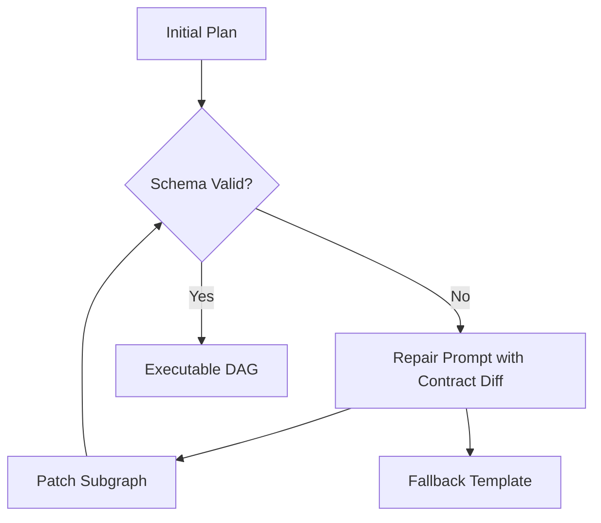

*Серия «Инженер агентных систем». [← Индекс серии](/vairl/blog/2026/07/10/agent-systems-interview-ru/) · часть 6 из 12*

*Практика: [задачи с кодом на Python](/vairl/blog/2026/07/10/agent-systems-interview-06-pipeline-generator-design-code-ru/)*

Эта подстатья тренирует проектирование контура `NL -> исполняемый pipeline`, что является ядром роли инженера агентных систем.

## Design-задача 1: Синтез пайплайна из текстовой задачи

**Сценарий:** Пользователь пишет: "Собери weekly-отчет по инцидентам, кластеризуй причины и предложи 3 action items". Нужно автоматически построить граф шагов.

### Пошаговое решение
1. Разбить задачу на intents: сбор данных, анализ, синтез рекомендаций.
2. Сгенерировать typed IR (промежуточное представление), где у каждого узла есть `input_schema`, `output_schema`, `tool_requirements`.
3. Прогнать статическую валидацию: доступность инструментов, согласованность типов, отсутствие циклов.
4. Построить DAG и оценить cost/latency до запуска.
5. Сохранить объяснимый план (почему именно эти шаги), чтобы улучшить дебаг и доверие.


### Trade-offs
- Более строгая типизация на этапе компиляции уменьшает runtime-ошибки, но требует больше upfront-работы по схемам.
- Агрессивная автоматизация ускоряет UX, но без explainability сложнее разбирать неудачные решения генератора.

### Псевдокод
```python
def compile_pipeline(user_task: str) -> PipelinePlan:
    intents = parse_intents(user_task)
    ir = build_typed_ir(intents)
    validate_constraints(ir)
    dag = compile_dag(ir)
    return attach_estimates_and_rationale(dag, ir)
```

## Design-задача 2: Исправление невалидного автосгенерированного плана

**Сценарий:** Генератор выдал план, где шаг суммаризации требует поля `cluster_labels`, но предыдущая ветка возвращает `topic_groups`.

### Пошаговое решение
1. На этапе compile-time поймать schema mismatch и сформировать machine-readable ошибку.
2. Запустить repair-loop: LLM получает diff контрактов и предлагает минимальную правку графа.
3. Повторно валидировать только затронутый подграф, а не весь pipeline.
4. Если repair неудачен после N попыток, деградировать в шаблонный fallback-пайплайн.
5. Логировать типы ошибок для последующего дообучения генератора.



### Trade-offs
- Локальный repair ускоряет восстановление, но может закрепить архитектурно слабый план.
- Полный re-generation чище концептуально, но дороже по токенам и времени.

### Что проговорить на интервью
- Где хранится canonical-реестр step-схем (`Pydantic`).
- Как измеряется качество генератора: compile success rate, execution success rate, median repair attempts.
- Как связать feedback из исполнения с будущим синтезом (closed loop).
