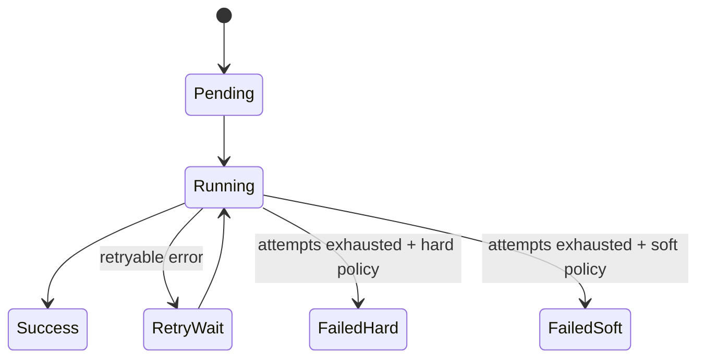

*Серия «Инженер агентных систем». [← Индекс серии](/vairl/blog/2026/07/11/agent-systems-interview-ru/) · часть 7 из 12*

Подстатья про второй контур платформы: надежное исполнение типизированных шагов с параллелизацией, retries и наблюдаемостью.

## Design-задача 1: Оркестратор с типизированными узлами и параллелизмом

**Сценарий:** Нужно исполнять DAG с независимыми ветками, ограничением ресурсов и детерминированным сбором результатов.

### Пошаговое решение
1. Представить граф как набор `NodeSpec` + `EdgeSpec`, где у узла есть версия, схема IO и policy выполнения.
2. При старте run вычислить ready-очередь по in-degree и запускать узлы через `asyncio.TaskGroup`.
3. Контролировать лимиты через семафоры: отдельные для CPU-heavy и I/O-heavy задач.
4. Фиксировать state-machine прогона: `pending -> running -> success|failed|skipped`.
5. На выходе выдавать run-отчет с артефактами, таймингом и причинно-следственным trace.


### Trade-offs
- Высокая степень параллелизма уменьшает latency, но усложняет отладку гонок и порядок логов.
- Жесткие лимиты ресурсов повышают предсказуемость, но могут ухудшить throughput в пиковых сценариях.

### Псевдокод
```python
async def run_dag(plan: Plan) -> RunReport:
    state = init_state(plan)
    async with asyncio.TaskGroup() as tg:
        while has_ready_nodes(state):
            for node in pop_ready(state):
                tg.create_task(run_node_with_limits(node, state))
    return build_report(state)
```

## Design-задача 2: Отказоустойчивость, retries и partial-failure режим

**Сценарий:** В пайплайне есть внешние API; часть узлов периодически падает по сети, но run не должен полностью умирать.

### Пошаговое решение
1. Для каждого узла определить retry-policy (`max_attempts`, backoff, retryable errors).
2. Ввести semantics ошибок: `hard_fail` (останавливает run) и `soft_fail` (помечает ветку degraded).
3. Для зависимых узлов задать fallback-поведение: использовать кэш, упрощенный алгоритм, или пропуск.
4. Добавить idempotency key на уровне node-run, чтобы безопасно повторять шаг.
5. Протоколировать причины отказов для анализа системных узких мест.



### Trade-offs
- Aggressive retries улучшают шанс успеха, но повышают задержку и стоимость.
- Soft-failure повышает доступность системы, но может ухудшить итоговое качество ответа.

### Что проговорить на интервью
- Как реализовать exactly-once/at-least-once на практике для шагов DAG.
- Какие SLO держать для оркестратора: success rate, p95 latency, failover time.
- Как связывать telemetry оркестратора с контуром эволюционного улучшения.
