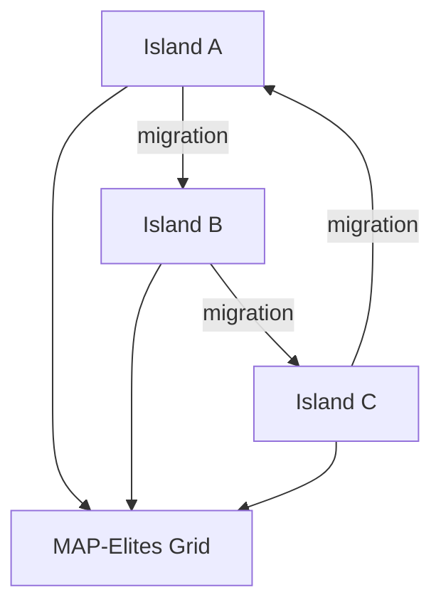

*Серия «Инженер агентных систем». [← Индекс серии](/vairl/blog/2026/07/10/agent-systems-interview-ru/) · часть 8 из 12*

*Практика: [задачи с кодом на Python](/vairl/blog/2026/07/10/agent-systems-interview-08-evolutionary-engine-design-code-ru/)*

Подстатья покрывает третий контур платформы: автоматическое улучшение агентных пайплайнов через эволюционные алгоритмы и LLM-мутации.

## Design-задача 1: Мультиобъективный генетический поиск pipeline-кандидатов

**Сценарий:** Нужно одновременно улучшать success rate, latency и token cost без ручного тюнинга каждого шага.

### Пошаговое решение
1. Определить геном кандидата: структура графа, промпты, выбор tools, параметры декодирования.
2. Сгенерировать начальную популяцию из шаблонов и исторически сильных кандидатов.
3. Запустить evaluation на фиксированном benchmark-наборе задач.
4. Выполнить отбор по Pareto-доминированию и diversity-метрике.
5. Применить кроссовер/мутации и повторять цикл до budget-лимита.


### Trade-offs
- Мультиобъективный отбор дает более реалистичные решения, но сложнее в интерпретации, чем один scalar score.
- Большой benchmark улучшает устойчивость результатов, но резко увеличивает стоимость эволюции.

### Псевдокод
```python
for gen in range(max_generations):
    scores = evaluate_population(population, benchmark)
    elite = pareto_select(scores, k=elite_k)
    offspring = mutate_and_crossover(elite)
    population = survive(elite, offspring)
```

## Design-задача 2: MAP-Elites + островная модель + LLM-мутации

**Сценарий:** Нужно избегать преждевременной сходимости и находить разнообразные, но сильные стратегии.

### Пошаговое решение
1. Задать дескрипторы поведения для MAP-Elites, например "глубина reasoning" и "степень tool usage".
2. Разделить популяцию на острова с разными mutation policy.
3. Использовать LLM как оператор мутаций: переписать промпт, изменить decomposition, заменить tool.
4. Периодически мигрировать топ-кандидатов между островами.
5. Поддерживать novelty archive и штрафовать дубликаты стратегий.



### Trade-offs
- LLM-мутации дают семантически богатые изменения, но могут нарушать типовые ограничения графа.
- Миграция между островами повышает diversity, но при слишком частой миграции стирает специализацию островов.

### Что проговорить на интервью
- Как гарантировать воспроизводимость эволюции при стохастических мутациях.
- Как защищаться от "метрического оверфита" на конкретный benchmark.
- Как интегрировать compile-time проверки перед дорогим прогоном кандидатов.
