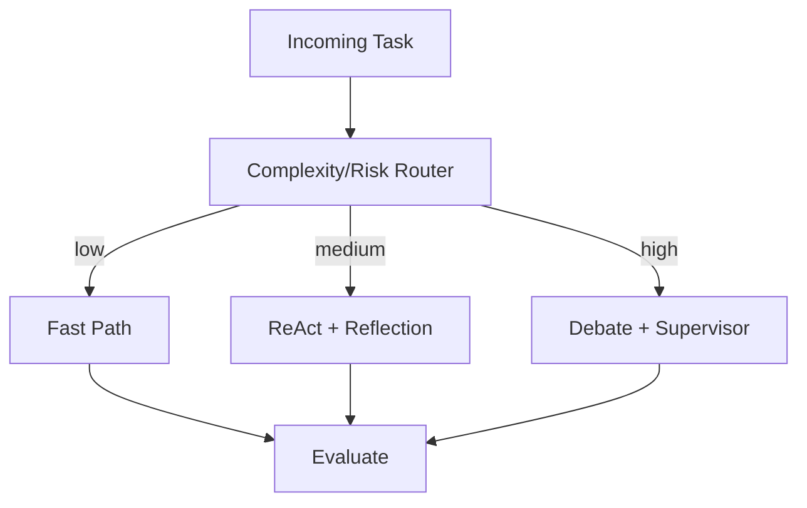
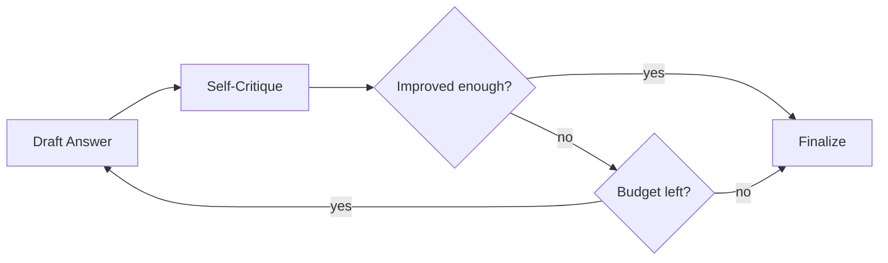

*Серия «Инженер агентных систем». [← Индекс серии](/vairl/blog/2026/07/10/agent-systems-interview-ru/) · часть 9 из 12*

Эта подстатья тренирует выбор и композицию паттернов (ReAct, рефлексия, супервайзер, дебаты, планирование) под конкретную задачу и бюджет.

## Design-задача 1: Выбор паттерна под тип задачи

**Сценарий:** Для одних задач нужен быстрый single-shot ответ, для других — глубокое рассуждение с проверками. Нужно маршрутизировать запросы по паттернам.

### Пошаговое решение
1. Построить легкий classifier, который оценивает сложность, риск ошибки и требуемую объяснимость.
2. Для low-risk задач выбирать fast-path (`direct answer` + minimal tool use).
3. Для high-risk задач переключать на `plan -> execute -> reflect`.
4. Для критичных решений включать multi-agent debate или supervisor-review.
5. После выполнения собирать outcome-метрики и обновлять policy маршрутизации.

### Trade-offs
- Сложные паттерны повышают качество на трудных кейсах, но увеличивают latency и стоимость.
- Универсальный "тяжелый" паттерн прост в поддержке, но неэффективен для массовых простых задач.

## Design-задача 2: Контур саморефлексии без бесконечных циклов

**Сценарий:** Агент должен уметь исправлять свои ответы, но не застревать в endless refinement.

### Пошаговое решение
1. Ввести bounded-reflection: максимум N итераций, строгий budget по токенам и времени.
2. Формализовать критерий улучшения (например, рост confidence + прохождение проверок).
3. Если прирост ниже порога, завершать цикл и отдавать лучший кандидат.
4. Для каждой итерации логировать "что изменилось" и "почему".
5. Переносить успешные шаблоны рефлексии в библиотеку стратегий.

### Trade-offs
- Жесткие лимиты защищают инфраструктуру от runaway-циклов, но могут обрывать полезные улучшения.
- Мягкие лимиты улучшают шанс высокого качества, но увеличивают непредсказуемость SLA.

### Что проговорить на интервью
- Как увязать выбор паттерна с метриками и профилем задач клиента.
- Как обеспечить наблюдаемость reasoning-цепочки без хранения лишних чувствительных данных.
- Как реализовать fallback из "умного" режима в детерминированный baseline.
