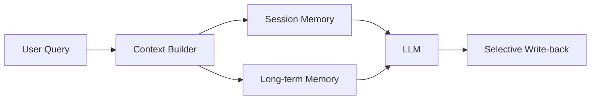
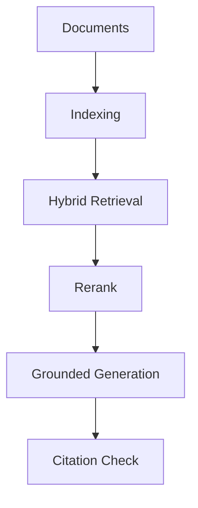

*Серия «Инженер агентных систем». [← Индекс серии](/vairl/blog/2026/07/11/agent-systems-interview-ru/) · часть 10 из 12*

Подстатья про память и retrieval в агентной платформе: как сделать ответы устойчивыми к hallucination и полезными в многосессионной работе.

## Design-задача 1: Гибридная память (short-term + long-term)

**Сценарий:** Агент должен помнить контекст текущей сессии и важные факты из прошлых задач, но не раздувать prompt.

### Пошаговое решение
1. Разделить память на уровни: ephemeral session memory и persistent knowledge memory.
2. Для session memory хранить компактный state summary + unresolved goals.
3. Для persistent memory хранить факты/решения в векторном и структурированном индексах.
4. Перед генерацией собирать контекст через retrieval policy с бюджетом токенов.
5. После ответа писать только высокоценные артефакты по explicit правилам write-back.

### Trade-offs
- Агрессивная запись в память повышает recall, но создает шум и ухудшает retrieval precision.
- Сильная фильтрация снижает шум, но может потерять важные детали для будущих задач.

## Design-задача 2: Production RAG с контролем качества retrieval

**Сценарий:** Нужно построить RAG-слой для технических документов с цитируемыми ответами и управляемой стоимостью.

### Пошаговое решение
1. Препроцессинг: чанкование с overlap, нормализация метаданных, дедупликация.
2. Retrieval: hybrid search (dense + BM25) и reranker для top-k.
3. Generation: принудить модель ссылаться на источники и явно отмечать uncertain cases.
4. Verification: post-check на наличие подтверждающих цитат.
5. Evaluation: отслеживать answer groundedness, retrieval hit rate, cost per successful answer.

### Trade-offs
- Большой `k` в retrieval повышает шанс найти релевантный факт, но растит latency и цену контекста.
- Строгая верификация цитат повышает надежность, но может снижать полноту ответов в редких темах.

### Что проговорить на интервью
- Политика "когда читать/когда писать" в память.
- Как бороться с stale knowledge и версионировать индексы.
- Как оценивать RAG не только по качеству текста, но и по groundedness.
