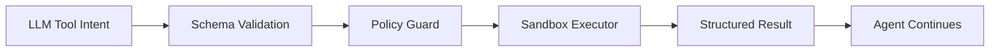
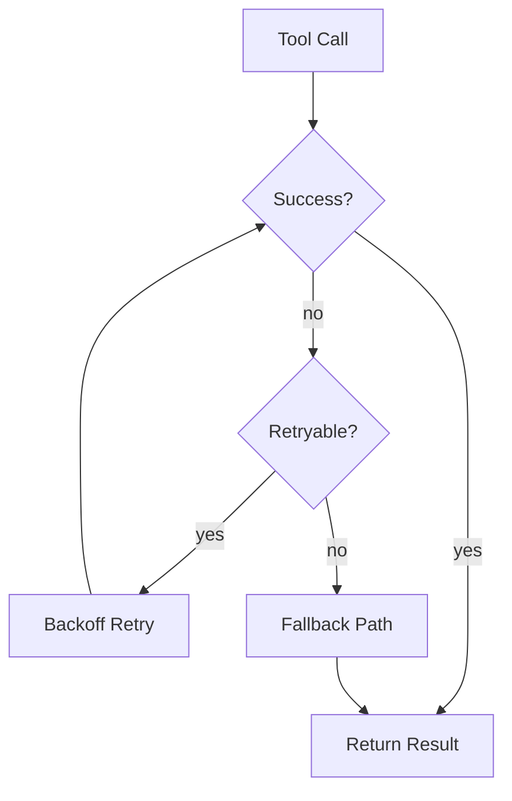

*Серия «Инженер агентных систем». [← Индекс серии](/vairl/blog/2026/07/10/agent-systems-interview-ru/) · часть 11 из 12*

Подстатья про надежный слой инструментов: контрактный вызов tool API, безопасность выполнения и управление ошибками в agentic-пайплайне.

## Design-задача 1: Типобезопасный реестр инструментов

**Сценарий:** LLM должна вызывать десятки внутренних и внешних инструментов, не ломая контракт аргументов.

### Пошаговое решение
1. Завести `ToolRegistry`, где у каждого инструмента есть `name`, `version`, `input_schema`, `output_schema`, `permissions`.
2. Принуждать LLM к function calling с JSON-схемой вместо свободного текста.
3. Перед вызовом делать валидацию аргументов и policy-check (доступ, rate-limit, allowlist).
4. Выполнять инструмент в sandbox-раннере с timeout и лимитами ресурсов.
5. Возвращать в модель структурированный результат + нормализованный код ошибки.

### Trade-offs
- Строгая схема снижает гибкость ad-hoc действий, но резко повышает надежность системы.
- Богатые output-схемы дают лучший контроль, но требуют дисциплины версионирования инструментов.

## Design-задача 2: Стратегия retries, fallback и деградации

**Сценарий:** Внешний API инструмента периодически недоступен, но пользователь должен получить полезный ответ.

### Пошаговое решение
1. Классифицировать ошибки на retryable и non-retryable.
2. Для retryable применять экспоненциальный backoff с jitter и ограничением попыток.
3. При исчерпании попыток включать fallback: кэш, альтернативный инструмент или упрощенный сценарий.
4. Логировать инцидент в telemetry с контекстом run и параметрами запроса.
5. Обновлять routing policy инструментов на основании фактической надежности.

### Trade-offs
- Длинный retry-цикл повышает шанс успеха, но может нарушать latency SLA.
- Быстрый fallback стабилизирует UX, но иногда дает менее точный результат.

### Что проговорить на интервью
- Как сделать tool-use наблюдаемым: success/fail rate, p95 latency, error taxonomy.
- Как ограничивать привилегии инструмента и снижать риск prompt injection.
- Как тестировать инструменты контрактными тестами и нагрузочными сценариями.
