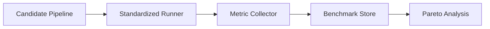
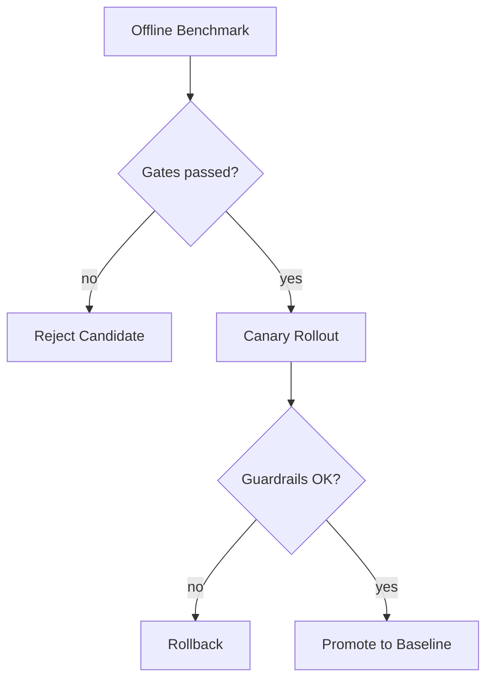

*Серия «Инженер агентных систем». [← Индекс серии](/vairl/blog/2026/07/10/agent-systems-interview-ru/) · часть 12 из 12*

*Практика: [задачи с кодом на Python](/vairl/blog/2026/07/10/agent-systems-interview-12-evaluation-benchmarking-design-code-ru/)*

Подстатья закрывает контур измерения качества: как честно сравнивать версии агентных пайплайнов и безопасно выкатывать улучшения.

## Design-задача 1: Единый benchmark-контур для трёх контуров платформы

**Сценарий:** Нужно сравнивать кандидатов генератора, оркестратора и эволюционного движка на едином наборе задач.

### Пошаговое решение
1. Сформировать benchmark suite из production-подобных задач с разметкой ожидаемого результата.
2. Разделить метрики по уровням: task success, correctness, latency, token cost, failure rate.
3. Запускать кандидатов в одинаковой среде (фиксированные версии, deterministic seeds, sandbox).
4. Сохранять артефакты прогона для последующего аудита и репликации.
5. Строить dashboard по Pareto-фронту, а не только по одному интегральному числу.

### Trade-offs
- Стандартизация окружения повышает честность сравнения, но удорожает инфраструктуру запуска.
- Слишком широкий набор метрик может усложнить принятие решения без четкой приоритизации.

## Design-задача 2: Gatekeeping перед релизом и online-валидация

**Сценарий:** Новая версия пайплайна показывает +3% quality offline, но дороже по токенам. Нужно решить, выкатывать ли в прод.

### Пошаговое решение
1. Ввести release gates: минимальный прирост качества и максимальный рост стоимости/латентности.
2. Если offline-gates пройдены, запускать canary на доле трафика.
3. На canary измерять бизнес-метрики и технические метрики с guardrail-порогами.
4. При деградации выше порога выполнять автоматический rollback.
5. После успешного canary обновлять baseline и архивировать отчеты сравнения.

### Trade-offs
- Жесткие gate-пороги защищают стабильность, но могут замедлять инновации.
- Мягкие пороги ускоряют релизы, но повышают риск деградации в продакшне.

### Что проговорить на интервью
- Как проектировать набор задач, чтобы избежать overfitting на benchmark.
- Как учитывать статистическую значимость различий между версиями.
- Как связывать результаты evaluation с решениями эволюционного движка.
