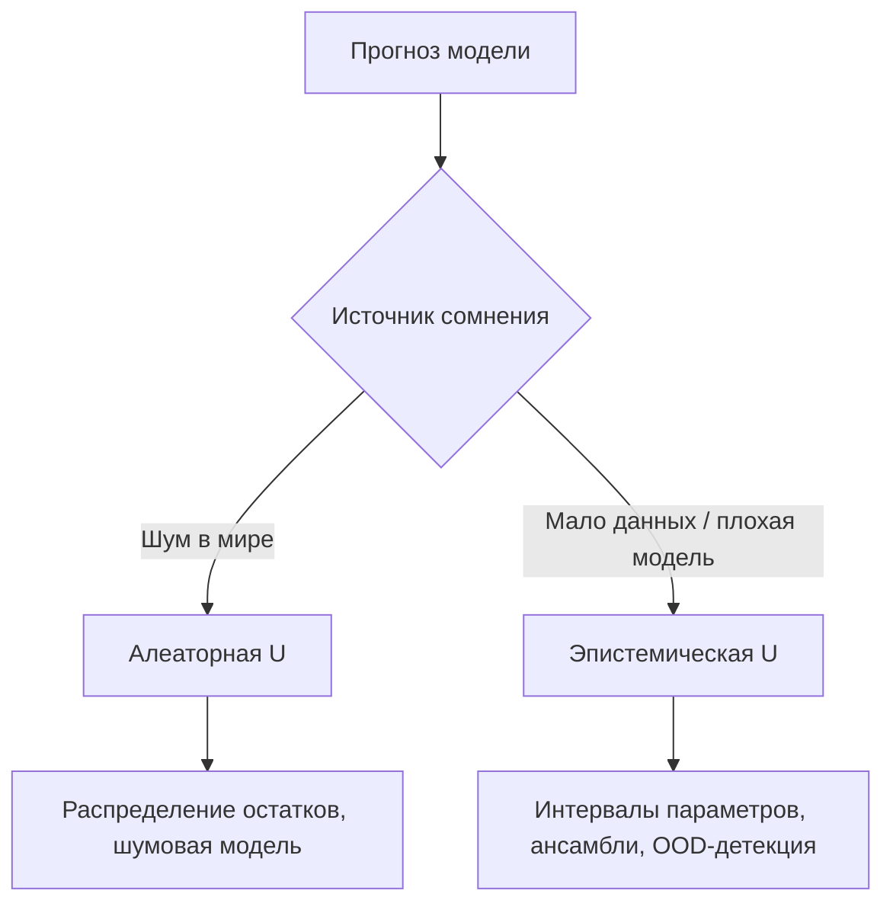
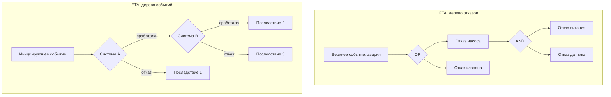
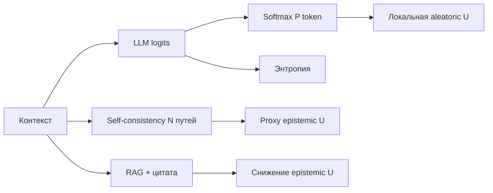

Модель выдала `P = 0.97`. Значит, она почти уверена? Не обязательно. Вероятность — это число внутри конкретной математической постановки. **Неопределённость** — более широкое понятие: насколько мы не знаем истинный ответ, и *почему* мы его не знаем. В продакшене путают эти вещи постоянно: калиброванный классификатор, некалиброванный softmax LLM и байесовский интервал прогноза — всё это «вероятности», но они отвечают на разные вопросы.

Ниже — карта от простого к сложному: деревья событий, **деревья оценки рисков** (FTA/ETA), регрессии, ансамбли, нейросети, языковые модели. В каждом блоке — что именно измеряется, какой тип неопределённости доминирует и какие методы оценки реально работают.

<figure style="margin: 2em auto; text-align: center;">
  
  <figcaption style="font-size: 0.9em; color: #666; max-width: 720px; margin: 0 auto;">Алеаторная неопределённость — шум в данных; эпистемическая — незнание модели. Разные архитектуры кодируют их по-разному.</figcaption>
</figure>

---

## Два слоя: вероятность как модель, неопределённость как вопрос

**Вероятность** — элемент аксиоматической модели: события, распределения, правила умножения и сложения. Мы *задаём* её явно (дерево, Байес, softmax) или *оцениваем* из данных (MLE, эмпирические частоты).

**Неопределённость** — практический вопрос: «насколько надёжен этот прогноз?» Её удобно делить на два источника (разделение De Finetti / Hüllermeier):

| Тип | Синонимы | Суть | Можно убрать? |
|-----|----------|------|---------------|
| **Алеаторная** | data noise, irreducible | Случайность самого процесса: монета, шум датчика, вариативность пациентов | Нет — только моделировать |
| **Эпистемическая** | model ignorance, reducible | Недостаток данных, плохая модель, out-of-distribution | Да — больше данных, лучше модель |

Ключевая ловушка: **высокая вероятность ≠ низкая неопределённость**. Классификатор может выдать 0,99 на класс «кошка» и ошибиться — softmax перегрет, обучающая выборка мала, объект вне распределения. Для регрессии аналог: узкий доверительный интервал для *параметров* не гарантирует узкий интервал для *нового* наблюдения.



---

## Деревья событий: вероятность задана явно

Самый прозрачный случай — **дерево решений / событий**, где каждое ребро несёт условную вероятность. Здесь вероятность и неопределённость совпадают по смыслу: мы явно описываем, что может произойти.

Пример: медицинский скрининг.

```
                    [Болезнь D]
                   /          \
              P(D)=0.01    P(¬D)=0.99
                 /              \
           [Тест +]          [Тест +]
          /       \          /       \
    P(+|D)=0.95  ...   P(+|¬D)=0.05  ...
```

**Что измеряется:** совместные и маргинальные вероятности, условные \(P(A \mid B)\).

**Методы:**
- Правило Байеса для обратных вероятностей
- Полное распределение по листьям дерева
- Монте-Карло по дереву при стохастических ветвях

**Ограничение:** дерево хорошо, пока структура известна. В ML деревья решений (CART) обычно дают **точечный** класс или среднее — вероятность появляется, если считать долю класса в листе (частотная оценка) или использовать `predict_proba` в sklearn. Это оценка **алеаторной** доли в листе, но почти не ловит **эпистемическую** неуверенность на редких путях.

| Подход | Вероятность | Эпистемическая U |
|--------|-------------|------------------|
| Ручное дерево событий | Явная | Задаётся экспертом (субъективные priors) |
| Random Forest `predict_proba` | Доля класса в листьях | Разброс между деревьями (см. ниже) |
| Gradient Boosting | Калиброванный softmax / log-odds | Слабее, чем у RF |

---

## Неопределённость в деревьях оценки рисков

В **теории оценки рисков** (PRA — probabilistic risk assessment) деревья — не учебные схемы из теории вероятностей, а формальный инструмент инженерной безопасности: АЭС, химзаводы, авиация, кибербезопасность. Здесь неопределённость — центральная тема: редкие катастрофические события почти никогда не дают частотную статистику «из коробки», а структура сценария сама по себе спорна.

### Три типа деревьев

| Инструмент | Направление | Вопрос | Логика |
|------------|-------------|--------|--------|
| **FTA** (fault tree) | Сверху вниз | *Почему* произошёл отказ? | AND / OR-вентили, базовые события |
| **ETA** (event tree) | Слева направо | *Что* случится после инициирующего события? | Ветви «сработало / не сработало» |
| **Bow-tie** | Центр — опасное событие | Причины слева (FTA), последствия справа (ETA) | Связка причин и сценариев |



**Вероятность сценария** считается по правилам дерева. Для OR-вентиля:

\[
P(\text{TOP}) = 1 - \prod_i (1 - q_i)
\]

Для AND при независимых базовых событиях: \(P(\text{TOP}) = \prod_i q_i\). В ETA вероятность листа — произведение условных вероятностей вдоль пути. Итоговая частота катастрофы — сумма по всем путям, ведущим к тяжёлому последствию.

### Где живёт неопределённость

В PRA различают три слоя — они точнее, чем просто «алеаторная / эпистемическая», но к ним привязаны:

| Слой | Суть | Тип U | Пример |
|------|------|-------|--------|
| **Случайность отказа** | Внутренняя непредсказуемость компонента | Алеаторная | Время наработки на отказ распределено экспоненциально |
| **Незнание параметров** | Мало данных о частоте \(q_i\) | Эпистемическая | «Отказ клапана: от \(10^{-5}\) до \(10^{-3}\) в год» |
| **Незнание модели** | Спорная топология, пропущенные ветви, CCF | Эпистемическая | Забыли общую причину отказа двух насосов |

**Ключевое отличие от ML:** в дереве риска неопределённость чаще сидит не в «шуме меток», а в **оценках базовых частот** \(q_i\) и в **выборе структуры**. Один и тот же TOP-event может дать \(P = 10^{-6}\) или \(P = 10^{-4}\) — в зависимости от того, заложили ли общую причину отказа (CCF — common cause failure) и какой диапазон дали эксперты.

### Точечная оценка vs распространение неопределённости

Наивный подход — подставить **точечные** \(q_i\) из справочника (OREDA, IEEE 493, заводская статистика) и получить одно число \(P(\text{TOP})\). Это удобно, но **прячет эпистемическую U**: ответ выглядит точным, хотя каждый \(q_i\) — оценка с разбросом.

Рабочий стандарт — **Монте-Карло по дереву**:

1. На каждое базовое событие задают **распределение** на \(q_i\) (логнормальное, бета, треугольное — по результатам экспертной оценки).
2. Сэмплируют вектор \(\{q_i\}\), пересчитывают \(P(\text{TOP})\).
3. Повторяют \(N\) раз → получают распределение итогового риска.

```python
import numpy as np

rng = np.random.default_rng(7)
n_sim = 50_000

# Два независимых базовых события: медиана + порядок величины неопределённости
q1 = rng.lognormal(mean=np.log(1e-4), sigma=0.8, size=n_sim)
q2 = rng.lognormal(mean=np.log(5e-5), sigma=1.0, size=n_sim)

# OR-вентиль: TOP = A ∪ B
p_top = 1.0 - (1.0 - q1) * (1.0 - q2)

print(f"Медиана P(TOP): {np.median(p_top):.2e}")
print(f"95% интервал:   [{np.quantile(p_top, 0.025):.2e}, {np.quantile(p_top, 0.975):.2e}]")
```

На выходе — не «риск = \(2{,}3 \times 10^{-5}\)», а **распределение риска**: медиана, 5–95% перцентиль, хвост. Для регуляторов и FMEA-отчётов это принципиально: важен не только central estimate, но и **верхний квантиль** (например, 95-й перцентиль частоты аварии).

### Экспертная оценка и байесовское обновление

Когда статистики мало (типично для редких событий), \(q_i\) берут из **экспертной оценки** (expert elicitation): эксперты задают минимум, максимум, «наиболее вероятное» — из них строят распределение (методы Sheffield, Cooke, Delphi).

По мере поступления данных (отказы на заводе, результаты тестов) параметры **обновляют по Байесу**:

\[
p(q \mid \text{данные}) \propto p(\text{данные} \mid q)\, p(q)
\]

Prior — экспертное распределение; likelihood — наблюдённые отказы. Эпистемическая U сужается, алеаторная остаётся: даже при точном \(q\) отказ в конкретный момент случаен.

### Анализ чувствительности и важности

Дерево риска отвечает не только «каков риск?», но и **«что его двигает?»**. Классические метрики:

| Метрика | Что измеряет |
|---------|--------------|
| **Fussell–Vesely** | Доля сценариев с участием события \(i\) |
| **Birnbaum** | Чувствительность \(P(\text{TOP})\) к изменению \(q_i\) |
| **RAW** (risk achievement worth) | Во сколько раз вырастет риск, если \(q_i \to 1\) |
| **RRW** (risk reduction worth) | Во сколько раз упадёт риск, если \(q_i \to 0\) |

Если при MC-симуляции разброс \(P(\text{TOP})\) огромен, а Birnbaum показывает доминирование одного \(q_i\) — **снижение эпистемической U** начинают с измерения именно этого компонента (больше данных, лучший датчик, резервирование), а не с уточнения всего дерева сразу.

### Связь с aleatoric / epistemic в PRA

В отчётах PRA (NRC, IAEA) часто явно разделяют:

- **Aleatory uncertainty** — моделируется случайным временем отказа при *фиксированных* \(q_i\)
- **Epistemic uncertainty** — моделируется распределением на самих \(q_i\) и альтернативными топологиями дерева

Полный анализ иногда делает **двойной цикл MC**: внешний — сэмпл эпистемических параметров, внутренний — алеаторные отказы при этих параметрах. Это прямой аналог разделения из начала статьи, только в инженерной постановке.

### Ограничения и типичные ловушки

1. **Независимость.** Формулы AND/OR предполагают независимость базовых событий. Без CCF-групп риск **занижается** — классическая ошибка.
2. **Ложная точность.** Точечные \(q_i\) из справочника создают иллюзию надёжного \(P(\text{TOP})\).
3. **Структурная U.** Два валидных дерева с разной топологией дают разные ответы при одних и тех же \(q_i\); MC по параметрам это не ловит.
4. **Хвостовой риск.** Медиана может быть приемлемой, 95-й перцентиль — нет; для катастроф смотрят именно хвост распределения.

Для агентных и ML-систем аналог очевиден: **граф инструментов** (какой tool вызвать, сработает ли API) — это ETA; **цепочка сбоев** (почему агент выдал неверный ответ) — FTA. Неопределённость в \(q_i\) там — надёжность API, качество RAG, доля галлюцинаций; распространять её по дереву сценария полезнее, чем смотреть только на softmax последнего токена.

---

## Регрессия: три разных «интервала»

Линейная регрессия \(y = X\beta + \varepsilon\) — эталон для понимания различий.

### 1. Доверительный интервал (CI) для параметров

Оценивает неопределённость **коэффициентов** \(\hat\beta\):

\[
\hat\beta \pm t_{\alpha/2} \cdot \text{SE}(\hat\beta)
\]

Отвечает на вопрос: «Насколько точно мы знаем наклон?» Это **эпистемическая** неопределённость параметров.

### 2. Интервал прогноза (prediction interval)

Для нового \(x_*\):

\[
\hat{y}(x_*) \pm t_{\alpha/2} \cdot \text{SE}_{\text{pred}}
\]

Включает и ошибку оценки \(\hat\beta\), и **алеаторный** шум \(\varepsilon\). Шире CI — и правильно: пользователю чаще нужен именно он.

### 3. Bootstrap-интервал

Пересэмплируем данные, переобучаем модель, смотрим квантили \(\hat{y}\). Не требует нормальности остатков — универсальный приём для любой регрессии (деревья, нейросети).

```python
import numpy as np
from sklearn.linear_model import LinearRegression

rng = np.random.default_rng(42)
X = rng.normal(size=(200, 3))
y = X @ np.array([2.0, -1.0, 0.5]) + rng.normal(scale=0.8, size=200)

def bootstrap_predict(X_train, y_train, X_new, n_boot=500):
    preds = []
    n = len(y_train)
    for _ in range(n_boot):
        idx = rng.integers(0, n, size=n)
        m = LinearRegression().fit(X_train[idx], y_train[idx])
        preds.append(m.predict(X_new))
    preds = np.array(preds)
    return preds.mean(axis=0), np.quantile(preds, [0.025, 0.975], axis=0)

X_new = rng.normal(size=(1, 3))
mean, (lo, hi) = bootstrap_predict(X, y, X_new)
print(f"Прогноз: {mean[0]:.2f}, 95% PI: [{lo[0]:.2f}, {hi[0]:.2f}]")
```

**Логистическая регрессия** добавляет слой: вместо интервала для \(y\) — **вероятность класса** \(\hat{p} = \sigma(X\hat\beta)\) плюс CI для \(\hat\beta\) или bootstrap по \(\hat{p}\). Здесь уже смешиваются оба типа U: шум меток (алеаторный) и неуверенность в весах (эпистемический).

---

## Байесовский взгляд: распределение вместо точки

В байесовской постановке неопределённость — это **апостериорное распределение** \(p(\theta \mid \mathcal{D})\).

- **Prior** кодирует эпистемическую неуверенность до данных
- **Likelihood** переносит информацию из наблюдений
- **Posterior predictive** \(p(y_* \mid x_*, \mathcal{D}) = \int p(y_* \mid x_*, \theta)\, p(\theta \mid \mathcal{D})\, d\theta\) — полный ответ «с учётом всех сомнений о параметрах»

Для линейной регрессии с гауссовым prior получаем аналитический posterior. Для нейросетей — variational inference (VI), MCMC, Laplace approximation.

**Плюс:** единый язык для обоих типов U.  
**Минус:** вычислительная цена; для больших моделей — приближения.

| Метод | Масштаб | Эпистемическая U | Типичное применение |
|-------|---------|------------------|---------------------|
| Conjugate Bayes (линейная/логистическая) | Малый | Аналитический posterior | A/B, медицина, малые таблицы |
| MCMC | Малый–средний | Точный posterior (медленно) | Исследования, малые NN |
| Variational Bayes | Средний–большой | Приближённый posterior | BNN, VAE |
| Laplace / last-layer Bayes | Большой | Локальная аппроксимация около MAP | Fine-tuned классификаторы |

---

## Ансамбли и сэмплирование: эпистемика без формул

Когда полный Байес дорог, используют **практические прокси эпистемической** неопределённости:

### Deep Ensembles

Обучаем \(M\) моделей с разными инициализациями. Прогноз — среднее; **дисперсия между моделями** — оценка эпистемической U.

### MC Dropout (Gal & Ghahramani)

Включаем dropout на инференсе, делаем \(T\) проходов. Разброс выходов ≈ эпистемическая компонента. Дёшево, но калибровка зависит от архитектуры.

### Conformal Prediction

Строим **распределениено-свободный** интервал или множество классов с гарантией покрытия \(1-\alpha\) на обменных данных. Не требует байесовской модели — отделяет «что предсказать» от «как оценить риск ошибки».

```python
# Иллюстрация: разброс ансамбля как proxy эпистемической U
import numpy as np

ensemble_preds = np.array([
    [0.82, 0.15, 0.03],
    [0.71, 0.22, 0.07],
    [0.88, 0.09, 0.03],
    [0.65, 0.28, 0.07],
    [0.79, 0.17, 0.04],
])  # 5 моделей, 3 класса

mean_proba = ensemble_preds.mean(axis=0)
epistemic_spread = ensemble_preds.std(axis=0)  # по моделям
print("Средняя вероятность:", mean_proba.round(3))
print("Разброс (epistemic):", epistemic_spread.round(3))
```

**Random Forest** — частный случай ансамбля: `predict_proba` усредняет по деревьям, а **дисперсия голосов** показывает, согласны ли деревья. На редких объектах дисперсия растёт — полезный сигнал для отсечения.

---

## Нейросети: что именно выдаёт softmax

Для классификации последний слой + softmax даёт **вероятности классов** — но это вероятности *внутри модели*, обученной minimize cross-entropy. Они часто **некалиброваны**: 0,9 на логите не значит 90% частоты ошибок в продакшене.

**Калибровка** — отдельная задача от UQ:

| Метод | Что делает |
|-------|------------|
| Temperature scaling | Один параметр \(T\) на валидации: \(\text{softmax}(z/T)\) |
| Platt scaling | Логистическая регрессия на logits |
| Isotonic regression | Монотонная калибровка по бинам |
| ECE / reliability diagram | Метрика: \|confidence − accuracy\| по бинам |

**OOD-детекция** (out-of-distribution) — ещё один слой: модель может быть «уверена» (высокий softmax) на чужом объекте. Методы: Mahalanobis distance, energy score, ODIN, энтропия активаций.

Для **регрессии на нейросетях**:
- Heteroscedastic head: модель предсказывает и \(\mu(x)\), и \(\sigma(x)\) — явная алеаторная U
- Quantile regression: квантили 0,05 / 0,95 без гауссового допущения
- Deep Ensembles / MC Dropout — эпистемическая добавка

---

## Языковые модели: особый случай

У LLM на каждом шаге генерации — распределение над словарём \(P(w_t \mid w_{<t})\). Это **алеаторная** структура в пространстве токенов: модель описывает, какой токен «случаен» при фиксированном контексте. Но:

1. **Softmax-вероятность токена ≠ уверенность в факте.** Высокий \(P(\text{«Париж»})\) не гарантирует, что столицей действительно Париж — модель может галлюцинировать уверенно.
2. **Эпистемическая U в LLM плохо представлена одним числом.** Нет явного posterior над весами на инференсе; типичные прокси:
   - **Перплексия / энтропия** следующего токена — локальная неопределённость выбора слова
   - **Self-consistency**: \(N\) цепочек рассуждений, согласованность финальных ответов
   - **Verbalized confidence**: «я уверен на 70%» — калибровка слабая, зависит от промпта
   - **Ensemble of prompts / models**
   - **Retrieval grounding**: неопределённость снижается, если ответ привязан к источнику с цитатой



**Калибровка LLM** — активная область: LLM часто **overconfident** на фактологических вопросах и **underconfident** на творческих. Для агентов критично разделять:
- «Модель не знает, какой токен выбрать» (высокая энтропия)
- «Модель выбрала токен уверенно, но факт неверен» (низкая энтропия, высокий риск)

Второй случай ловят **верификаторы**, **tool use** (калькулятор, поиск), **conformal**-подобные abstention-политики на уровне пайплайна, а не одного softmax.

---

## Сводная таблица: что спрашивать у каждой модели

| Модель | Что выдаёт «из коробки» | Алеаторная U | Эпистемическая U | Практичный метод |
|--------|-------------------------|--------------|------------------|------------------|
| Дерево событий (Байес) | \(P(\text{лист})\) | Ветви дерева | Субъективные priors | Байес по дереву |
| FTA / ETA (оценка рисков) | \(P(\text{TOP})\), частота сценария | Время отказа, ветвление | Разброс \(q_i\), топология, CCF | MC по дереву + важность |
| Линейная регрессия | \(\hat{y}\), CI параметров | \(\sigma^2\) остатков | CI / bootstrap \(\hat{\beta}\) | **Prediction interval** |
| Логистическая регрессия | \(\hat{p}\) | Шум меток | Bootstrap по \(\hat{p}\) | + Platt / isotonic |
| Random Forest | `predict_proba` | Листовые частоты | Дисперсия деревьев | Отсев по разбросу |
| Gradient Boosting | log-odds → sigmoid | — | Слабая | + калибровка, conformal |
| Нейросеть (классиф.) | softmax | — | MC Dropout, ensemble | Temperature + OOD |
| Нейросеть (регр.) | \(\hat{y}\) | Heteroscedastic \(\hat\sigma\) | Ensemble | Квантильная голова |
| LLM | \(P(\text{token})\) | Энтропия токена | Self-consistency, RAG | Верификатор + abstain |

---

## Как выбирать метод в продакшене

Короткий чеклист для ML- и агентных систем:

1. **Сформулируйте вопрос явно.** «Интервал для следующего наблюдения» ≠ «доверие к классу» ≠ «модель знает предмет».
2. **Разделите aleatoric и epistemic.** Шум датчика не лечится ансамблем; незнание на OOD не лечится temperature scaling.
3. **Для табличных данных** — начните с bootstrap или conformal; для RF — разброс деревьев.
4. **Для нейросетей** — deep ensemble (если бюджет есть) или MC Dropout; обязательно калибровка на hold-out.
5. **Для LLM-агентов** — не полагайтесь на softmax; комбинируйте retrieval, инструменты, self-consistency и политику «не отвечать», если эпистемическая U высока.
6. **Меряйте калибровку** (ECE, Brier score, coverage conformal), а не только accuracy.

---

## Итог

**Вероятность** — язык описания случайности внутри выбранной модели. **Неопределённость** — ответ на вопрос о надёжности прогноза, и она распадается на неустранимый шум данных и устранимое незнание модели.

Деревья событий делают вероятность явной; в PRA (FTA/ETA) неопределённость параметров и структуры распространяют Монте-Карло, а не маскируют точечной оценкой. Регрессия учит различать интервал для параметров и для прогноза. Байес обобщает это в распределения. Ансамбли и conformal дают рабочие приближения без полного posterior. Нейросети требуют отдельной калибровки softmax. Языковые модели добавляют слой: уверенный токен не равен верному факту — и для агентов критичны внешние проверки, а не только \(P(w_t)\).

Связанный материал на VAIRL: [отрицательная вероятность](/vairl/blog/2026/07/08/negative-probability-ru/) — когда классическое совместное распределение не существует, но маргинальные вероятности измеряемы.

---

*Материал подготовлен с опорой на классическую статистику (prediction vs confidence intervals), обзоры uncertainty quantification в ML (Gal, Lakshminarayanan, Angelopoulos conformal) и практику калибровки нейросетей и LLM.*
