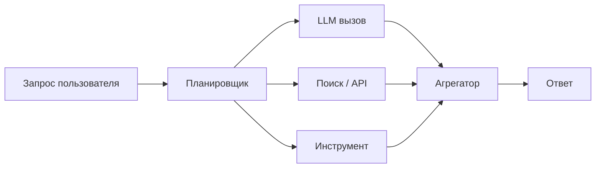
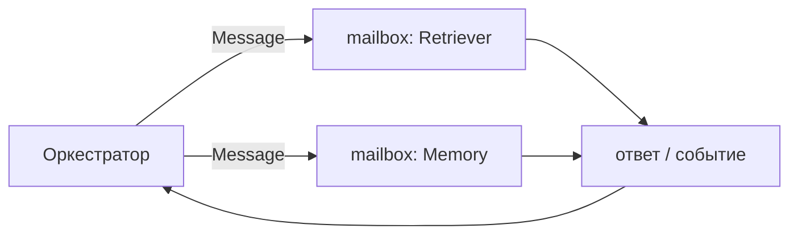

Агентная система редко падает из-за того, что модель «плохо думает». Гораздо чаще она простаивает: ждёт ответ LLM, поиск в базе, браузерный инструмент или другой узел графа. Пока один запрос висит в сети, в процессоре почти нечего делать — и именно здесь способ организации конкурентной работы определяет задержку, стоимость и предсказуемость платформы.

В [серии «Инженер агентных систем»](/vairl/blog/2026/07/10/agent-systems-interview-01-python-async-typing-ru/) мы уже разбирали базовые навыки Python. Теперь пройдём путь от понятного последовательного кода до акторов. Цель не в том, чтобы объявить `asyncio` победителем: у каждого инструмента есть свой тип нагрузки и своя цена. Незнакомые термины — в [глоссарии к этой статье](/vairl/blog/2026/07/10/python-async-evolution-glossary-ru/).

## Введение: почему это важно агентам

Один пользовательский запрос может породить DAG: классификатор выбирает инструменты, несколько ветвей одновременно ищут документы и вызывают модели, затем агрегатор строит ответ. Эти операции неоднородны. Вызов LLM и HTTP-инструмент — I/O-bound; эмбеддинги на CPU, распознавание файлов или симуляция — CPU-bound; небезопасный tool-код лучше вообще изолировать в отдельном процессе или контейнере.



Конкурентность сокращает wall-clock latency, когда независимые ветви ждут внешнего мира. Параллелизм действительно выполняет несколько вычислений одновременно — обычно на разных ядрах. Не смешивайте эти понятия: `asyncio` отлично даёт конкурентность I/O, но сам по себе не ускорит тяжёлую CPU-функцию.

## Последовательный baseline: простота и её предел

Начинать стоит именно с sync-версии. Она читается линейно, легко логируется и почти не имеет гонок. Для короткого сценария или для зависимых шагов это правильный выбор. Но три независимых запроса по секунде займут примерно три секунды.

```python
from time import sleep, perf_counter


def call_tool(name: str, delay: float = 1.0) -> str:
    """Имитирует сетевой вызов без внешнего API."""
    sleep(delay)
    return f"{name}: готово"


started = perf_counter()
results = [call_tool(name) for name in ("llm", "search", "calendar")]
print(results)
print(f"Прошло: {perf_counter() - started:.2f} c")
```

Интерактивная схема ниже показывает, как три независимых ожидания выстраиваются в одну очередь и складывают пользовательскую задержку.

<div class="python-async-widget phase-portrait-widget" data-async-mode="sync">
  <div class="python-async-toolbar">
    <div class="phase-portrait-controls">
      <button type="button" data-async-play>▶ Старт</button>
      <button type="button" data-async-step>Шаг</button>
      <button type="button" data-async-reset>Сброс</button>
    </div>
    <span class="python-async-status" aria-live="polite"></span>
  </div>
  <div class="python-async-canvas phase-portrait-canvas"></div>
  <p class="phase-portrait-caption">Сплошные блоки — CPU-работа, штриховка — ожидание сети. Главный поток почти всё время простаивает, а задержки складываются в 3 секунды.</p>
</div>

Здесь нет полезной работы во время `sleep`: процесс ждёт. В реальном приложении вместо него будут сокет, DNS, HTTP или драйвер базы. Если вызовы независимы, последовательность превращает сумму задержек в пользовательскую задержку. Если же шаг B требует результат A, никакая магия конкурентности не отменит причинность — сначала нужно правильно нарисовать DAG.

## Потоки (`threading`): ждать вместе

Поток — отдельный путь исполнения внутри одного процесса. Для блокирующих библиотек он удобен: старый HTTP-клиент может ждать в своём потоке, а главный поток запускает остальные задачи. При I/O CPython обычно освобождает GIL (Global Interpreter Lock), поэтому ожидание сети не мешает другим потокам работать.

```python
from concurrent.futures import ThreadPoolExecutor, as_completed
from time import sleep, perf_counter


def blocking_tool(name: str) -> str:
    sleep(1.0)  # аналог блокирующего HTTP-клиента
    return f"{name}: готово"


started = perf_counter()
with ThreadPoolExecutor(max_workers=3, thread_name_prefix="tool") as pool:
    futures = [pool.submit(blocking_tool, n) for n in ("llm", "search", "calendar")]
    for future in as_completed(futures):
        print(future.result())
print(f"Прошло: {perf_counter() - started:.2f} c")
```

Интерактивная схема ниже иллюстрирует, как блокирующие I/O-вызовы ждут одновременно внутри одного процесса, хотя GIL остаётся общей границей для Python bytecode.

<div class="python-async-widget phase-portrait-widget" data-async-mode="threads">
  <div class="python-async-toolbar">
    <div class="phase-portrait-controls">
      <button type="button" data-async-play>▶ Старт</button>
      <button type="button" data-async-step>Шаг</button>
      <button type="button" data-async-reset>Сброс</button>
    </div>
    <span class="python-async-status" aria-live="polite"></span>
  </div>
  <div class="python-async-canvas phase-portrait-canvas"></div>
  <p class="phase-portrait-caption">Ожидания I/O перекрылись и время упало с 3 до ~1.2 с. Но строка «GIL» внизу показывает: CPU-кусочки Python-кода по-прежнему идут строго по одному.</p>
</div>

Время близко к максимальной, а не суммарной задержке. Но GIL означает, что два Python-потока не исполняют Python bytecode одновременно. Потоки не являются универсальным ускорителем CPU-задач: контекстные переключения и борьба за GIL могут сделать их даже хуже одного потока. Они также разделяют память — значит, нужны блокировки, очереди и дисциплина владения состоянием.

```python
from concurrent.futures import ThreadPoolExecutor


def cpu_bound(limit: int) -> int:
    return sum(number * number for number in range(limit))


with ThreadPoolExecutor(max_workers=4) as pool:
    # Потоки удобны по API, но CPU-функция не получает настоящего параллелизма CPython.
    values = list(pool.map(cpu_bound, [2_000_000] * 4))
print(len(values), "CPU-задачи завершены")
```

Для agent platform это хороший адаптер к синхронному SDK или драйверу: ограничьте `max_workers`, ставьте таймауты на уровне клиента и не создавайте поток на каждый запрос. Неконтролируемые потоки легко превращают очередь запросов в исчерпание памяти и соединений.

## Процессы (`multiprocessing`): когда нужны ядра

Процесс имеет отдельный интерпретатор, свой GIL и адресное пространство. Поэтому CPU-bound работу можно распределить по ядрам. Цена — запуск воркеров, копирование или сериализация аргументов, IPC и более сложная передача ошибок. Объекты должны быть pickle-able; лямбда или живое соединение с базой обычно не пройдут границу процесса.

```python
from concurrent.futures import ProcessPoolExecutor
from os import cpu_count


def count_primes(up_to: int) -> int:
    total = 0
    for candidate in range(2, up_to):
        if all(candidate % divisor for divisor in range(2, int(candidate ** 0.5) + 1)):
            total += 1
    return total


if __name__ == "__main__":
    with ProcessPoolExecutor(max_workers=min(4, cpu_count() or 1)) as pool:
        print(list(pool.map(count_primes, [20_000, 21_000, 22_000, 23_000])))
```

Интерактивная схема ниже отделяет воркеры друг от друга: у каждого процесса свой интерпретатор и своё ядро, а обмен данными проходит через IPC.

<div class="python-async-widget phase-portrait-widget" data-async-mode="processes">
  <div class="python-async-toolbar">
    <div class="phase-portrait-controls">
      <button type="button" data-async-play>▶ Старт</button>
      <button type="button" data-async-step>Шаг</button>
      <button type="button" data-async-reset>Сброс</button>
    </div>
    <span class="python-async-status" aria-live="polite"></span>
  </div>
  <div class="python-async-canvas phase-portrait-canvas"></div>
  <p class="phase-portrait-caption">Три ядра считают одновременно — сплошные блоки идут параллельно. Серые сегменты — цена spawn и IPC, а контур внизу показывает тот же объём работы в одном потоке (~3 c).</p>
</div>

Не отправляйте в процесс гигабайтный dataframe ради десяти миллисекунд расчёта: IPC съест выгоду. Для долгоживущих eval workers разумнее держать пул процессов и передавать компактные задания или ссылки на данные. А для запуска недоверенного инструмента процесс — только начальный рубеж: требуются лимиты ресурсов, отдельные права и, часто, контейнерная изоляция.

## `asyncio` и async/await: ожидание без толпы потоков

`asyncio` запускает один event loop, а корутины добровольно уступают ему управление в точках `await`. Пока одна корутина ждёт сокет, loop исполняет другую. Тысячи I/O-задач могут обслуживаться без тысяч потоков, если весь путь использует неблокирующие библиотеки.

```python
import asyncio
from time import perf_counter


async def async_tool(name: str) -> str:
    await asyncio.sleep(1.0)  # аналог await HTTP-запроса
    return f"{name}: готово"


async def main() -> None:
    started = perf_counter()
    results = await asyncio.gather(*(async_tool(n) for n in ("llm", "search", "calendar")))
    print(results)
    print(f"Прошло: {perf_counter() - started:.2f} c")


asyncio.run(main())
```

Интерактивная схема ниже показывает event loop: корутины отдают управление на `await`, и один поток успевает обслужить остальные ожидания.

<div class="python-async-widget phase-portrait-widget" data-async-mode="asyncio">
  <div class="python-async-toolbar">
    <div class="phase-portrait-controls">
      <button type="button" data-async-play>▶ Старт</button>
      <button type="button" data-async-step>Шаг</button>
      <button type="button" data-async-reset>Сброс</button>
    </div>
    <span class="python-async-status" aria-live="polite"></span>
  </div>
  <div class="python-async-canvas phase-portrait-canvas"></div>
  <p class="phase-portrait-caption">Строка «Event loop» занята лишь короткими CPU-вставками — всё остальное время корутины ждут в await, и один поток обслуживает всех.</p>
</div>

В production-коде предпочтительнее структурированная конкурентность. `asyncio.TaskGroup` связывает жизненный цикл дочерних задач с блоком: если одна задача завершилась ошибкой, остальные отменяются, а вызывающий код получает `ExceptionGroup`. Это особенно полезно для fan-out ветвей агентного плана.

```python
import asyncio


async def fetch(name: str, delay: float) -> str:
    async with asyncio.timeout(1.5):
        await asyncio.sleep(delay)
        return f"{name}: ok"


async def main() -> None:
    tasks: dict[str, asyncio.Task[str]] = {}
    async with asyncio.TaskGroup() as group:
        for name, delay in (("llm", 0.3), ("retrieval", 0.5), ("tool", 0.7)):
            tasks[name] = group.create_task(fetch(name, delay), name=name)
    print({name: task.result() for name, task in tasks.items()})


asyncio.run(main())
```

Типичная авария: блокирующий вызов внутри loop. `time.sleep`, CPU-цикл или синхронный клиент остановят *все* корутины. Исправление — async-версия библиотеки, либо вынос блокирующей функции в поток через `asyncio.to_thread`; CPU-нагрузку лучше передавать в процессный пул.

```python
import asyncio
from time import sleep


def legacy_sdk_call(query: str) -> str:
    sleep(0.2)  # блокирует, если вызвать напрямую из async def
    return query.upper()


async def main() -> None:
    result = await asyncio.wait_for(asyncio.to_thread(legacy_sdk_call, "find documents"), timeout=1.0)
    print(result)


asyncio.run(main())
```

Таймаут не всегда прекращает внешнюю работу: отмена корутины не обязана отменить уже отправленный HTTP-запрос, а `to_thread` не убивает поток. Поэтому проектируйте идемпотентность, лимиты повторов и явные cancellation-aware клиенты.

## Сравнение подходов

| Подход | Latency независимого I/O | Throughput | Память | Сложность | Лучший тип нагрузки |
|---|---:|---|---|---|---|
| Sync | Сумма задержек | Низкий | Низкая | Низкая | Короткий линейный поток, зависимые шаги |
| Threads | Близка к максимуму задержек | Хороший для десятков/сотен I/O | Средняя: стек на поток | Средняя: shared state | Блокирующий I/O, legacy SDK |
| Processes | Есть IPC-накладные расходы | Высокий на нескольких ядрах | Высокая: отдельная память | Средняя/высокая | CPU-bound, изоляция воркеров |
| asyncio | Близка к максимуму задержек | Очень высокий для I/O | Низкая на задачу | Средняя: cancellation, lifecycle | Массовый сетевой I/O, orchestration |

Таблица — правило первого выбора, не бенчмарк. Измеряйте p95/p99, очередь, число открытых соединений и использование CPU в вашей нагрузке. Средняя latency способна скрыть длинный хвост, который заметит пользователь.

### Два измерения, о которых легко забыть

Первое — **backpressure**. Если планировщик способен создать десять тысяч задач быстрее, чем провайдер отвечает, конкурентность не увеличит throughput: она лишь перенесёт очередь в память процесса. Ограничивайте одновременные вызовы `Semaphore`, задавайте размер очереди и решайте, что делать при переполнении: ждать, отказать с понятной ошибкой или отбросить необязательный enrichment. Особенно опасен бесконечный fan-out, когда каждый промежуточный ответ открывает новые tool calls.

Второе — **граница отмены**. У запроса есть deadline, а не набор независимых «таймаутов по умолчанию». Если пользователь уже ушёл или оркестратор выбрал другой план, незавершённые ветви стоит отменить, освободить слот семафора и не записывать устаревший результат в память сессии. При этом cleanup должен жить в `finally`, а операции записи — быть идемпотентными: отмена может прийти между внешним эффектом и получением ответа о нём.

Полезный operational-минимум для каждой ветви DAG: correlation id для трассировки, deadline, лимит попыток, категория ошибки и метрика длины очереди. Тогда вопрос «почему агент медленный?» можно разделить на четыре проверяемые гипотезы: долго думает провайдер, нет свободного слота, блокируется event loop или слишком медленно выполняется CPU-воркер.

## Акторная модель: состояние живёт у владельца

У актора есть mailbox и приватное состояние; другие участники посылают ему сообщения, но не меняют состояние напрямую. В отличие от набора обычных async-функций, это даёт естественную границу владения: один actor loop обрабатывает сообщения последовательно и не нуждается в `Lock` для собственного состояния.

`asyncio.Queue` — упрощённый локальный mailbox. Настоящие акторные системы добавляют supervision, распределённое размещение, durable mailboxes и restart semantics. Но даже минимальная версия помогает увидеть идею.



В `asyncio`-агенте состояние часто закрыто в объекте, но несколько задач могут одновременно менять его после разных `await`. Актор явно сериализует эти изменения через очередь. Это особенно уместно для сессии диалога, rate limiter, кэша, диспетчера инструментов. Для простого fan-out/fan-in DAG акторы могут быть избыточны: `TaskGroup` прозрачнее и проще отладить.

```python
import asyncio
from dataclasses import dataclass


@dataclass
class Add:
    value: int
    reply: asyncio.Future[int]


async def counter_actor(mailbox: asyncio.Queue[Add | None]) -> None:
    total = 0
    while (message := await mailbox.get()) is not None:
        total += message.value
        message.reply.set_result(total)


async def main() -> None:
    mailbox: asyncio.Queue[Add | None] = asyncio.Queue()
    worker = asyncio.create_task(counter_actor(mailbox))
    loop = asyncio.get_running_loop()
    replies = [loop.create_future() for _ in range(3)]
    for value, reply in zip((2, 3, 5), replies):
        await mailbox.put(Add(value, reply))
    print([await reply for reply in replies])
    await mailbox.put(None)
    await worker


asyncio.run(main())
```

Интерактивная схема ниже переносит счётчик в отдельного владельца: сообщения сначала попадают в mailbox, а затем последовательно меняют его состояние.

<div class="python-async-widget phase-portrait-widget" data-async-mode="actors">
  <div class="python-async-toolbar">
    <div class="phase-portrait-controls">
      <button type="button" data-async-play>▶ Старт</button>
      <button type="button" data-async-step>Шаг</button>
      <button type="button" data-async-reset>Сброс</button>
    </div>
    <span class="python-async-status" aria-live="polite"></span>
  </div>
  <div class="python-async-canvas phase-portrait-canvas"></div>
  <p class="phase-portrait-caption">Пунктирная рамка — сообщение №2 ждёт в mailbox, пока актор обрабатывает первое. Внутри актора всё строго последовательно, между акторами — параллельно.</p>
</div>

## Одна задача, четыре эволюции

Пусть планировщик должен получить три независимых mock-вызова: LLM-резюме, поиск и проверку политики. Ниже — один и тот же сценарий, не четыре разных бенчмарка. У всех вызовов задержка одинакова, поэтому различие видно сразу.

### 1. Sync: самый честный прототип

```python
from time import sleep, perf_counter


def invoke(name: str) -> str:
    sleep(0.4)
    return f"{name}: ответ"


started = perf_counter()
answer = [invoke(name) for name in ("LLM", "search", "policy")]
print(answer, f"{perf_counter() - started:.2f} c")
```

Это удачный baseline для теста логики: воспроизводимость важнее скорости. Но ожидания складываются.

### 2. Threads: оборачиваем блокирующий SDK

```python
from concurrent.futures import ThreadPoolExecutor
from time import sleep, perf_counter


def invoke(name: str) -> str:
    sleep(0.4)
    return f"{name}: ответ"


started = perf_counter()
with ThreadPoolExecutor(max_workers=3) as pool:
    answer = list(pool.map(invoke, ("LLM", "search", "policy")))
print(answer, f"{perf_counter() - started:.2f} c")
```

Изменений мало, зато появляется задача контроля размеров пула и безопасного доступа к общим клиентам.

### 3. asyncio: orchestration как основной путь

```python
import asyncio
from time import perf_counter


async def invoke(name: str) -> str:
    await asyncio.sleep(0.4)
    return f"{name}: ответ"


async def main() -> None:
    started = perf_counter()
    async with asyncio.TaskGroup() as group:
        tasks = [group.create_task(invoke(name)) for name in ("LLM", "search", "policy")]
    print([task.result() for task in tasks], f"{perf_counter() - started:.2f} c")


asyncio.run(main())
```

Это естественный каркас request-level оркестратора: сюда добавляются semaphore на провайдера, deadline запроса, tracing и политика деградации отдельной ветви.

### 4. Actors: когда нужны независимые владельцы состояния

```python
import asyncio
from dataclasses import dataclass


@dataclass
class Request:
    name: str
    reply: asyncio.Future[str]


async def tool_actor(mailbox: asyncio.Queue[Request | None]) -> None:
    while (request := await mailbox.get()) is not None:
        await asyncio.sleep(0.4)
        request.reply.set_result(f"{request.name}: ответ")


async def main() -> None:
    boxes = [asyncio.Queue() for _ in range(3)]
    workers = [asyncio.create_task(tool_actor(box)) for box in boxes]
    loop = asyncio.get_running_loop()
    replies = [loop.create_future() for _ in boxes]
    for box, name, reply in zip(boxes, ("LLM", "search", "policy"), replies):
        await box.put(Request(name, reply))
    print(await asyncio.gather(*replies))
    for box in boxes:
        await box.put(None)
    await asyncio.gather(*workers)


asyncio.run(main())
```

Эта версия длиннее — и это честный сигнал. Она окупится, если каждый инструмент хранит очередь, rate-limit, состояние авторизации или политику рестарта. Если состояния нет, берите `TaskGroup`.

Интерактивная схема ниже запускает все четыре подхода наперегонки на одном и том же сценарии из трёх tool calls: LLM, поиск и Policy.

<div class="python-async-widget phase-portrait-widget" data-async-mode="evolution">
  <div class="python-async-toolbar">
    <div class="phase-portrait-controls">
      <button type="button" data-async-play>▶ Старт</button>
      <button type="button" data-async-step>Шаг</button>
      <button type="button" data-async-reset>Сброс</button>
      <button type="button" data-async-variant="sync" class="active">Sync</button>
      <button type="button" data-async-variant="threads">Threads</button>
      <button type="button" data-async-variant="asyncio">asyncio</button>
      <button type="button" data-async-variant="actors">Actors</button>
    </div>
    <span class="python-async-status" aria-live="polite"></span>
  </div>
  <div class="python-async-canvas phase-portrait-canvas"></div>
  <p class="phase-portrait-caption">Все подходы стартуют одновременно; метка у каждой строки — финиш по wall-clock. Кнопки подсвечивают выбранный подход.</p>
</div>

## Практические рекомендации для agent platform

Начните с async-оркестратора для LLM, retrieval и HTTP tools: задайте общий deadline запроса, отдельные timeout на зависимость, bounded semaphore и ограниченную очередь. `TaskGroup` используйте для ветвей, которые должны быть отменены вместе; для необязательного enrichment ловите ошибки явно и возвращайте деградированный результат.

Синхронный SDK не повод переписывать платформу: изолируйте его в `asyncio.to_thread` или в ограниченном `ThreadPoolExecutor`. Но следите за backpressure: очередь из десяти тысяч задач — не пропускная способность, а отложенная авария. Ограничения должны совпадать с квотами LLM-провайдера и пулом соединений.

CPU-тяжёлые eval workers, reranking, локальные модели и парсинг больших файлов отдавайте `ProcessPoolExecutor` или отдельным воркерам. Так event loop сохраняет отзывчивость. Tool sandbox выбирайте из соображений безопасности, а не производительности: процесс помогает отделить память, но не заменяет контейнер, сетевые политики и resource limits.

Акторный подход полезен там, где состояние должно иметь одного хозяина: conversation session, менеджер бюджета токенов, per-tenant rate limiter, coordinator долгоживущей задачи. Обычная async-оркестрация лучше для коротких запросов по DAG. В одной платформе нормально сочетать всё: `asyncio` сверху, threads для legacy I/O, processes для CPU и изолированные actor-like сервисы для состояния.

Выбирайте по вопросу, который задаёт задача. «Нужно ли пережить ожидание сети?» — начинайте с `asyncio`. «Нужно ли вызвать библиотеку, которую нельзя сделать async?» — ограниченный thread pool. «Нужно ли занять несколько ядер или отделить вычислительный воркер?» — process pool. «Нужно ли, чтобы ровно один компонент владел изменяемым состоянием и последовательно принимал команды?» — actor loop. Это практичнее, чем архитектурное решение «всё будет акторами» или «всё будет async».

Перед нагрузочным тестом сформулируйте SLO. Например: p95 полного ответа до 4 секунд, не более 20 одновременных запросов к одному LLM-провайдеру, не более 100 ожидающих задач на tenant. Затем проверьте деградацию: один инструмент отвечает за 30 секунд, provider возвращает 429, CPU-воркер умирает, клиент отменяет запрос. Хорошая конкурентная архитектура видна не на happy path, а в том, как она освобождает ресурсы и сообщает частичный результат.

Не оптимизируйте вслепую. Сначала добавьте измерение времени каждой ветви и ожидания семафора; затем снимите профиль CPU и дамп активных задач event loop. Если 80% времени уходит в удалённый LLM, перевод чистой бизнес-логики в процессы не поможет. Если loop занят сериализацией большого JSON, ещё больше корутин усугубят задержку. Если thread pool постоянно заполнен, это может быть верным признаком медленного downstream, а не поводом просто увеличить `max_workers`.

Отдельно договоритесь о контракте ошибок. Ветка retrieval может вернуть пустой контекст, policy-check — запретить действие, LLM — дать временную ошибку, а tool — нарушить схему ответа. Эти исходы не равнозначны. Оркестратор должен различать retryable и terminal ошибки, записывать причину в trace и решать, возможен ли безопасный частичный ответ. Конкурентный код становится управляемым, когда его протоколы столь же явны, как его `await`.

<script src="{{ '/assets/js/python-async-evolution-demo.js' | relative_url }}"></script>

## Заключение

Эволюция от sync к акторам — не лестница зрелости, по которой нужно обязательно взобраться. Это набор границ: последовательность для причинно связанных шагов, потоки для блокирующего I/O, процессы для CPU и изоляции, `asyncio` для множества ожиданий, акторы для владения состоянием. Удачная система выбирает минимально сложный инструмент, который сохраняет latency и корректность под нагрузкой.

На собеседовании по инженерии агентных систем часто спросят:

- Почему `asyncio` ускоряет множество HTTP-вызовов, но не CPU-bound Python-код?
- Что произойдёт, если вызвать `time.sleep()` или синхронный клиент внутри event loop?
- Когда `TaskGroup` предпочтительнее `asyncio.gather()`, и как распространяется отмена?
- Почему process pool может проиграть потоку или sync-вызову на маленькой задаче?
- Как построить backpressure и ownership состояния для LLM-оркестратора?

Ответы полезнее заученных определений, если вы можете показать их на маленьком runnable-примере — а затем измерить на реальном профиле нагрузки.

Начните с одного сценария, одной метрики и ограниченного уровня конкурентности. Когда измерения покажут настоящее узкое место, следующий шаг архитектуры станет следствием данных, а не моды на очередной runtime.
