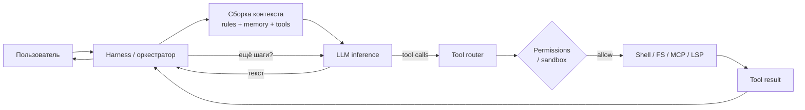
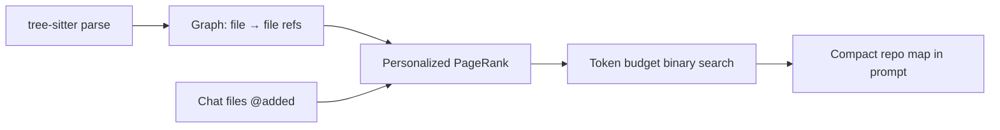

*Статья «[От sync к акторам](/vairl/blog/2026/07/10/python-async-evolution-actors-ru/)» · архитектуры coding-агентов*

После разбора механизмов конкурентности и [сетей Петри](/vairl/blog/2026/07/10/python-async-evolution-actors-ru/) логичный следующий шаг — посмотреть, как те же идеи реализованы в **production coding agents**: Claude Code, Cursor, Codex CLI, OpenCode и **Aider** (часто на слух пишут «aider» / «айдер»). Под «Cloud Code» обычно имеют в виду **Claude Code** (Anthropic), а не Google Cloud Code.

Все перечисленные системы — не «просто чат с моделью», а **agent harness**: цикл «модель → tool call → результат → снова модель», плюс память, права доступа и сжатие контекста.

## Общий каркас: agent loop

Независимо от бренда, coding agent почти всегда сводится к одной схеме:



**Harness** — прослойка вокруг модели: он решает, *какие* tools доступны, *какой* контекст подмешать, *когда* сжимать историю и *где* остановиться. Модель предлагает действия; harness исполняет их по правилам.

| Слой | За что отвечает |
|------|-----------------|
| **Session** | История сообщений, parts/tool outputs, стоимость, recovery после сбоя |
| **Memory** | Правила и знания *между* сессиями (файлы, индекс, SQLite) |
| **Tools** | Read/Edit/Bash, MCP, LSP diagnostics, subagent `task` |
| **Permissions** | allow / deny / ask; read-only режимы; sandbox |
| **Compaction** | Prune, summarize, collapse — когда контекст переполняется |

Подробнее про Cursor как IDE-harness — в [справочнике senior vibe-coder](/vairl/blog/2026/07/04/cursor-senior-vibe-coder-handbook-ru/).

## Сравнение архитектур

| Система | Оболочка | Ядро loop | Память | Изоляция / права | Subagents |
|---------|----------|-----------|--------|------------------|-----------|
| **Claude Code** | CLI / IDE plugin | `while tool_use` + Responses API | `CLAUDE.md`, auto memory, skills | Permission modes, checkpoints, sandbox | `Task` / Agent tool, depth=1 |
| **Cursor** | IDE (agent-first) | Agent harness + Composer | Rules, skills, semantic index, `@` context | Smart approve, modes Ask/Plan/Agent | Subagents, cloud agents, worktrees |
| **Codex CLI** | Terminal / IDE ext | Rust `codex-core`, Responses API | Rollout + compaction endpoint | OS sandbox + `execpolicy` rules | Threads, MCP tools |
| **OpenCode** | TUI / desktop / IDE | `SessionPrompt.loop` + event bus | SQLite parts, AGENTS.md, compaction agent | Permission ruleset per agent profile | Build / Plan + explore / general subagents |
| **Aider** | Terminal (Python) | Chat loop + edit formats | **Repo map** (PageRank), chat files | Git-only edits, `.aiderignore` | Нет классических subagents; map + `@files` |

Ниже — по каждой системе: принцип работы, организация памяти и отличительная черта.

---

## Claude Code (Anthropic)

**Суть:** тонкий, но зрелый orchestration layer вокруг Claude. Не vector-RAG «из коробки» — упор на **grep/glob**, точечное чтение файлов и **subagents** с отдельным context window.

**Agent loop:** классический цикл `while` модель возвращает tool call → harness исполняет → результат append в историю → следующий inference. System reminders подмешиваются к user message в зависимости от состояния TODO и последнего tool.

**Tools (ядро):** Bash, Read, Edit, Write, Grep, Glob, Task (subagent), TodoWrite. Расширение — **MCP**, hooks, skills, plugins.

**Память:**

| Тип | Механизм | Характер |
|-----|----------|----------|
| In-session | Conversation + tool outputs | Растёт до compaction |
| Project | `CLAUDE.md`, path-scoped rules | Markdown в репо; *контекст*, не hard policy |
| Cross-session | Auto memory, agent `memory: user` | Файлы вроде `MEMORY.md` у subagent |
| Subagent | Отдельное окно; в parent — только summary | Защита main thread от шума |

**Compaction pipeline:** budget reduction → snip tool outputs → microcompact → context collapse → auto-compact summary.

**Subagents:** `Task` spawn изолированного агента (часто Haiku для explore). Parent получает финальный ответ; промежуточные grep/read не раздувают main context.

**Отличие:** минималистичный loop + сильные **long-session tricks** (compaction, reminders, subagents) вместо тяжёлого multi-agent debate.

---

## Cursor

**Суть:** IDE, где agent — first-class citizen. **Agent harness** подстраивает instructions и tool surface под конкретную frontier-модель.

**Agent loop:** тот же observe–act, но с **режимами** (Ask / Plan / Agent / Debug), `@`-контекстом и **semantic codebase index** (chunk → embedding → retrieval по смыслу, не только по path).

**Память и контекст:**

| Слой | Где живёт | Роль |
|------|-----------|------|
| Rules | `.cursor/rules/`, AGENTS.md, team rules | Статические инструкции |
| Skills | `.cursor/skills/` | Процедурные «как делать» on demand |
| Dynamic | `@file`, `@folder`, semantic search | Точечная подача кода |
| MCP | `.cursor/mcp.json` | Внешние tools (Slack, DB, browser…) |

**Параллелизм:** до 8 **parallel agents** в изолированных **git worktrees**; cloud agents для фоновых задач; best-of-N на разных моделях.

**Отличие:** глубокая интеграция с **редактором** и **context engineering** (rules + index + MCP), а не только terminal loop.

---

## Codex CLI (OpenAI)

**Суть:** production terminal agent на **Rust** (`codex-rs`): `ThreadManager`, `Session`, `ToolRouter`, platform sandbox.

**Agent loop:** Responses API stream → tool calls → `ToolOrchestrator` (approval → sandbox → exec → retry) → items append → repeat. История на каждый шаг **stateless** (полный input), с **compaction endpoint** при переполнении окна.

**Память:**

| Компонент | Описание |
|-----------|----------|
| Session items | Текст, reasoning, tool I/O, compaction parts |
| AGENTS.md / instructions | Project guidance |
| Rollout logs | Аудит и воспроизводимость |

**Sandbox (не Docker по умолчанию):** macOS Seatbelt, Linux Landlock/seccomp/bubblewrap, Windows restricted token. Режимы `read-only`, `workspace-write`, `danger-full-access`. **`execpolicy`** — DSL-правила в `~/.codex/rules/*.rules`.

**MCP:** tools с **собственными** guardrails; sandbox Codex на них не распространяется.

**Отличие:** **security-first harness** на системных механизмах ОС + явная политика exec approval.

---

## OpenCode

**Суть:** open-source agent с **client–server** архитектурой: HTTP server + TUI/desktop/IDE clients; worker thread для I/O (LLM, FS, MCP).

**Agent loop:** `SessionPrompt.loop()` → `SessionProcessor` consumes stream → persist **parts** в SQLite → tools через permission engine → doom-loop detection (одинаковые tool args → pause).

**Память:**

| Механизм | Детали |
|----------|--------|
| SQLite session | Каждый chunk, tool call, reasoning — отдельный `part`; crash recovery |
| AGENTS.md | Project rules |
| Compaction | Hidden `compaction` agent summarizer при нехватке tokens |
| Prune | Старые tool outputs режутся до summarize |

**Agents как profiles:** **Build** (full tools) vs **Plan** (write tools *убраны из списка*, не «просьба в prompt»). Subagents: **explore** (read-only), **general**, **scout** — через `task` tool в отдельной session.

**Event bus:** decoupling UI, LSP, storage, tools; SSE на клиенты.

**Отличие:** **permission ruleset = capability model**; открытый эталон «как собрать production agent OS».

---

## Aider (Python, terminal)

**Суть:** pair-programming в терминале на **Python**; сильный акцент на **repo map**, а не на bash-ориентированный loop.

**Agent loop:** user message → attach **repo map** + выбранные файлы → LLM → **structured edit** (whole file / diff / patch) → apply через git → repeat.

**Память — главная инновация:**



1. **tree-sitter** извлекает defs/refs по языкам.
2. Строится граф зависимостей файлов.
3. **PageRank** с персонализацией на файлы из чата.
4. В prompt попадает elided map в пределах `--map-tokens` (≈1k по умолчанию).
5. LLM может запросить **полный файл** — aider добавит в chat context.

Кеш map по mtime; `.aiderignore` для vendor/generated.

**Tools:** по сути edit + git; нет тяжёлого shell agent loop как у Claude Code.

**Отличие:** **graph-based automatic context** вместо «модель сама grep'ает всё» — хороший reference для Python-реализации memory layer.

---

## IDE-агент как класс

**Cursor**, расширения **Codex** / **Claude Code** в VS Code, **OpenCode IDE plugin** — один паттерн:

- UI = chat + diff + permissions UI
- LSP = diagnostics feedback loop
- Local FS + terminal через sandbox
- Project rules в markdown рядом с кодом

Разница не в «есть ли loop», а в **глубине интеграции**: semantic index (Cursor), LSP stream (OpenCode), inline diff (все).

---

## Память: три стратегии

| Стратегия | Пример | Плюс | Минус |
|-----------|--------|------|-------|
| **File rules** | CLAUDE.md, AGENTS.md, `.cursor/rules` | Прозрачно, version control | Не масштабируется на 10k файлов |
| **Structured index** | Cursor semantic search, Aider repo map | Автоматический отбор контекста | Стоимость индекса / parse |
| **Session store** | OpenCode SQLite, Codex items | Recovery, audit | Нужна compaction политика |

Для агентной **platform** (не IDE) обычно комбинируют: file rules для политик + vector/graph index для retrieval + session store для trace.

---

## Минимальный аналог на Python

Ниже — учебный **~120 строк**, повторяющий каркас OpenCode/Aider/Codex: session, tools, permissions, asyncio loop, простая **memory** (rules file + message history) и заготовка subagent.

```python
#!/usr/bin/env python3
"""Minimal coding-agent harness: loop + tools + permissions + file memory."""
from __future__ import annotations

import asyncio
import json
from dataclasses import dataclass, field
from pathlib import Path
from typing import Any, Awaitable, Callable

ToolFn = Callable[[dict[str, Any]], Awaitable[str]]


@dataclass
class ToolSpec:
    name: str
    description: str
    handler: ToolFn
    permission: str = "allow"  # allow | ask | deny


@dataclass
class Session:
    messages: list[dict[str, Any]] = field(default_factory=list)
    parts: list[dict[str, Any]] = field(default_factory=list)

    def append(self, role: str, content: str) -> None:
        self.messages.append({"role": role, "content": content})
        self.parts.append({"type": "message", "role": role, "content": content})


class PermissionEngine:
    def __init__(self, rules: dict[str, str]) -> None:
        self.rules = rules  # tool_name -> allow|deny|ask

    def check(self, tool: str) -> str:
        return self.rules.get(tool, "ask")


class FileMemory:
    """AGENTS.md / CLAUDE.md style project memory."""

    def __init__(self, root: Path) -> None:
        self.root = root

    def load_rules(self) -> str:
        chunks: list[str] = []
        for name in ("AGENTS.md", "CLAUDE.md", ".cursor/rules/agent.mdc"):
            path = self.root / name
            if path.is_file():
                chunks.append(f"## {name}\n{path.read_text(encoding='utf-8')[:4000]}")
        return "\n\n".join(chunks) or "(no project rules)"


class SimpleRepoMap:
    """Tiny stand-in for Aider map: list Python defs in repo."""

    def summarize(self, root: Path, budget_chars: int = 2000) -> str:
        lines: list[str] = []
        for path in sorted(root.rglob("*.py"))[:40]:
            if ".venv" in path.parts:
                continue
            text = path.read_text(encoding="utf-8", errors="ignore")
            defs = [ln.strip() for ln in text.splitlines() if ln.startswith(("def ", "class "))][:5]
            if defs:
                lines.append(f"{path.relative_to(root)}: " + "; ".join(defs))
        blob = "\n".join(lines)
        return blob[:budget_chars]


@dataclass
class AgentProfile:
    name: str
    tools: set[str]
    system_preamble: str


class CodingAgentHarness:
    def __init__(
        self,
        profile: AgentProfile,
        registry: dict[str, ToolSpec],
        permissions: PermissionEngine,
        memory: FileMemory,
        llm: Callable[[list[dict[str, Any]]], Awaitable[dict[str, Any]]],
    ) -> None:
        self.profile = profile
        self.registry = registry
        self.permissions = permissions
        self.memory = memory
        self.llm = llm

    def _build_context(self, session: Session, repo_map: str) -> list[dict[str, Any]]:
        system = (
            f"{self.profile.system_preamble}\n\n"
            f"# Project rules\n{self.memory.load_rules()}\n\n"
            f"# Repo map\n{repo_map}\n"
        )
        return [{"role": "system", "content": system}, *session.messages]

    async def run_tool(self, name: str, args: dict[str, Any]) -> str:
        if name not in self.profile.tools:
            return f"error: tool {name!r} not allowed for profile {self.profile.name!r}"
        spec = self.registry.get(name)
        if not spec:
            return f"error: unknown tool {name!r}"
        decision = self.permissions.check(name)
        if decision == "deny":
            return f"error: permission denied for {name!r}"
        if decision == "ask":
            # production: UI prompt; here — auto-approve read-only
            if name not in {"read_file", "repo_map"}:
                return f"error: approval required for {name!r}"
        return await spec.handler(args)

    async def loop(self, session: Session, user: str, repo_root: Path, max_steps: int = 8) -> str:
        session.append("user", user)
        repo_map = SimpleRepoMap().summarize(repo_root)

        for step in range(max_steps):
            response = await self.llm(self._build_context(session, repo_map))
            if response.get("type") == "text":
                text = response["content"]
                session.append("assistant", text)
                return text

            if response.get("type") == "tool_call":
                name = response["name"]
                args = response.get("arguments", {})
                result = await self.run_tool(name, args)
                session.append("tool", json.dumps({"tool": name, "result": result}, ensure_ascii=False))
                continue

            return "error: invalid llm response"

        return "error: max steps exceeded"


# --- stub LLM: replace with OpenAI / Anthropic client ---
async def stub_llm(messages: list[dict[str, Any]]) -> dict[str, Any]:
    last = messages[-1]["content"]
    if last.startswith('{"tool"'):
        return {"type": "text", "content": "Done: applied changes."}
    return {
        "type": "tool_call",
        "name": "read_file",
        "arguments": {"path": "README.md"},
    }


async def main() -> None:
    root = Path(".")

    async def read_file(args: dict[str, Any]) -> str:
        path = root / args["path"]
        return path.read_text(encoding="utf-8")[:8000] if path.is_file() else "missing"

    registry = {
        "read_file": ToolSpec("read_file", "Read UTF-8 file", read_file),
        "bash": ToolSpec("bash", "Run shell", lambda _: asyncio.sleep(0), permission="ask"),
    }
    profile = AgentProfile(
        name="explore",
        tools={"read_file", "repo_map"},
        system_preamble="You are a read-only codebase agent.",
    )
    perms = PermissionEngine({"read_file": "allow", "bash": "deny"})
    harness = CodingAgentHarness(profile, registry, perms, FileMemory(root), stub_llm)

    session = Session()
    answer = await harness.loop(session, "Explain project layout", root)
    print(answer)
    print("parts logged:", len(session.parts))


if __name__ == "__main__":
    asyncio.run(main())
```

**Что здесь соответствует реальным агентам:**

| Компонент класса | Claude Code / Codex | OpenCode | Cursor | Aider |
|------------------|---------------------|----------|--------|-------|
| `Session` + `parts` | conversation items | SQLite parts | chat history | messages + edits |
| `FileMemory` | CLAUDE.md | AGENTS.md | rules / skills | — |
| `SimpleRepoMap` | grep/glob | explore subagent | semantic index | **repo map** |
| `AgentProfile.tools` | tool list | permission ruleset | Agent vs Plan mode | read-only vs edit |
| `PermissionEngine` | permission modes | allow/deny/ask | Smart approve | git-only apply |
| `loop()` | agent loop | SessionPrompt.loop | harness | chat turns |

Следующий шаг для «боевого» аналога: подключить real LLM API с function calling, compaction при `len(tokens) > budget`, и **subagent** как `asyncio.create_task(harness.loop(...))` с отдельным `Session`, возвращающим только summary — паттерн Claude Code `Task` и OpenCode `task` tool.

---

## Связь с asyncio и Petri net

Coding agents — частный случай [конкурентности из основной статьи](/vairl/blog/2026/07/10/python-async-evolution-actors-ru/):

- **Semaphore** на LLM provider = позиция `provider_slots` в сети Петри.
- **Subagent** = отдельная подсеть с собственным context window; parent ждёт `await subagent`.
- **Compaction** = переход, сжимающий marking истории, сохраняя `done`-достижимость.
- **OpenCode worker thread** = I/O-bound loop вне UI, как `asyncio.to_thread` для blocking tools.

---

## Практический выбор

| Задача | Куда смотреть |
|--------|---------------|
| Terminal, open source, изучать internals | **OpenCode** |
| Terminal, sandbox + enterprise policy | **Codex CLI** |
| IDE, team rules, parallel agents | **Cursor** |
| Minimal CLI, сильный repo context на Python | **Aider** |
| Subagents + long session на Claude | **Claude Code** |
| Свой orchestrator | Python harness выше + [Petri net](/vairl/blog/2026/07/10/python-async-evolution-actors-ru/) для лимитов |

Термины — в [глоссарии серии](/vairl/blog/2026/07/10/python-async-evolution-glossary-ru/).
