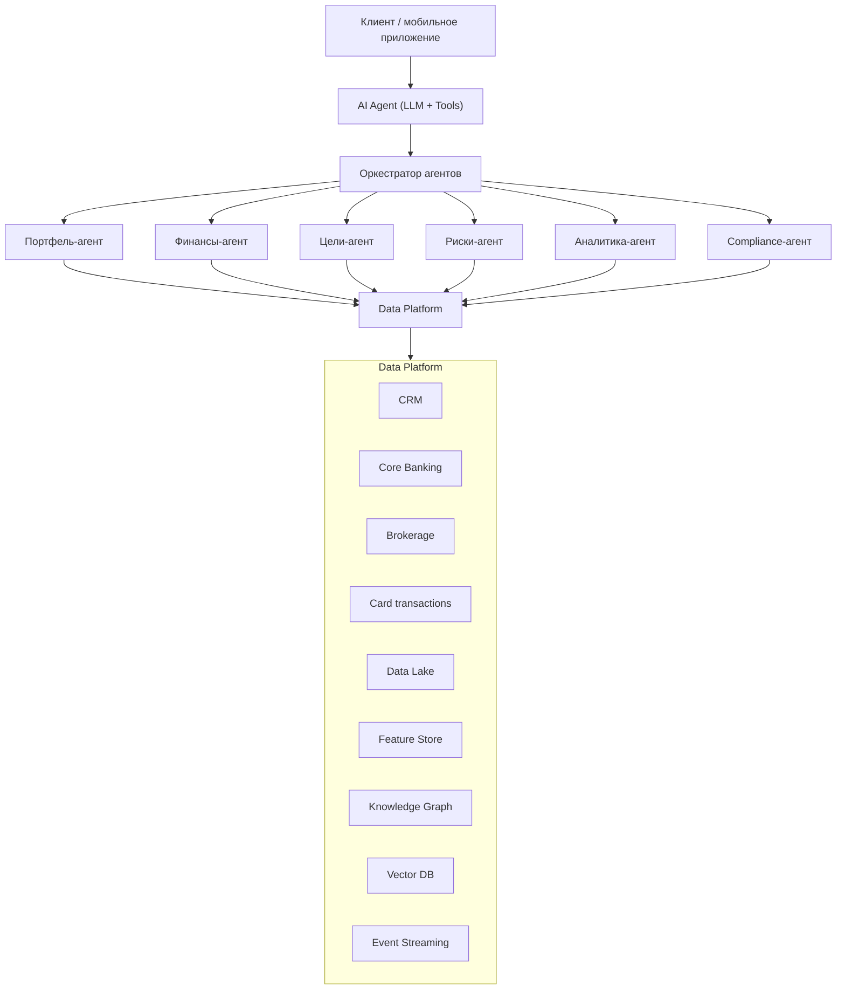
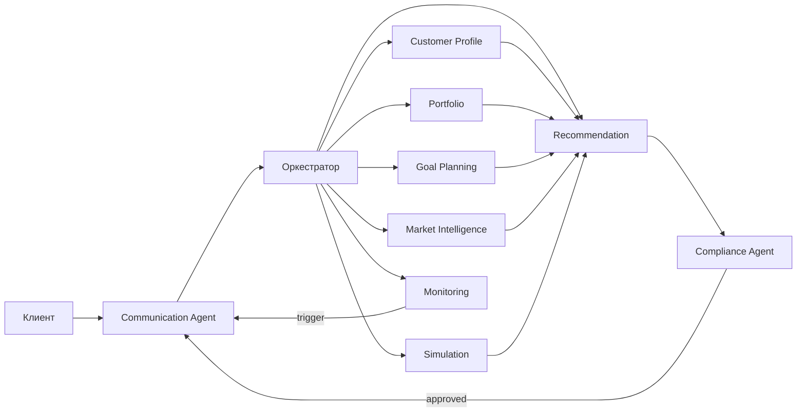
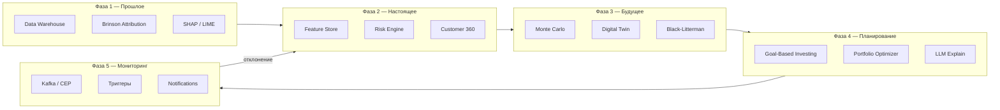

### TL;DR

Инвестиционный AI-ассистент банка не «отвечает на вопросы» — он ведёт клиента к финансовым целям: объясняет, что случилось с портфелем, проверяет текущее состояние, проигрывает сценарии будущего и следит за планом в фоне. Разбираем типовую архитектуру таких платформ — того класса систем, который строят JPMorgan, Morgan Stanley, UBS и Сбер, — от схемы до конкретных математических моделей.

- **Решения принимает математика, а не LLM.** Портфель считают Markowitz, Monte Carlo и risk engine; LLM только объясняет результат человеческим языком.
- **Не один бот, а девять агентов.** Портфель, цели, риски, аналитика, мониторинг — у каждого своя зона, и ни одна рекомендация не дойдёт до клиента мимо compliance-агента.
- **Всё держится на Customer 360.** Система знает доходы, расходы, цели и даже поведение клиента при просадках — иначе персонализация не работает.
- **Каждый запрос сначала классифицируется.** Три оси (что за задача → как исполнять → как проверять) решают, кто её выполнит: solver (детерминированный вычислитель — оптимизатор, движок атрибуции), гибридный pipeline или диалоговый агент.

**Погружение по разделам** — открывайте только нужный блок:

1. [Что должен уметь агент](#agent-capabilities) — две функции и пять фаз цикла
2. [Общая архитектура](#architecture) — схема платформы и Data Platform
3. [Customer 360](#customer-360) — профиль клиента: доходы, цели, предпочтения
4. [Технологический стек](#tech-stack) — Data Lake, RAG, Kafka, Digital Twin
5. [Пять фаз: технологии](#lifecycle) — что работает на каждом этапе
6. [Мультиагентная архитектура](#multi-agent) — 9 специализированных агентов
7. [Математические модели](#math-models) — полная таблица моделей
8. [Конвейер](#pipeline) — как фазы связаны в pipeline
9. [Классификация задач](#task-classification) — три оси и маршрутизация (кратко; полный разбор — часть 2)
10. [Куда движется индустрия](#industry-trends) — три тренда

Иван, 34 года, открывает банковское приложение после недели, за которую его портфель просел на 8%, и спрашивает: «продавать?» Что произойдёт дальше — решит не LLM. Ответ соберут движок атрибуции, risk engine и портфельный оптимизатор, compliance-модуль проверит его на соответствие риск-профилю, и только потом языковая модель переведёт цифры в спокойное человеческое объяснение.

Так работает **AI Wealth Management Platform** — класс систем, который строят JPMorgan, Morgan Stanley, Goldman Sachs, UBS, Сбер и Т-Банк: композиция аналитических моделей, рекомендательных движков, LLM, RAG и event-driven архитектуры поверх классических банковских систем. Для инженера агентных систем это один из самых требовательных доменов: мультиагентность, потоковые события, финансовая математика и жёсткий compliance сходятся в одном контуре. Ниже — как это устроено, слой за слоем; Иван и его цель «квартира к 2030» пройдут с нами через все пять фаз.

<figure style="margin: 2em auto; text-align: center;">
  
  <figcaption style="font-size: 0.9em; color: #666; max-width: 720px; margin: 0 auto;">Типичная многоуровневая архитектура инвестиционного AI-ассистента в банке</figcaption>
</figure>

---

## Что должен уметь агент {#agent-capabilities}

Две базовые функции задают весь контур системы:

1. **На основе знаний о клиенте** — портфель, доходы и расходы, инвестиционные продукты, текущая ситуация, прогнозы аналитиков — формировать и вести клиента к финансовым целям.
2. **Знать всё о клиенте**: доходы, расходы, планы, цели, семейное положение, нефинансовые активы, предпочтения, поведенческие паттерны.

Цикл работы с клиентом разбивается на пять фаз. Для Ивана (зарплата 250 000 ₽, ипотека, цель — квартира к 2030) они выглядят так:

| Фаза | Название | Что получает Иван |
|------|----------|-------------------|
| 1 | **Прошлое** (ретроспектива) | Объяснение, почему портфель просел на 8% и какие бумаги виноваты |
| 2 | **Настоящее** (диагностика) | Диагноз: доля акций разъехалась с целевой, кэш простаивает |
| 3 | **Будущее** (прогнозирование) | Сценарий «что если куплю квартиру через 3 года, а не через 5» |
| 4 | **Планирование** | План пополнений и распределения активов с контрольными точками |
| 5 | **Мониторинг** | Push «пришла премия + до цели не хватает — пополнить?» без захода в приложение |

Ключевой принцип: **LLM не принимает инвестиционных решений**. Она объясняет, ведёт диалог, интерпретирует данные и составляет отчёты. Решения принимают детерминированные и ML-модели — портфельный оптимизатор, rule engine, recommendation engine — с обязательной проверкой compliance-агентом.

---

## Общая архитектура {#architecture}

Клиент взаимодействует с единым AI-агентом в приложении. Тот делегирует задачи оркестратору, который маршрутизирует запросы специализированным агентам. Все агенты читают и пишут в общую Data Platform, объединяющую банковские системы, рыночные данные и ML-инфраструктуру.

---

## Customer 360: профиль клиента {#customer-360}

Основа всей системы — единый цифровой профиль. Без него ни RAG, ни рекомендации, ни сценарное моделирование не работают.

### Доходы

Зарплата, дивиденды, купоны, аренда, проценты по депозитам — всё агрегируется из core banking, брокерских счетов и карточных транзакций.

### Расходы

Категоризация трат: еда, транспорт, путешествия, ипотека, кредиты, коммунальные, подписки, образование, дети. Источник — карточные и счётные операции плюс ручной ввод клиента.

### Активы

| Финансовые | Нефинансовые |
|------------|--------------|
| Акции, облигации, ETF, фонды | Квартира, машина |
| Депозиты, золото | Бизнес, криптовалюта |
| | Предметы искусства |

### Обязательства

Ипотека, потребительские кредиты, налоговые выплаты, страховые премии.

### Цели

Покупка квартиры, пенсия, учёба ребёнка, путешествие, финансовая независимость — каждая цель с горизонтом, целевой суммой и приоритетом.

### Предпочтения и ограничения

Любит дивиденды, не любит рисковать, интересуется AI, не инвестирует в нефть, не покупает табак, ESG-фильтры — всё это попадает в constraint engine рекомендаций.

### Поведение

Панически продаёт при падении, любит докупать на просадках, редко читает аналитику, часто открывает приложение — поведенческие признаки идут в Feature Store и влияют на тон коммуникации.

---

## Технологический стек {#tech-stack}

### Data Lake

Практически всегда — S3, HDFS, Delta Lake или Iceberg. Складывается всё: история операций, логи, рыночные котировки, новости, аналитические отчёты, чаты, телефонные разговоры, email, CRM-записи.

### Feature Store

Признаки клиента для ML: средний доход, доходность портфеля, просадка, Sharpe, volatility, LTV, возраст, наличие детей и ипотеки, размер кэша, вероятность оттока. Популярные решения: Feast, Hopsworks, собственные реализации.

### Customer Knowledge Graph

Граф связывает клиента с его счетами, картами, покупками, доходами, портфелем, компаниями, новостями, макроэкономикой и советами. Пример цепочки рассуждений:

> Иван → Apple → AI → NVIDIA → полупроводники → рост спроса → увеличить долю?

Технологии: Neo4j, Amazon Neptune, TigerGraph, Memgraph.

### Векторная БД и RAG

Векторный индекс строится по аналитике, отчётам, новостям, законам, FAQ, стратегиям, финансовым исследованиям. Pinecone, Milvus, Qdrant, pgvector, Weaviate.

LLM получает через RAG: портфель, новости, аналитику, историю клиента, прогноз, макроэкономику — и только потом отвечает. Без RAG ответы устаревают за часы.

### Recommendation Engine

Сердце системы. Три уровня:

| Уровень | Примеры | Когда |
|---------|---------|-------|
| **Rule Engine** | «возраст > 55 → снизить риск» | Детерминированные политики |
| **ML Recommendation** | XGBoost, CatBoost, Gradient Boosting | Персонализация продуктов |
| **Reinforcement Learning** | MDP, policy gradient | Долгосрочная оптимизация стратегии |

Портфельная оптимизация — классика: Markowitz, Black–Litterman, Risk Parity, CVaR, Kelly.

### Event Streaming и CEP

Kafka, Pulsar или Redpanda. События: дивиденды, падение курса, рост инфляции, зарплата, новость, рождение ребёнка.

**Complex Event Processing** анализирует потоки:

> зарплата выросла + остаток > 500 000 + цель «квартира» → предложить стратегию накопления

### Time Series Forecasting

ARIMA, Prophet, GARCH, LSTM, Temporal Fusion Transformer, PatchTST — для прогноза доходов, расходов, волатильности и макропоказателей.

### Explainable AI

Клиент должен понимать, почему появилась рекомендация. SHAP, LIME, counterfactual explanations — обязательный слой между ML-моделью и Communication Agent.

### Digital Twin клиента

Виртуальная финансовая модель: можно проигрывать «что если» — купить квартиру, сменить работу, родится ребёнок, кризис, курс доллара +20%, инфляция 15%. Основа для интерактивного сценарного анализа в фазе «Будущее».

---

## Пять фаз жизненного цикла: технологии {#lifecycle}

### 1. Прошлое — ретроспектива

Иван спрашивает: «почему −8%?» Агент раскладывает просадку по полочкам: −5% дал перегруженный технологический сектор, −2% — валютная переоценка, −1% — неудачная точка входа в марте. Это не LLM «рассуждает» — это Brinson Attribution разложил доходность на allocation effect (выбор классов активов), selection effect (выбор конкретных бумаг) и interaction effect, а SHAP показал вклад каждого фактора.

**Технологии:** Data Warehouse, Time Series DB, attribution analysis, Brinson Attribution, Explainable AI.

**Ответы клиенту:** почему портфель вырос или упал, какие активы внесли основной вклад, какие решения были удачными, как результат соотносится с бенчмарком.

### 2. Настоящее — диагностика и навигация

Агент проверяет портфель Ивана и находит: доля акций США разъехалась с целевой на 6% (это называется drift — дрейф от целевого распределения), 400 000 ₽ кэша простаивают на счёте, а фактический риск выше анкетного профиля. Диагноз уходит в сервис портфельных рекомендаций как структурированный контекст — не как свободный текст.

**Технологии:** Feature Store, Risk Engine, Recommendation Engine, Customer 360, Event Streaming.

**Оценивается:** структура активов, соответствие риск-профилю, drift, ликвидность, налоговая эффективность, свободный денежный поток.

### 3. Будущее — прогнозирование

Иван двигает ползунок: «а если купить квартиру не в 2030, а в 2028?» Digital Twin пересчитывает: вероятность достичь цели падает с 78% до 54%, но растёт обратно до 71%, если увеличить ежемесячное пополнение на 15 000 ₽. Под капотом — Monte Carlo прогоняет тысячи сценариев рынка, ставок и доходов семьи.

**Технологии:** Monte Carlo Simulation, Black–Litterman, макроэкономические сценарии, Digital Twin, модели временных рядов.

Клиент видит не один прогноз, а веер сценариев с вероятностями — и меняет параметры в реальном времени.

### 4. Планирование

Из выбранного сценария рождается план: целевая доходность 9% годовых, пополнение 40 000 ₽ в месяц, распределение 60/30/10 (акции/облигации/золото), контрольные точки каждые полгода. Оптимизатор считает распределение, rule engine накладывает ограничения («не больше 15% в одной бумаге»), LLM объясняет план Ивану простыми словами.

**Технологии:** Goal-Based Investing (GBI), Portfolio Optimizer, Rule Engine, LLM для объяснения плана.

На этом же этапе создаются **индивидуальные триггеры** — правила, которые Monitoring Agent будет отслеживать в фоне.

### 5. Мониторинг

Через три месяца Ивану приходит push: «Пришла годовая премия, а до контрольной точки по цели не хватает 60 000 ₽ — пополнить сейчас?» Иван не заходил в приложение — событие «зарплата выросла» поймал Kafka, CEP сопоставил его с целью и остатком, триггер сработал, LLM сформулировала сообщение.

**Технологии:** Kafka/Pulsar, CEP, триггерный движок, Recommendation Engine, Notification Service, LLM для персонализированной коммуникации.

**Примеры триггеров:**

| Событие | Действие |
|---------|----------|
| Отклонение портфеля от целевой структуры > 5% | Ребалансировка |
| Достижение цели по накоплениям | Предложить следующий шаг |
| Существенное изменение риск-профиля | Пересмотр плана |
| Новая инвестиционная возможность | Персонализированное уведомление |
| Изменение налогового законодательства | Обновление стратегии |
| Ухудшение макроэкономики | Стресс-тест портфеля |

Мониторинг работает **в фоне** — клиенту не нужно заходить в приложение, чтобы получить проактивный сигнал.

---

## Мультиагентная архитектура {#multi-agent}

Современные банки переходят от одного универсального помощника к специализированным агентам:

| Агент | Функции |
|-------|---------|
| **Customer Profile Agent** | Поддерживает Customer 360, обновляет профиль |
| **Portfolio Agent** | Состав портфеля, риск, доходность, ребалансировка |
| **Goal Planning Agent** | Формулировка и уточнение финансовых целей |
| **Market Intelligence Agent** | Новости, исследования, макроэкономика через RAG |
| **Simulation Agent** | Сценарии «что если», Monte Carlo |
| **Recommendation Agent** | Инвестиционные рекомендации на основе всех данных |
| **Compliance Agent** | Соответствие регуляторным и внутренним политикам |
| **Communication Agent** | Объяснение рекомендаций, диалог с клиентом |
| **Monitoring Agent** | Фоновое отслеживание, проактивные уведомления |

Разделение ответственности даёт три преимущества: **объяснимость** (каждый агент логирует свой вклад), **масштабируемость** (можно обновлять Portfolio Agent без перезапуска всей системы) и **compliance** (рекомендация не доходит до клиента без проверки Compliance Agent).

---

## Математические модели {#math-models}

Современный AI-ассистент инвестора использует **не одну модель, а композицию из десятков**, объединённых в единый конвейер. Для плана Ивана на квартиру реально работают три: Markowitz считает распределение активов, Monte Carlo — вероятность успеть к 2030, Black–Litterman вписывает прогнозы аналитиков в рыночное равновесие.

### Что используют чаще всего

| Категория | Наиболее распространённые модели |
|-----------|--------------------------------|
| Управление портфелем | Марковиц, Black–Litterman, Risk Parity |
| Оценка риска | VaR, CVaR, GARCH, Maximum Drawdown |
| Прогнозирование | ARIMA, Prophet, LSTM, Temporal Fusion Transformer |
| Сценарный анализ | Monte Carlo Simulation |
| Персонализация | XGBoost, CatBoost, Knowledge Graph |
| Оптимизация решений | MDP, Reinforcement Learning |
| Объяснение рекомендаций | SHAP, LIME |
| Долгосрочное планирование | Goal-Based Investing + Monte Carlo + Black–Litterman |

### Полный каталог — для поиска своей задачи

Не читайте таблицу подряд: найдите свою задачу в первой колонке.

Развернуть полную таблицу моделей (~50 строк)

| Задача | Модель | Что вычисляет | Где применяется |
|--------|--------|---------------|-----------------|
| Доходность | Простая и логарифмическая доходность | ROI, CAGR | Анализ истории |
| Риск | Дисперсия, стандартное отклонение | Волатильность | Оценка риска |
| Риск | Semi-Variance | Риск отрицательных движений | Консервативные стратегии |
| Риск | Value at Risk (VaR) | Максимальный ожидаемый убыток | Контроль риска |
| Риск | Conditional VaR (CVaR) | Средний убыток при превышении VaR | Управление риском |
| Доходность/риск | Sharpe Ratio | Доходность на единицу риска | Сравнение портфелей |
| Доходность/риск | Sortino Ratio | Доходность на отрицательный риск | Консервативные инвесторы |
| Доходность/риск | Calmar Ratio | Доходность к максимальной просадке | Долгосрочные стратегии |
| Просадка | Maximum Drawdown | Максимальное падение капитала | Контроль потерь |
| Альфа | Jensen Alpha | Превышение рынка | Анализ эффективности |
| Рыночный риск | CAPM | Ожидаемая доходность | Оценка активов |
| Многофакторная | Fama–French | Влияние факторов рынка | Анализ акций |
| Оптимизация | Mean-Variance (Марковиц) | Оптимальное распределение активов | Построение портфеля |
| Оптимизация | Black–Litterman | Объединение прогнозов и рынка | Wealth Management |
| Оптимизация | Risk Parity | Равный вклад риска | Институциональные портфели |
| Оптимизация | Minimum Variance | Минимизация риска | Консервативные стратегии |
| Оптимизация | Kelly Criterion | Оптимальная доля капитала | Управление капиталом |
| Оптимизация | Utility Optimization | Максимизация полезности | Персональные рекомендации |
| Стохастика | Geometric Brownian Motion | Моделирование цен | Монте-Карло |
| Стохастика | Ornstein–Uhlenbeck | Возврат к среднему | Процентные ставки |
| Стохастика | Heston Model | Стохастическая волатильность | Производные |
| Стохастика | Jump Diffusion | Резкие скачки цен | Кризисные сценарии |
| Прогноз | ARIMA | Линейный прогноз рядов | Макроэкономика |
| Прогноз | GARCH | Прогноз волатильности | Финансовые рынки |
| Прогноз | VAR | Взаимосвязанные показатели | Экономические системы |
| Прогноз | Prophet | Сезонность и тренды | Доходы, расходы |
| ML | XGBoost | Прогноз поведения клиента | Персонализация |
| ML | CatBoost | Вероятность покупки продукта | CRM |
| ML | Random Forest | Классификация клиентов | Риск |
| Deep Learning | LSTM | Последовательности | Прогноз денежных потоков |
| Deep Learning | Temporal Fusion Transformer | Многомерные ряды | Финансовые прогнозы |
| Deep Learning | PatchTST | Долгосрочный прогноз | Доходы и расходы |
| Байесовские | Bayesian Networks | Вероятности событий | Финансовое планирование |
| Байесовские | Bayesian Updating | Обновление прогнозов | Инвестиционный агент |
| Причинный анализ | Structural Causal Models | Причинно-следственные связи | Объяснение рекомендаций |
| Сценарный анализ | Monte Carlo | Тысячи сценариев | Планирование |
| Decision Theory | Markov Decision Process | Последовательные решения | Автоматический советник |
| RL | Reinforcement Learning | Максимизация долгосрочной прибыли | Робоэдвайзер |
| Графы | Knowledge Graph | Связи между объектами | Customer 360 |
| Рекомендации | Collaborative Filtering | Похожие клиенты | Инвестпродукты |
| Рекомендации | Content-Based Filtering | Похожие активы | Персональные рекомендации |
| Аномалии | Isolation Forest | Нетипичные операции | Антифрод |
| Аномалии | One-Class SVM | Отклонения поведения | Безопасность |
| Explainable AI | SHAP | Вклад факторов | Объяснение решений |
| Explainable AI | LIME | Локальное объяснение | Прозрачность |
| Оптимизация целей | Goal-Based Investing | Достижение финансовых целей | Финансовый план |
| Анализ портфеля | Brinson Attribution | Источники доходности | Ретроспектива |
| Корреляция | Covariance Matrix | Связь активов | Диверсификация |
| Зависимости | Copula Models | Совместное поведение активов | Стресс-тесты |
| Оптимизация | Convex Optimization | Решение инвестиционной задачи | Portfolio Optimizer |
| Многокритериальная | Pareto Optimization | Баланс риска, доходности, ликвидности | Персональный план |

---

## Как это складывается в конвейер {#pipeline}

Статистические методы оценивают риск, ML и deep learning прогнозируют потоки, оптимизационные алгоритмы формируют портфель, а LLM с RAG и Knowledge Graph — объясняют клиенту, что происходит и почему.

---

## Классификация задач инвестиционного агента {#task-classification}

Иван пишет ассистенту «помоги с инвестициями» — но это десяток разных задач: объяснить просадку, пересчитать портфель, смоделировать покупку квартиры или ответить на вопрос про дивиденды. Без классификатора оркестратор либо отправит всё в LLM, либо вызовет portfolio optimizer там, где нужен только RAG.

Поэтому router wealth-платформы работает **до** agent loop: запрос размечается тремя осями, и по результату выбирается исполнитель.

| Ось | Классификатор | Вопрос |
|-----|---------------|--------|
| **1. Предмет** | Пятиуровневая таксономия (Domain → Model → Method) | *О чём* задача, к какой модели относится? |
| **2. Исполнение** | Матрица L × D (автономность × детерминизм) | *Как* решать: автономность и детерминизм? |
| **3. Постановка** | [U–S–Y](/vairl/blog/2026/07/02/systems-theory-task-types-ru/) | *Что* задано, *что* найти? |

Результат классификации — маршрут до конкретного агента с нужным pipeline и верификатором:

| Классификация | Агент | Pipeline |
|---------------|-------|----------|
| `attribution` · symbolic | Portfolio Agent | Brinson engine |
| `convex_optimization` · symbolic | Recommendation Agent | Markowitz / BL solver |
| `monte_carlo` · hybrid | Simulation Agent | LLM slots → MC → report |
| `cep_monitoring` · symbolic · L4 | Monitoring Agent | Kafka → rules → trigger |
| `explanation` / `dialogue` | Communication Agent | RAG → LLM → Compliance |

Два принципа, которые держат систему в рамках банковской регуляторики: **зона риска L4–L5 × neural** (автономная торговля без human approve) в банках закрыта — сделки живут в L2–L3 × symbolic/hybrid; а классификация хранится как **данные** (`task_record` в базе задач), к которым симметрично привязана база бенчмарков с CI-гейтами.

Полный разбор — шкалы L0–L5 и D0–D5, каталог задач по фазам, схема базы задач и решений и «бенчмарк как сервис» — во второй части: [**«Классификация задач инвестиционного агента: база задач, матрица L×D и бенчмарк как сервис»**](/vairl/blog/2026/07/14/banking-agent-task-classification-ru/).

---

## Куда движется индустрия {#industry-trends}

Три тренда определяют развитие инвестиционных AI-ассистентов в ближайшие годы:

1. **От чат-бота к агентной платформе.** Один LLM с промптом заменяется оркестратором специализированных агентов с чётким разделением ответственности и compliance-контуром.

2. **От реактивного к проактивному.** Monitoring Agent с CEP и триггерами инициирует коммуникацию до того, как клиент сам заметит проблему.

3. **От «чёрного ящика» к объяснимости.** Регуляторы (MiFID II, SEC, ЦБ РФ) требуют, чтобы клиент понимал логику рекомендации. SHAP, LIME и counterfactual explanations — не опция, а необходимость.

Для инженера агентных систем банковский wealth management — один из самых требовательных доменов: здесь сходятся мультиагентная архитектура, event-driven processing, классическая финансовая математика, ML-персонализация и жёсткие compliance-ограничения. Именно поэтому этот домен часто становится эталоном для проектирования production-grade agentic systems.

**Куда дальше на VAIRL:**

- [Типы задач в теории систем (U–S–Y)](/vairl/blog/2026/07/02/systems-theory-task-types-ru/) — откуда берётся третья ось классификации;
- [Постановка задачи агенту](/vairl/blog/2026/07/04/agent-task-specification-ru/) — как Contract-этап защищает от неверной интерпретации запроса;
- [Генерация бенчмарков для агентов](/vairl/blog/2026/06/29/agent-benchmark-generation-ru/) — как тестировать такие платформы до продакшена.
