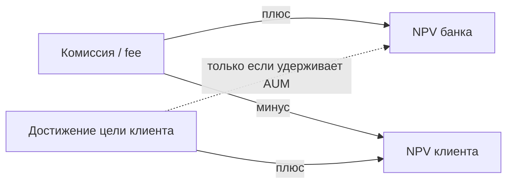
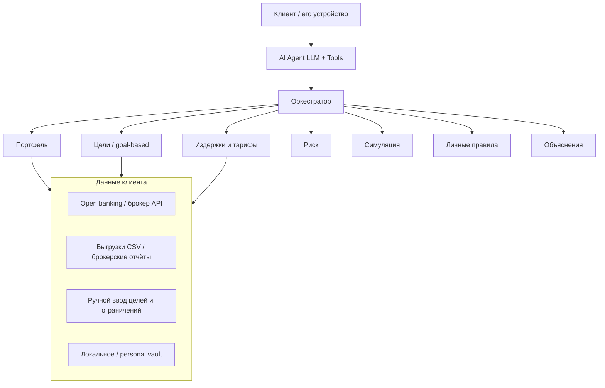

<div class="post-tldr" markdown="1">

### TL;DR

Я собирал AI wealth-ассистента **внутри банка** и упёрся не в LLM (*large language model*), а в экономику. **Банковский NPV** (*net present value*) и **клиентский NPV** — разные целевые функции. Банк максимизирует прибыль от клиента (fee, AUM — *assets under management*, кросс-селл, удержание). Клиент минимизирует свои затраты и максимизирует шанс достичь цели (квартира, пенсия) при своём риске. Пока агент живёт на стороне банка, он по умолчанию оптимизирует чужой NPV — даже если говорит «мы заботимся о вас».

- **DCF** (*discounted cash flow*) — способ привести будущие денежные потоки к сегодняшним деньгам. **NPV** — «стоит ли игра свеч» после дисконтирования.
- **Банк** считает NPV *клиента как актива*. **Клиент** считает NPV *своей цели и своих комиссий*.
- **Вывод:** ту же математику (портфель, Monte Carlo, мониторинг) разумнее крутить **на стороне клиента** — с его данными, его objective и его compliance к самому себе.
- Технически это всё ещё мультиагенты + solvers + LLM только для объяснений; меняется **чей NPV в loss-функции**.

</div>

<div class="post-decision" markdown="1">

### Ремарка: на чём стоит банк {#business-foundation}

Пока не агенты и не LLM. **Основа банковского бизнеса — дисконтированные денежные потоки (DCF, *discounted cash flow*) и NPV (*net present value*).**

Именно по NPV (часто рядом с LTV — *lifetime value* — клиента) принимаются решения: кого удерживать, какой продукт предложить, какой риск принять, какой пайплайн строить. Data Lake, Feature Store, скоры, рекомендательные движки, ассистенты в приложении — надстройки над одной первопричиной: *привести будущие деньги клиента к сегодняшней стоимости и максимизировать её для банка*.

**DCF** — метод («как привести потоки к сегодня»). **NPV** — вердикт («стоит ли» / «сколько стоит отношение»). Без этой оптики wealth-платформа выглядит набором фич; с ней — становится ясно, *зачем* вообще крутятся пайплайны и *чью* целевую функцию они оптимизируют.

Дальше в статье: формулы, NPV банка vs NPV клиента и почему агента логичнее ставить на сторону клиента.

</div>

<div class="post-decision" markdown="1">

### Решение на один слайд {#decision-slide}

1. **Что делать?** Собрать **клиентский** investment agent: личный Customer 360 (счета/брокерка через open banking или выгрузки) + оркестратор агентов + solvers под **клиентский DCF/NPV цели** + LLM для объяснений. Банковские API (*application programming interface*) — источники данных и исполнения по желанию клиента, не хозяева objective.

2. **Зачем?** У банка и клиента **противоположные** знаки у одних и тех же потоков: комиссия банка — доход банка и расход клиента; кросс-селл — NPV банка и часто минус к NPV клиента. Агент «на стороне банка» структурно тянет к банковскому NPV.

3. **Каким образом?** Явно развести две метрики → зафиксировать objective клиента → классификация задач → математика → личные правила (не bank policy) → объяснение. Eval на синтетике и Kaggle. Банк остаётся каналом, не владельцем целевой функции.

</div>

<div class="post-toc" markdown="1">

**Погружение по разделам:**

0. [Ремарка: на чём стоит банк](#business-foundation) — DCF/NPV как первопричина пайплайнов
1. [Решение на один слайд](#decision-slide)
2. [Как я к этому пришёл](#how-it-started)
3. [DCF и NPV без магии](#dcf-npv-basics)
4. [NPV банка: клиент как актив](#bank-npv)
5. [NPV клиента: цель и минимизация затрат](#client-npv)
6. [Где метрики сталкиваются](#conflict)
7. [Почему систему нужно делать на стороне клиента](#client-side)
8. [Что умеет агент и как разрабатывать](#agent-capabilities)
9. [Архитектура client-side](#architecture)
10. [Синтетика и Kaggle](#synthetic-eval)
11. [Пять фаз под клиентский NPV](#lifecycle)
12. [Мультиагенты и модели](#multi-agent)
13. [Код: от PV до оркестратора](#code-ladder) — примеры Python по нарастающей
14. [Классификация задач](#task-classification) — [часть 2](/vairl/blog/2026/07/14/banking-agent-task-classification-ru/)
15. [Выводы](#lessons)

</div>

---

## Как я к этому пришёл {#how-it-started}

На банковском проекте ко мне пришли не с «сделай GPT для инвесторов». Пришли с болью: после просадки клиент пишет «продавать?», шаблонный ответ, человек либо уходит, либо всё продаёт. Fee падает, LTV (*lifetime value*) падает, колл-центр горит.

Мы собрали то, что принято называть AI Wealth Management Platform: Customer 360, оркестратор, solvers, LLM только для текста, compliance-контур. Правило на доске было правильным технически:

> **LLM объясняет. Считает математика. Подписывает policy.**

Но policy и математика считали **не то, что думал клиент**. В бэклоге KPI (*key performance indicators*) звучали так: удержание, AUM (*assets under management*), take-up продукта, cost-to-serve. Для Ивана с целью «квартира к 2030» это чужие метрики. Его вопрос — *успею ли я при моих комиссиях, налогах и риске*, а не *останусь ли я в экосистеме банка*.

Именно тогда я начал раскладывать **две** NPV-задачи на одном и том же денежном потоке. Ниже — этот разбор и вывод: агента с такой силой лучше строить **на стороне клиента**.

<figure style="margin: 2em auto; text-align: center;">
  
  <figcaption style="font-size: 0.9em; color: #666; max-width: 720px; margin: 0 auto;">Та же многослойная схема работает и у банка, и у клиента — отличается то, чей NPV оптимизируется</figcaption>
</figure>

---

## DCF и NPV без магии {#dcf-npv-basics}

### DCF — *discounted cash flow*

**Дисконтированный денежный поток** — способ сказать: рубль через \(t\) лет стоит меньше рубля сегодня.

$$
\mathrm{PV} = \sum_{t=0}^{T} \frac{\mathrm{CF}_{t}}{(1+r)^{t}}
$$

- \(CF_t\) (*cash flow* в периоде \(t\)) — денежный поток (приток со знаком «+», отток «−»);
- \(r\) — ставка дисконта (стоимость денег / капитала / требуемая доходность с учётом риска);
- \(PV\) (*present value*) — приведённая стоимость всего потока.

Дисконт \(r\) — не «магия Excel». Для клиента это часто ожидаемая доходность альтернативы + премия за риск + инфляция (если потоки номинальные). Для банка — стоимость капитала, регуляторный капитал, стоимость фондирования, иногда hurdle rate дивизиона.

### NPV — *net present value*

**Чистая приведённая стоимость** — PV (*present value*) всех выгод минус PV всех затрат (включая «входной билет» сегодня):

$$
\mathrm{NPV} = -I_{0} + \sum_{t=1}^{T} \frac{\mathrm{CF}_{t}}{(1+r)^{t}}
$$

или просто сумма всех дисконтированных потоков, если \(I_0\) уже внутри \(CF_0\).

Правило простое:

| NPV | Смысл |
|-----|--------|
| **> 0** | После учёта стоимости денег проект/отношения/цель «стоят того» |
| **= 0** | Граница безразличия |
| **< 0** | В среднем разрушаете стоимость (при выбранном \(r\)) |

DCF — *метод*. NPV — *вердикт* по методу. Путаница начинается, когда одну и ту же букву «NPV» вешают на **разные** \(CF_t\) и разные \(r\).

Ниже — та же идея в коде (полный «лестничный» разбор — в [разделе с примерами](#code-ladder)). Самое простое: PV и NPV на чистом Python.

```python
def pv(cash_flows: list[float], r: float) -> float:
    """Приведённая стоимость: сумма CF_t / (1+r)^t."""
    return sum(cf / (1 + r) ** t for t, cf in enumerate(cash_flows))


def npv(cash_flows: list[float], r: float) -> float:
    """NPV = PV всех потоков (CF_0 уже со знаком «−» для инвестиции)."""
    return pv(cash_flows, r)


# Инвестировали 100 сегодня, через год +60, через два +60; r = 10%
flows = [-100.0, 60.0, 60.0]
print(round(npv(flows, 0.10), 2))  # → 4.13  (> 0 — «стоит того»)
```

---

## NPV банка: клиент как актив {#bank-npv}

Для банка клиент — не «человек с мечтой о квартире». Это **актив**, генерирующий потоки. Типичный банковский DCF / customer NPV (часто рядом с LTV — *lifetime value*):

### Что входит в \(CF_t\) банка

| Поток | Знак для банка | Откуда берётся |
|-------|----------------|----------------|
| Комиссии брокерские / success fee | **+** | Обороты, спреды |
| Management fee / % от AUM (*assets under management*) | **+** | Размер портфеля под управлением/учётом |
| Кросс-селл (карта, страховка, ипотека, депозит) | **+** | Propensity / take-up модели |
| Процентный доход за вычетом фондирования | **+** | Кредиты, остатки |
| Cost-to-serve (поддержка, пуши, LLM-токены, колл-центр) | **−** | Операционка |
| Бонусы, кэшбек, welcome | **−** | Маркетинг |
| Резервы / capital charge / ожидаемые потери | **−** | Риск, PD (*probability of default*) / LGD (*loss given default*) |
| Отток (churn) | убивает будущие **+** | Churn-скор, логрег |

Банк **максимизирует** \(NPV_{bank}\): больше AUM, больше fee, больше кросс-селла, дольше lifetime, дешевле обслуживание, контролируемый риск и штрафы.

Упрощённый поток «клиент как актив» (без PD/LGD — только fee и cost-to-serve):

```python
def bank_customer_npv(
    aum: float,
    years: int,
    fee_aum: float = 0.01,       # 1% от AUM в год
    cost_to_serve: float = 200.0,
    r: float = 0.08,
) -> float:
    flows = []
    for t in range(1, years + 1):
        fee = aum * fee_aum
        flows.append(fee - cost_to_serve)
    return sum(cf / (1 + r) ** t for t, cf in enumerate(flows, start=1))


print(round(bank_customer_npv(aum=5_000_000, years=5), 0))  # → заметный плюс для банка
```

### Где тут «забота о клиенте»

Ассистент, который удерживает клиента после −8% и не даёт нажать «продать всё», действительно полезен человеку — но в KPI банка это в первую очередь **защита \(NPV_{bank}\)**: не потерять fee-поток. Совпадение интересов *частичное*, не полное.

Логреги и скоры (PD, take-up, churn, propensity) — нервная система именно **банковского** NPV: кого звать в кампанию, кому предложить продукт, кого считать «дорогим в поддержке».

---

## NPV клиента: цель и минимизация затрат {#client-npv}

У клиента другая задача. Он не максимизирует fee банка. Он максимизирует **достижимость цели** и/или **богатство после издержек**, минимизируя всё, что ест его капитал без необходимости.

### Два связанных критерия клиента

**1. NPV / PV цели (goal-based)**  
Цель: «квартира 18 млн к 2030». Тогда \(CF_t\) — пополнения, доходность портфеля, налоги, комиссии, инфляция цены квартиры. Вердикт часто не «NPV > 0» в абстракте, а:

- вероятность достичь цели \(P(\text{wealth}_T \ge \text{goal}_T)\);
- или expected shortfall — насколько в среднем не хватит;
- или минимальные ежемесячные пополнения при фиксированном риске.

Это **клиентский DCF цели**, часто через Monte Carlo.

**2. NPV «стоимости владения» инвестициями**  
Отдельный слой, который банки любят прятать в мелкий шрифт:

| Поток | Знак для клиента | Комментарий |
|-------|------------------|-------------|
| Комиссии банка / брокера | **−** | Прямой антагонист fee банка |
| Спреды, наценки на продукты | **−** | Скрытый \(CF\) |
| Налоги | **−** | Зависит от горизонта и юрисдикции |
| Страховки/навязанный кросс-селл | часто **−** | Плюс к \(NPV_{bank}\), минус к клиенту |
| Доходность портфеля (после всех дыр) | **+** | То, ради чего игра |
| Время и стресс (паника → lock-in loss) | **−** | Редко в модели, часто в жизни |

Клиент **минимизирует** суммарные дисконтированные затраты на инфраструктуру денег и **максимизирует** дисконтированный (или вероятностный) исход цели.

Формально:

$$
\mathrm{NPV}_{\mathrm{client}} = \mathrm{PV}(\text{цель}) - \mathrm{PV}(\text{комиссии} + \text{налоги} + \text{кросс-селл} + \text{ошибки})
$$

Банковский агент почти никогда не ставит PV комиссий в loss с минусом для *себя*. Клиентский — обязан.

Тот же AUM, но знак fee для клиента — минус. Плюс грубая проверка «успею ли к цели» без Monte Carlo:

```python
def fee_drag_pv(aum: float, years: int, fee_aum: float, r: float = 0.05) -> float:
    """PV комиссий, которые клиент платит банку (для клиента — затраты)."""
    return sum((aum * fee_aum) / (1 + r) ** t for t in range(1, years + 1))


def goal_gap(
    wealth0: float,
    annual_contrib: float,
    years: int,
    expected_return: float,
    fee_aum: float,
    goal: float,
) -> float:
    """Сколько не хватает (или запас) до цели при постоянном fee от текущего AUM."""
    w = wealth0
    net_r = expected_return - fee_aum
    for _ in range(years):
        w = w * (1 + net_r) + annual_contrib
    return w - goal


print(round(fee_drag_pv(5_000_000, 10, fee_aum=0.01), 0))
print(round(goal_gap(5_000_000, 50_000, 10, 0.08, 0.01, 12_000_000), 0))
```

---

## Где метрики сталкиваются {#conflict}

Один и тот же рубль в \(CF_t\) часто имеет **противоположный знак**.

| Событие | Эффект на \(NPV_{bank}\) | Эффект на \(NPV_{client}\) |
|---------|--------------------------|----------------------------|
| Рост брокерских комиссий | ↑ | ↓ |
| Клиент чаще ребалансирует (больше оборота) | часто ↑ | часто ↓ (если без нужды) |
| Кросс-селл страховки к портфелю | ↑ | ? / часто ↓ |
| Клиент ушёл к low-cost брокеру | ↓↓ | ↑ (дешевле инфраструктура) |
| Клиент не паникует на −8% и остаётся | ↑ (fee жив) | ↑ (не фиксирует убыток) — **редкое совпадение** |
| «Рекомендация» продукта с высокой маржой банку | ↑ | часто ↓ |
| Налог-неэффективная структура | безразлично или ↑ (оборот) | ↓ |


```mermaid
flowchart LR
  Fee["Комиссия / fee"]
  Fee -->|плюс| Bank["NPV банка"]
  Fee -->|минус| Client["NPV клиента"]
  Goal["Достижение цели клиента"]
  Goal -->|плюс| Client
  Goal -.->|только если удерживает AUM| Bank
```

Совпадение интересов — в зоне «не дай клиенту застрелиться на просадке». Расхождение — почти везде, где появляется **маржа банка**.

Один рубль комиссии в коде — два вердикта:

```python
def conflict_on_fee(aum: float, fee_aum: float, years: int = 5, r: float = 0.08) -> dict:
    bank_flows = [aum * fee_aum for _ in range(years)]          # + для банка
    client_flows = [-aum * fee_aum for _ in range(years)]       # − для клиента
    bank_npv = sum(cf / (1 + r) ** t for t, cf in enumerate(bank_flows, 1))
    client_npv = sum(cf / (1 + r) ** t for t, cf in enumerate(client_flows, 1))
    return {"npv_bank": round(bank_npv, 0), "npv_client": round(client_npv, 0)}


print(conflict_on_fee(5_000_000, 0.01))
# → {'npv_bank': 199635.0, 'npv_client': -199635.0}  — зеркало
```

Пока objective агента задаётся банковским KPI-деревом, модель честно оптимизирует \(NPV_{bank}\). Можно добавить ethics layer и suitability — они ограничивают худшие злоупотребления, но **не меняют знак целевой функции**.

---

## Почему систему нужно делать на стороне клиента {#client-side}

Аргумент не моральный, а инженерный: **нельзя стабильно оптимизировать \(NPV_{client}\), если loss живёт в \(NPV_{bank}\)**.

### Что даёт client-side

1. **Objective принадлежит клиенту.** Maximization: вероятность цели / wealth after costs. Minimization: комиссии, ненужный оборот, навязанный кросс-селл (как явные штрафы в модели).
2. **Данные — у клиента.** Мультибанк: брокер A + банк B + депозит C. Банковский агент видит только свой контур и *не заинтересован* показывать «убери деньги отсюда — там fee ниже».
3. **Банк становится tool, не хозяин.** Open API / выгрузки / исполнение поручений — по запросу агента клиента. Конкуренция каналов исполнения — в пользу \(NPV_{client}\).
4. **Комплаенс другой.** Не «продай продукт под MiFID (*Markets in Financial Instruments Directive*) и не нарвись на штраф банку», а «не навреди себе: риск-профиль, must-not, audit личного решения». Лицензия на совет — отдельный юридический слой; технически objective всё равно клиентский.
5. **Инcentives LLM-обёртки.** На стороне банка LLM объясняет *решение банка*. На стороне клиента — *решение его солвера*, в том числе «этот тариф банка тебя грабит на 1.2% годовых к NPV цели».

### Что забрать из банковского опыта

Опыт «внутри банка» не выкидывается:

- LLM не считает сделки;
- solvers + oracles + eval pack;
- классификация задач до agent loop;
- мониторинг событий;
- запрет L4–L5 neural на необратимые действия без approve.

Меняется хозяин NPV и набор «политик».

---

## Что должен уметь агент и как разрабатывать {#agent-capabilities}

Функции те же, что у банковского ассистента, но **ради клиента**:

1. Вести к **его** цели на **его** горизонте.  
2. Знать его полный денежный контур (не только один банк).  
3. Явно считать **стоимость инфраструктуры** (комиссии, налоги, лишние продукты) в DCF.  
4. Сравнивать каналы: «оставить AUM здесь vs перенести».

### Процесс разработки (тот же каркас, другой KPI)

1. **Discovery:** какой \(NPV_{client}\) двигаем — вероятность цели, expected shortfall, PV комиссий.  
2. **Contract задачи** с `must_not` уже клиентскими («не рекомендуй оборот ради оборота»).  
3. **Solvers и личные rules → потом LLM.**  
4. **Мультиагенты** с «Fee/Cost Agent» или явным cost-слоем в Recommendation — иначе снова оптимизируете красоту портфеля без комиссий.  
5. **Eval** на синтетике: персона + тарифы банков как параметры мира.  
6. Shadow → limited → проактивные nudges без автоторговли.

Пример контракта:

```yaml
id: explain-drawdown
intent: "почему упал портфель"
abstract_model: attribution
objective: client_goal_npv
family: symbolic
must_not: [recommend_trade, guarantee_return, upsell_bank_product]
verifier: brinson_sum_equals_total_return
llm_role: narrative_only
```

---

## Архитектура client-side {#architecture}


```mermaid
flowchart TB
    User["Клиент / его устройство"]
    Agent["AI Agent LLM + Tools"]
    Orch["Оркестратор"]

    Portfolio["Портфель"]
    Goals["Цели / goal-based"]
    Cost["Издержки и тарифы"]
    Risk["Риск"]
    Sim["Симуляция"]
    Policy["Личные правила"]
    Comm["Объяснения"]

    User --> Agent --> Orch
    Orch --> Portfolio & Goals & Cost & Risk & Sim & Policy & Comm

    subgraph Data ["Данные клиента"]
        OB["Open banking / брокер API"]
        Files["Выгрузки CSV / брокерские отчёты"]
        Manual["Ручной ввод целей и ограничений"]
        Local["Локальное / personal vault"]
    end

    Portfolio & Goals & Cost --> Data
```

Ключевое отличие от банковской схемы: появляется явный контур **издержек и тарифов**, а Data Platform — не core банка, а **personal vault** + подключённые источники. Compliance Agent банка заменяется (или дополняется) **личными правилами** и, при необходимости, отдельным юридическим контуром «это не индивидуальная инвестиционная рекомендация / это рекомендация лицензированного советника».

Customer 360 остаётся, но это **360 клиента для клиента**: все банки, все брокерки, семья, цели, поведение.

---

## Синтетика и Kaggle {#synthetic-eval}

Пока нет полного доступа к счетам — тот же приём, что в банке: синтетика + публичные данные. Для client-side в генератор персон добавляются **тарифы**:

```yaml
persona_id: ivan-2030
goal: {type: apartment, year: 2030, amount: 18000000}
brokers:
  - name: bank_a
    fee_aum_bps: 100
    fee_trade_bps: 5
  - name: low_cost
    fee_aum_bps: 10
    fee_trade_bps: 2
oracle:
  prefer_channel_by: client_npv_after_fees
```

Публичные датасеты (как и раньше) закрывают куски:

| Компонент | Источник | Роль |
|-----------|----------|------|
| Траты / RFM (*recency, frequency, monetary*) | [Bank Customer Segmentation](https://www.kaggle.com/datasets/shivamb/bank-customer-segmentation) | priors для cash-flow |
| Бюджет / risk flags | [Personal Finance & Credit Risk](https://www.kaggle.com/datasets/dzikriraihan/personal-finance-and-credit-risk-classification) | персоны |
| Ledger | [Retail Banking 2020–2025](https://www.kaggle.com/datasets/subhanu/retail-banking-dataset) | парсинг операций |
| Credit-прокси | [Home Credit](https://www.kaggle.com/competitions/home-credit-default-risk) | не для «купи акцию», для обязательств |
| Рынок | Yahoo / Stooq / Kaggle daily bars | MC (*Monte Carlo*), attribution |
| Behavioral synth | идеи вроде [PersonaLedger](https://huggingface.co/datasets/capitalone/PersonaLedger) | персоны + правила |

Eval-pack обязан ломать агента, который «для удобства» рекомендует высокомаржинальный канал при наличии более дешёвого с тем же риском.

---

## Пять фаз под клиентский NPV {#lifecycle}

| Фаза | Вопрос клиента | Что считает агент |
|------|----------------|-------------------|
| Прошлое | Почему −8%? | Attribution; отдельно — сколько съели комиссии за период |
| Настоящее | Где я относительно цели? | Drift, кэш, **текущий drag тарифов** |
| Будущее | Успею к 2030? | Monte Carlo / GBI (*goal-based investing*) при разных fee-каналах |
| План | Что делать? | Аллокация + график пополнений + выбор инфраструктуры |
| Мониторинг | Что случилось? | События рынка/дохода **и** изменение тарифов/налогов |

Иван после просадки получает не «останься с нами», а «просадка −8%, из них X — рынок, Y уже уплачено в fee; при твоей цели смена тарифа даёт +Z п.п. к вероятности успеть».

---

## Мультиагенты и модели {#multi-agent}

| Агент | Фокус на стороне клиента |
|-------|---------------------------|
| Profile | Личный 360, мультибанк |
| Portfolio | Риск/доходность после издержек |
| Goal | GBI (*goal-based investing*) / вероятность цели |
| **Cost / Fee** | Тарифы, налоги, drag — *обязательный* |
| Simulation | What-if, в т.ч. смена брокера |
| Recommendation | План под \(NPV_{client}\) |
| Personal Policy | Must-not, риск, ESG (*environmental, social, governance*) |
| Communication | Объяснение без upsell |
| Monitoring | Рынок + тарифы + цели |

На горячем пути моделей — те же Markowitz / BL (*Black–Litterman*) / MC / GARCH (*generalized autoregressive conditional heteroskedasticity*) / SHAP (*SHapley Additive exPlanations*) / логрег для *личного* propensity «уйти с дорогого тарифа», а не для take-up банковского баннера.

<details markdown="1">
<summary>Сжатый каталог моделей</summary>

Портфель: Markowitz, Black–Litterman, Risk Parity. Риск: VaR (*value at risk*) / CVaR (*conditional value at risk*), Max DD (*maximum drawdown*). Сценарии: Monte Carlo. Цель: GBI. Издержки: явный PV комиссий в objective. XAI (*explainable AI*): SHAP. Ряды: ARIMA (*autoregressive integrated moving average*) / GARCH / Prophet по необходимости.

</details>

---

## Код: от PV до оркестратора {#code-ladder}

Выше — короткие вставки у формул. Здесь — та же лестница целиком: каждый шаг опирается на предыдущий. Зависимости: стандартная библиотека Python 3.10+ (`random`, `dataclasses`). Без LLM — solvers считают, текст потом.

### 1. PV / NPV

Уже видели: `pv` / `npv` по списку \(CF_t\). Это ядро всего остального.

### 2. Банковский customer NPV

Fee от AUM минус cost-to-serve → дисконт. Objective банка в миниатюре.

### 3. Клиентский fee-drag и gap до цели

Тот же fee со знаком «−»; детерминированный путь богатства с `net_r = expected_return - fee_aum`.

### 4. Конфликт знаков

Один поток → `npv_bank = −npv_client` на чистых комиссиях.

### 5. Monte Carlo: вероятность цели при двух тарифах

Следующий уровень сложности — случайная доходность и явный выбор инфраструктуры:

```python
from __future__ import annotations

import random
from dataclasses import dataclass


@dataclass(frozen=True)
class Broker:
    name: str
    fee_aum: float  # доля AUM в год, напр. 0.01 = 100 bps


def simulate_terminal_wealth(
    wealth0: float,
    annual_contrib: float,
    years: int,
    mu: float,
    sigma: float,
    broker: Broker,
    rng: random.Random,
) -> float:
    w = wealth0
    for _ in range(years):
        r = rng.gauss(mu, sigma) - broker.fee_aum
        w = w * (1 + r) + annual_contrib
    return w


def goal_success_prob(
    *,
    wealth0: float,
    annual_contrib: float,
    years: int,
    mu: float,
    sigma: float,
    goal: float,
    broker: Broker,
    n_paths: int = 5_000,
    seed: int = 42,
) -> float:
    rng = random.Random(seed)
    hits = 0
    for _ in range(n_paths):
        if simulate_terminal_wealth(
            wealth0, annual_contrib, years, mu, sigma, broker, rng
        ) >= goal:
            hits += 1
    return hits / n_paths


bank_a = Broker("bank_a", fee_aum=0.010)
low_cost = Broker("low_cost", fee_aum=0.001)

params = dict(
    wealth0=5_000_000,
    annual_contrib=50_000,
    years=10,
    mu=0.07,
    sigma=0.15,
    goal=9_000_000,
)

p_bank = goal_success_prob(**params, broker=bank_a)
p_cheap = goal_success_prob(**params, broker=low_cost)
print(bank_a.name, round(p_bank, 3))
print(low_cost.name, round(p_cheap, 3))
# low_cost обычно выше: тот же рынок, меньше drag
```

Клиентский агент обязан уметь такой what-if **до** любой LLM-фразы «оставайтесь с нами».

### 6. Выбор канала как solver, не как чат

```python
def prefer_broker_by_goal_prob(
    brokers: list[Broker],
    **sim_kwargs,
) -> tuple[Broker, dict[str, float]]:
    scores = {
        b.name: goal_success_prob(**sim_kwargs, broker=b) for b in brokers
    }
    best = max(brokers, key=lambda b: scores[b.name])
    return best, scores


best, scores = prefer_broker_by_goal_prob([bank_a, low_cost], **params)
print(best.name, scores)
```

Здесь уже появляется `oracle.prefer_channel_by: client_npv_after_fees` из YAML персоны — только метрика вероятности цели вместо полного NPV.

### 7. Оркестратор без LLM: tools + must_not

Последний шаг перед «настоящим» агентом — маршрутизация к solvers и жёсткий запрет upsell:

```python
from typing import Any, Callable


Tool = Callable[..., Any]


class ClientOrchestrator:
    def __init__(self, tools: dict[str, Tool], must_not: set[str]):
        self.tools = tools
        self.must_not = must_not

    def run(self, intent: str, **kwargs) -> Any:
        if intent in self.must_not:
            raise PermissionError(f"blocked by must_not: {intent}")
        if intent not in self.tools:
            raise KeyError(f"unknown tool: {intent}")
        return self.tools[intent](**kwargs)


def explain_channel_choice(**sim_kwargs) -> str:
    best, scores = prefer_broker_by_goal_prob(
        [bank_a, low_cost], **sim_kwargs
    )
    ranked = ", ".join(f"{k}={v:.1%}" for k, v in sorted(scores.items()))
    return (
        f"По вероятности цели лучше канал «{best.name}» "
        f"({ranked}). Это не рекомендация конкретного банка — "
        f"сравнение тарифов в модели клиента."
    )


orch = ClientOrchestrator(
    tools={
        "goal_prob": lambda broker, **kw: goal_success_prob(broker=broker, **kw),
        "prefer_channel": lambda **kw: prefer_broker_by_goal_prob(
            [bank_a, low_cost], **kw
        ),
        "explain_channel": explain_channel_choice,
        "upsell_bank_product": lambda **kw: "buy our fund",  # есть, но запрещён
    },
    must_not={"upsell_bank_product", "recommend_trade", "guarantee_return"},
)

print(orch.run("explain_channel", **params))
# orch.run("upsell_bank_product")  → PermissionError
```

LLM, если появится, вызывает `explain_channel` / читает готовый текст солвера — **не** считает \(P(\text{цель})\) в промпте.

### Как наращивать дальше

| Следующий слой | Что добавить в код |
|----------------|--------------------|
| Портфель | веса, covariance, Markowitz / risk parity *после* fee |
| Налоги | отдельный \(CF_t\) в симуляции |
| Attribution | разложить −8% на рынок / стиль / fee |
| Eval | синтетические персоны + assert `prefer low_cost` |
| LLM | только `narrative_only` поверх `explain_channel` |

Идея лестницы: сначала знак денег, потом случайность, потом выбор инфраструктуры, потом policy вокруг tools. Без этого «агент» — чат с доступом к брокерскому API.

---

## Классификация задач {#task-classification}

Классификатор по-прежнему работает до agent loop. В `task_record` появляется поле objective: `client_goal_npv` | `client_cost_min` | … — и запрет маршрутов вида `upsell_bank_product`.

Подробно про таксономию, L×D и бенчмарк как сервис — во [второй части](/vairl/blog/2026/07/14/banking-agent-task-classification-ru/).

---

## Выводы {#lessons}

1. **DCF** приводит потоки к сегодняшним деньгам; **NPV** говорит, создаётся ли стоимость при выбранной ставке.  
2. У **банка** и **клиента** на одних и тех же рублях часто **разные знаки** — особенно на комиссиях и кросс-селле.  
3. Банковский wealth-агент по умолчанию оптимизирует \(NPV_{bank}\); suitability лишь режет хвосты.  
4. Чтобы оптимизировать \(NPV_{client}\) (цель ↑, издержки ↓), агента логичнее строить **на стороне клиента**, а банк использовать как data/execution tool.  
5. Технологический стек почти тот же; меняется хозяин objective, данные и набор must-not.  
6. Eval обязан включать тарифы и сценарии «смени канал» — иначе снова тестируете удобство банка.  
7. В коде это видно сразу: PV → customer NPV → fee-drag → конфликт знаков → Monte Carlo цели → оркестратор с `must_not`.

Если коротко одной фразой: *нельзя честно быть финансовым адвокатом клиента, получая зарплату от его комиссий — если только вы не вынесли целевую функцию и данные из-под этой зарплаты.*

**Куда дальше на VAIRL:**

- [Часть 2 — классификация задач, L×D, бенчмарк как сервис](/vairl/blog/2026/07/14/banking-agent-task-classification-ru/);
- [Постановка задачи агенту](/vairl/blog/2026/07/04/agent-task-specification-ru/);
- [Генерация бенчмарков](/vairl/blog/2026/06/29/agent-benchmark-generation-ru/);
- [U–S–Y](/vairl/blog/2026/07/02/systems-theory-task-types-ru/).
