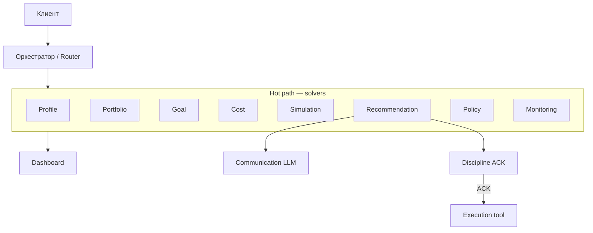
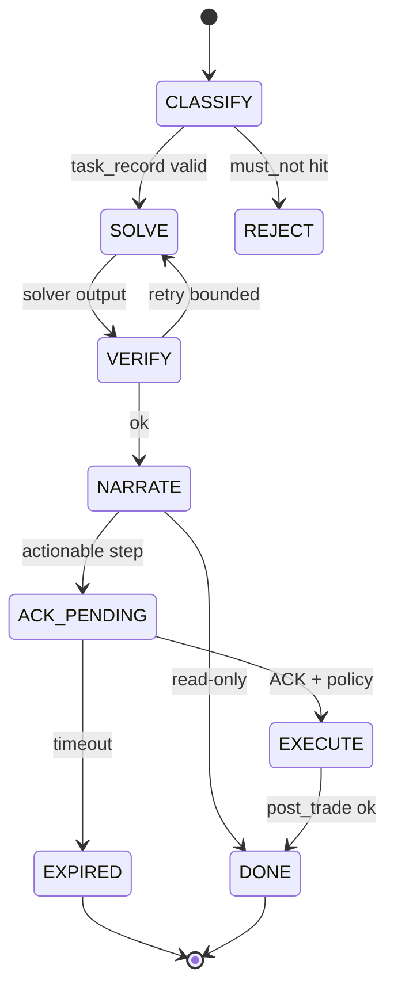

<div class="post-decision" markdown="1">

**Disclaimer.** Архитектурная заметка; не инвестиционная рекомендация. Примеры кода — воспроизводимые иллюстрации solvers, не торговая система.

**Продолжения:** [классификация задач L×D (ч. 2)](/vairl/blog/2026/07/14/banking-agent-task-classification-ru/) · [кейс грейса](/vairl/blog/2026/07/15/banking-credit-card-grace-case-ru/) · [кейс equity (не ОФЗ)](/vairl/blog/2026/07/17/banking-equity-agent-case-ru/) · [постановка задачи](/vairl/blog/2026/07/04/agent-task-specification-ru/).

</div>

---

## Аннотация {#abstract}

Банковские wealth-платформы оптимизируют \(NPV_{bank}\) — приведённую стоимость потоков от клиента как актива (fee, AUM, кросс-селл минус cost-to-serve). Клиентская постановка требует \(NPV_{client}\): достижимость цели минус PV комиссий, налогов и ошибок. На одних и тех же денежных потоках знаки часто противоположны. Предложена **client-side** мультиагентная архитектура: **девять вычислительных ролей** (Profile … Monitoring) плюс Dashboard и Discipline; **LLM — только narrative**, решения — solvers + policy + verifier. Зафиксирован протокол **classify → solve → verify → narrate → ACK**. Для каждого блока указан метод и первоисточник (§7). Приложение: лестница Python от PV до оркестратора (§12).

---

## Содержание {#toc}

1. [Постановка задачи](#problem)
2. [DCF и NPV](#dcf-npv-basics)
3. [\(NPV_{bank}\)](#bank-npv)
4. [\(NPV_{client}\)](#client-npv)
5. [Конфликт objective](#conflict)
6. [Client-side: инженерный аргумент](#client-side)
7. [Таблица методов и ссылок](#methods)
8. [Мультиагентная архитектура](#multi-agent)
9. [Протокол принятия решений](#decision)
10. [Контракт задачи и eval](#contract-eval)
11. [Фазы жизненного цикла](#lifecycle)
12. [Код: от PV до оркестратора](#code-ladder)
13. [Ограничения](#limitations)
14. [Выводы](#lessons)
15. [Литература](#refs)

---

## 1. Постановка задачи {#problem}

**Объект:** автоматизированный investment/money assistant с доступом к данным счетов, брокерским отчётам и policy клиента.

**Две objective-функции на одном потоке \(CF_t\):**

| Субъект | Максимизирует / минимизирует | Типичные \(CF_t\) |
|---------|------------------------------|-------------------|
| Банк | \(NPV_{bank}\) | +fee, +AUM margin, +кросс-селл; −cost-to-serve, −churn |
| Клиент | \(NPV_{client}\), \(P(\text{goal})\) | +доходность после издержек; −fee, −налог, −лишний оборот |

**Требование к системе:** hot path не содержит LLM; LLM — `narrative_only` ([Bender et al., 2021](#refs) — риск галлюцинаций в числовых выводах).

**Гипотеза:** агент с `objective: client_goal_npv` нельзя стабильно реализовать, если loss-функция и данные принадлежат \(NPV_{bank}\) (§6).

<figure style="margin: 2em auto; text-align: center;">
  
  <figcaption style="font-size: 0.9em; color: #666; max-width: 720px; margin: 0 auto;">Слои одинаковы; отличается objective и владелец данных</figcaption>
</figure>

---

## 2. DCF и NPV {#dcf-npv-basics}

### 2.1. Present value (DCF)

$$
\mathrm{PV} = \sum_{t=0}^{T} \frac{\mathrm{CF}_{t}}{(1+r)^{t}}
$$

\(CF_t\) — денежный поток; \(r\) — ставка дисконта ([Brealey et al., 2020](#refs)).

### 2.2. Net present value

$$
\mathrm{NPV} = -I_{0} + \sum_{t=1}^{T} \frac{\mathrm{CF}_{t}}{(1+r)^{t}}
$$

| NPV | Интерпретация |
|-----|---------------|
| > 0 | положительная приведённая стоимость при \(r\) |
| = 0 | граница безразличия |
| < 0 | разрушение стоимости при \(r\) |

```python
def pv(cash_flows: list[float], r: float) -> float:
    return sum(cf / (1 + r) ** t for t, cf in enumerate(cash_flows))


def npv(cash_flows: list[float], r: float) -> float:
    return pv(cash_flows, r)


flows = [-100.0, 60.0, 60.0]
print(round(npv(flows, 0.10), 2))  # → 4.13
```

---

## 3. \(NPV_{bank}\): клиент как актив {#bank-npv}

Потоки банка ([Gupta et al., 2006](#refs) — customer lifetime value; [Berger & Nasr, 1998](#refs) — customer profitability):

| Поток | Знак | Метод оценки |
|-------|------|--------------|
| Fee / AUM | + | тариф × баланс |
| Кросс-селл | + | propensity / take-up ([ logistic regression](#refs)) |
| Cost-to-serve | − | unit cost × контакты |
| Churn | −future + | survival / hazard model |
| PD / LGD | − | кредитный риск ([Basel](#refs)) |

```python
def bank_customer_npv(
    aum: float,
    years: int,
    fee_aum: float = 0.01,
    cost_to_serve: float = 200.0,
    r: float = 0.08,
) -> float:
    flows = [aum * fee_aum - cost_to_serve for _ in range(1, years + 1)]
    return sum(cf / (1 + r) ** t for t, cf in enumerate(flows, start=1))
```

Банковский assistant, удерживающий AUM после просадки, повышает \(NPV_{bank}\); для клиента эффект совпадает только если не зафиксирован behavioral loss ([Shefrin & Statman, 1985](#refs)).

---

## 4. \(NPV_{client}\) {#client-npv}

### 4.1. Goal-based criterion

Цель \(G_T\) на горizont \(T\): метрики — \(P(W_T \geq G_T)\), expected shortfall, минимальное пополнение ([Merton, 1969](#refs); [Das et al., 2007](#refs) — GBI).

### 4.2. Cost of ownership

$$
NPV_{client} = PV(\text{goal path}) - PV(\text{fees} + \text{taxes} + \text{cross-sell} + \text{errors})
$$

| Поток | Знак клиента |
|-------|--------------|
| Fee брокера | − |
| Налог | − ([Constantinides, 1983](#refs)) |
| Доходность net of costs | + |

```python
def fee_drag_pv(aum: float, years: int, fee_aum: float, r: float = 0.05) -> float:
    return sum((aum * fee_aum) / (1 + r) ** t for t in range(1, years + 1))


def goal_gap(
    wealth0: float,
    annual_contrib: float,
    years: int,
    expected_return: float,
    fee_aum: float,
    goal: float,
) -> float:
    w = wealth0
    net_r = expected_return - fee_aum
    for _ in range(years):
        w = w * (1 + net_r) + annual_contrib
    return w - goal
```

---

## 5. Конфликт objective {#conflict}

| Событие | \(\Delta NPV_{bank}\) | \(\Delta NPV_{client}\) |
|---------|----------------------|-------------------------|
| ↑ broker fee | + | − |
| ↑ turnover без нужды | часто + | − |
| Кросс-селл high-margin | + | часто − |
| Миграция на low-cost | −− | + |
| Удержание на просадке | + (fee alive) | +/− (зависит от поведения) |

```python
def conflict_on_fee(aum: float, fee_aum: float, years: int = 5, r: float = 0.08) -> dict:
    bank_flows = [aum * fee_aum for _ in range(years)]
    client_flows = [-x for x in bank_flows]
    bank_npv = sum(cf / (1 + r) ** t for t, cf in enumerate(bank_flows, 1))
    client_npv = sum(cf / (1 + r) ** t for t, cf in enumerate(client_flows, 1))
    return {"npv_bank": round(bank_npv, 0), "npv_client": round(client_npv, 0)}
# → зеркальные знаки на чистых fee
```

Suitability / ethics layer ограничивает домен, но **не меняет знак** банковской objective ([MiFID II](#refs)).

---

## 6. Client-side: инженерный аргумент {#client-side}

| Условие | Bank-side | Client-side |
|---------|-----------|-------------|
| Владелец objective | KPI банка | `client_goal_npv` в policy |
| Данные | один контур | personal vault, мультибанк |
| Исполнение | push продукта | API / CSV по запросу |
| Cost в loss | скрыт или вторичен | обязательный Cost/Fee Agent |
| LLM | объясняет решение банка | `narrative_only` поверх solver output |

Переносимые из bank-side практики: solvers + oracles + eval pack; классификация до agent loop ([ч. 2](/vairl/blog/2026/07/14/banking-agent-task-classification-ru/)); запрет L4–L5 на необратимые действия без ACK ([Parasuraman et al., 2000](#refs)).

---

## 7. Таблица методов и ссылок {#methods}

| Блок | Метод | Агент / этап | Ссылка |
|------|-------|--------------|--------|
| DCF / NPV | дисконтирование потоков | все solvers | [Brealey et al., 2020](#refs) |
| Customer NPV банка | LTV / CLV | (конtrast baseline) | [Gupta et al., 2006](#refs) |
| Fee drag | PV отрицательных fee | Cost / Fee | §4, [Philippon, 2017](#refs) |
| Goal probability | Monte Carlo wealth paths | Goal, Simulation | [Merton, 1969](#refs) |
| GBI | goal-based investing | Goal | [Das et al., 2007](#refs) |
| Portfolio weights | mean–variance | Portfolio | [Markowitz, 1952](#refs) |
| Views + equilibrium | Black–Litterman | Portfolio | [Black & Litterman, 1992](#refs) |
| Risk parity | risk budgeting | Portfolio | [Maillard et al., 2010](#refs) |
| Attribution | Brinson–Fachler | Monitoring | [Brinson et al., 1995](#refs) |
| Drawdown / tail | VaR, CVaR, MaxDD | Risk | [Artzner et al., 1999](#refs) |
| Volatility forecast | GARCH | Simulation (opt.) | [Bollerslev, 1986](#refs) |
| Time series | ARIMA / Prophet | Monitoring (opt.) | [Box et al., 2015](#refs) |
| Explainability | SHAP | Communication (opt.) | [Lundberg & Lee, 2017](#refs) |
| Churn / take-up | logistic regression | (bank baseline only) | [Hosmer et al., 2013](#refs) |
| Task routing | L×D taxonomy | Оркестратор | [ч. 2](/vairl/blog/2026/07/14/banking-agent-task-classification-ru/) |
| Contract | YAML objective + must_not | Personal Policy | [task spec](/vairl/blog/2026/07/04/agent-task-specification-ru/) |
| Verification | domain oracles | все шаги | [бенчмарки](/vairl/blog/2026/06/29/agent-benchmark-generation-ru/) |
| Human gate | ACK before act | Discipline | [Parasuraman et al., 2000](#refs) |
| Narration | LLM text-only | Communication | [Bender et al., 2021](#refs) |

---

## 8. Мультиагентная архитектура {#multi-agent}

**Девять вычислительных ролей** (solvers, без LLM в hot path) + **два прикладных** (визуализация и ACK). См. также [классификацию «девять агентов»](/vairl/blog/2026/07/14/banking-agent-task-classification-ru/).

| # | Агент | Вход | Выход | Метод (§7) |
|---|-------|------|-------|------------|
| 1 | **Profile** | CSV, open banking | Customer 360 | reconciliation |
| 2 | **Portfolio** | позиции, цены | веса, риск | Markowitz / BL |
| 3 | **Goal** | цель, horizon | \(P(\text{goal})\), gap | MC / GBI |
| 4 | **Cost / Fee** | тариф, оборот | PV fee, drag | DCF fee |
| 5 | **Simulation** | what-if params | counterfactual | MC |
| 6 | **Recommendation** | breaches, costs | ≤1 step | constrained opt |
| 7 | **Personal Policy** | policy YAML | allow/deny | rule engine |
| 8 | **Communication** | solver output | text | LLM narrative_only |
| 9 | **Monitoring** | рынок, тарифы | alerts | Brinson, rules |
| + | **Dashboard** | JSON series | UI | Streamlit / p5 ([кейс грейса](/vairl/blog/2026/07/15/banking-credit-card-grace-case-ru/#dashboard-discipline)) |
| + | **Discipline** | pending step | nudge, ACK | human-in-the-loop |


```mermaid
flowchart TB
  User["Клиент"]
  Orch["Оркестратор / Router"]
  subgraph Solvers["Hot path — solvers"]
    P[Profile]
    Po[Portfolio]
    G[Goal]
    C[Cost]
    S[Simulation]
    R[Recommendation]
    Pol[Policy]
    M[Monitoring]
  end
  Comm["Communication LLM"]
  Dash["Dashboard"]
  Disc["Discipline ACK"]
  User --> Orch
  Orch --> Solvers
  R --> Comm
  R --> Disc
  Solvers --> Dash
  Disc -->|ACK| Exec["Execution tool"]
```

---

## 9. Протокол принятия решений {#decision}

Заменяет неформальное «агент советует». Конечный автомат; LLM не участвует в переходах.


```mermaid
stateDiagram-v2
  [*] --> CLASSIFY
  CLASSIFY --> SOLVE: task_record valid
  CLASSIFY --> REJECT: must_not hit
  SOLVE --> VERIFY: solver output
  VERIFY --> NARRATE: ok
  VERIFY --> SOLVE: retry bounded
  NARRATE --> ACK_PENDING: actionable step
  NARRATE --> DONE: read-only
  ACK_PENDING --> EXECUTE: ACK + policy
  ACK_PENDING --> EXPIRED: timeout
  EXECUTE --> DONE: post_trade ok
  EXPIRED --> [*]
  DONE --> [*]
```

| Этап | Исполнитель | Verifier |
|------|-------------|----------|
| **CLASSIFY** | Router (L×D) | `abstract_model` ∈ allowed |
| **SOLVE** | Portfolio / Goal / Cost / … | numeric oracle |
| **VERIFY** | domain-specific | см. контракт |
| **NARRATE** | Communication | no new numbers |
| **ACK_PENDING** | Discipline | human confirm |
| **EXECUTE** | Execution adapter | post-state ⊆ policy |

Пример контракта:

```yaml
id: explain-drawdown
intent: "почему упал портфель"
abstract_model: attribution
objective: client_goal_npv
family: symbolic
must_not: [recommend_trade, guarantee_return, upsell_bank_product]
verifier: brinson_sum_equals_total_return
llm_role: narrative_only
```

Принцип из bank-side практики, перенесённый на client-side: **LLM объясняет; считает математика; подписывает policy** — но policy теперь клиентская.

---

## 10. Контракт задачи и eval {#contract-eval}

### 10.1. Пайплайн разработки

1. Discovery: метрика \(NPV_{client}\) (§4).  
2. Contract: `objective`, `must_not`, `verifier`.  
3. Solvers → Policy → LLM last.  
4. Multi-agent с обязательным Cost/Fee.  
5. Eval: синтетические персоны + тарифы как параметры мира.  
6. Rollout: shadow → limited → nudges без auto-trade.

### 10.2. Синтетика

```yaml
persona_id: ivan-2030
goal: {type: apartment, year: 2030, amount: 18000000}
brokers:
  - {name: bank_a, fee_aum_bps: 100, fee_trade_bps: 5}
  - {name: low_cost, fee_aum_bps: 10, fee_trade_bps: 2}
oracle:
  prefer_channel_by: client_npv_after_fees
```

| Компонент | Источник | Роль |
|-----------|----------|------|
| RFM / траты | [Kaggle segmentation](https://www.kaggle.com/datasets/shivamb/bank-customer-segmentation) | priors cash-flow |
| Budget / risk | [Personal Finance](https://www.kaggle.com/datasets/dzikriraihan/personal-finance-and-credit-risk-classification) | персоны |
| Ledger | [Retail Banking](https://www.kaggle.com/datasets/subhanu/retail-banking-dataset) | парсинг |
| Credit proxy | [Home Credit](https://www.kaggle.com/competitions/home-credit-default-risk) | обязательства |
| Market bars | Yahoo / Stooq | MC, attribution |
| Behavioral synth | [PersonaLedger](https://huggingface.co/datasets/capitalone/PersonaLedger) | правила |

**Null-agent test:** агент без действий должен проваливать бенчмарк ([ч. 2](/vairl/blog/2026/07/14/banking-agent-task-classification-ru/)). **Oracle test:** при двух тарифах solver обязан prefer low-cost при прочих равных (§12.6).

---

## 11. Фазы жизненного цикла {#lifecycle}

| Фаза | Запрос | Solver | Метод |
|------|--------|--------|-------|
| Прошлое | «почему −8%?» | Monitoring + Cost | Brinson + fee split |
| Настоящее | «где я vs цель?» | Goal + Portfolio | drift, gap |
| Будущее | «успею к T?» | Goal + Simulation | MC / GBI |
| План | «что делать?» | Recommendation | constrained opt |
| Мониторинг | события | Monitoring | rules + calendar |

Выход Communication Agent: декомпозиция просадки на рынок / стиль / fee — без trade recommendation, если `must_not` запрещает.

---

## 12. Код: от PV до оркестратора {#code-ladder}

Воспроизводимая лестница (Python 3.10+, stdlib). Каждый уровень — отдельный verifier.

### 12.1–12.4

См. §2–§5: `pv`, `npv`, `bank_customer_npv`, `fee_drag_pv`, `goal_gap`, `conflict_on_fee`.

### 12.5. Monte Carlo: \(P(\text{goal})\)

```python
from __future__ import annotations

import random
from dataclasses import dataclass


@dataclass(frozen=True)
class Broker:
    name: str
    fee_aum: float


def simulate_terminal_wealth(
    wealth0: float,
    annual_contrib: float,
    years: int,
    mu: float,
    sigma: float,
    broker: Broker,
    rng: random.Random,
) -> float:
    w = wealth0
    for _ in range(years):
        r = rng.gauss(mu, sigma) - broker.fee_aum
        w = w * (1 + r) + annual_contrib
    return w


def goal_success_prob(
    *,
    wealth0: float,
    annual_contrib: float,
    years: int,
    mu: float,
    sigma: float,
    goal: float,
    broker: Broker,
    n_paths: int = 5_000,
    seed: int = 42,
) -> float:
    rng = random.Random(seed)
    hits = sum(
        1
        for _ in range(n_paths)
        if simulate_terminal_wealth(
            wealth0, annual_contrib, years, mu, sigma, broker, rng
        )
        >= goal
    )
    return hits / n_paths


bank_a = Broker("bank_a", fee_aum=0.010)
low_cost = Broker("low_cost", fee_aum=0.001)
params = dict(
    wealth0=5_000_000,
    annual_contrib=50_000,
    years=10,
    mu=0.07,
    sigma=0.15,
    goal=9_000_000,
)
print(bank_a.name, round(goal_success_prob(**params, broker=bank_a), 3))
print(low_cost.name, round(goal_success_prob(**params, broker=low_cost), 3))
```

### 12.6. Выбор канала (solver)

```python
def prefer_broker_by_goal_prob(
    brokers: list[Broker],
    **sim_kwargs,
) -> tuple[Broker, dict[str, float]]:
    scores = {
        b.name: goal_success_prob(**sim_kwargs, broker=b) for b in brokers
    }
    best = max(brokers, key=lambda b: scores[b.name])
    return best, scores


best, scores = prefer_broker_by_goal_prob([bank_a, low_cost], **params)
# oracle: best.name == "low_cost" при одинаковых mu, sigma
```

### 12.7. Оркестратор с must_not

```python
from typing import Any, Callable

Tool = Callable[..., Any]


class ClientOrchestrator:
    def __init__(self, tools: dict[str, Tool], must_not: set[str]):
        self.tools = tools
        self.must_not = must_not

    def run(self, intent: str, **kwargs) -> Any:
        if intent in self.must_not:
            raise PermissionError(f"blocked by must_not: {intent}")
        if intent not in self.tools:
            raise KeyError(f"unknown tool: {intent}")
        return self.tools[intent](**kwargs)


def explain_channel_choice(**sim_kwargs) -> str:
    best, scores = prefer_broker_by_goal_prob(
        [bank_a, low_cost], **sim_kwargs
    )
    ranked = ", ".join(f"{k}={v:.1%}" for k, v in sorted(scores.items()))
    return (
        f"По P(goal) предпочтителен канал «{best.name}» ({ranked}). "
        f"Расчёт модели клиента, не оферта."
    )


orch = ClientOrchestrator(
    tools={
        "goal_prob": lambda broker, **kw: goal_success_prob(broker=broker, **kw),
        "prefer_channel": lambda **kw: prefer_broker_by_goal_prob(
            [bank_a, low_cost], **kw
        ),
        "explain_channel": explain_channel_choice,
        "upsell_bank_product": lambda **kw: "...",
    },
    must_not={"upsell_bank_product", "recommend_trade", "guarantee_return"},
)
```

| Следующий слой | Метод | §7 |
|----------------|-------|-----|
| Портфель | Markowitz post-fee | Portfolio |
| Налоги | \(CF_t\) tax | Cost |
| Attribution | Brinson | Monitoring |
| Eval | null-agent + oracle | §10 |
| LLM | narrative_only | Communication |

---

## 13. Ограничения {#limitations}

| Угроза | Следствие |
|--------|-----------|
| Неверный \(r\) | смещение NPV обеих сторон |
| LLM в hot path | числовые галлюцинации |
| Bank-side data only | неполный \(NPV_{client}\) |
| Отсутствие Cost Agent | скрытая оптимизация fee банка |
| Eval без тарифов | ложноположительный «успех» assistant |
| Юридический контур | технический objective ≠ лицензия на совет |

---

## 14. Выводы {#lessons}

1. DCF/NPV — общий формализм; **различие — в \(CF_t\) и знаке fee**.  
2. \(NPV_{bank}\) и \(NPV_{client}\) на одних потоках **антикоррелированы** по комиссиям.  
3. Bank-side agent оптимизирует \(NPV_{bank}\) при любой LLM-обёртке.  
4. Client-side переносит objective, данные и must_not; банк — execution tool.  
5. **Девять solvers + Dashboard + Discipline**; LLM — narrative; решения — verify + ACK.  
6. Протокол §9 делает pipeline **проверяемым**; таблица §7 — **цитируемым**.  
7. Код §12 — минимальный reproducible baseline до портфельных solvers.

**Кейсы применения архитектуры:**

- [Кредитка, грейс, Cost Agent](/vairl/blog/2026/07/15/banking-credit-card-grace-case-ru/) — `client_cost_min`, grace calendar.  
- [Equity sleeve (не ОФЗ)](/vairl/blog/2026/07/17/banking-equity-agent-case-ru/) — Monitor / Recommend / Manage.  
- [Классификация L×D](/vairl/blog/2026/07/14/banking-agent-task-classification-ru/) — этап CLASSIFY.

---

## 15. Литература и ссылки {#refs}

| ID | Источник |
|----|----------|
| Brealey et al., 2020 | Brealey R., Myers S., Allen F. *Principles of Corporate Finance*. McGraw-Hill. |
| Markowitz, 1952 | Markowitz H. Portfolio Selection. *Journal of Finance*, 7(1), 77–91. |
| Black & Litterman, 1992 | Black F., Litterman R. Global Portfolio Optimization. *Financial Analysts Journal*, 48(5), 28–43. |
| Brinson et al., 1995 | Determinants of Portfolio Performance. *FAJ*, 51(1), 133–138. |
| Merton, 1969 | Lifetime Portfolio Selection. *REStat*, 51(3), 247–257. |
| Das et al., 2007 | Dynamic Portfolio Optimization with Goals. *Operations Research*, 55(2), 338–349. |
| Constantinides, 1983 | Capital Market Equilibrium with Personal Tax. *Econometrica*, 51(3), 639–662. |
| Artzner et al., 1999 | Coherent Measures of Risk. *Mathematical Finance*, 9(3), 203–228. |
| Bollerslev, 1986 | Generalized Autoregressive Conditional Heteroskedasticity. *Journal of Econometrics*, 31(3), 307–327. |
| Lundberg & Lee, 2017 | A Unified Approach to Interpreting Model Predictions. *NeurIPS*. |
| Gupta et al., 2006 | Modeling Customer Lifetime Value. *Journal of Service Research*, 9(2), 139–155. |
| Berger & Nasr, 1998 | Customer Lifetime Value: Marketing Models. *Journal of Interactive Marketing*, 12(1), 17–30. |
| Philippon, 2017 | *The FinTech Opportunity*. NBER WP 22476. |
| Shefrin & Statman, 1985 | The Disposition to Sell Winners Too Early. *Journal of Finance*, 40(3), 777–790. |
| Parasuraman et al., 2000 | Automation and Human Performance. *Human Factors*, 42(1), 1–17. |
| Bender et al., 2021 | On the Dangers of Stochastic Parrots. *FAccT*. |
| Hosmer et al., 2013 | *Applied Logistic Regression*. Wiley. |
| Maillard et al., 2010 | The Properties of Equally Weighted Risk Contribution Portfolios. *JPM*, 36(4), 60–70. |
| Box et al., 2015 | *Time Series Analysis: Forecasting and Control*. Wiley. |
| MiFID II | Directive 2014/65/EU — suitability requirements. |
| Basel | BCBS — credit risk (PD/LGD framework). |
| VAIRL ch.2 | [Классификация задач L×D](/vairl/blog/2026/07/14/banking-agent-task-classification-ru/) |
| VAIRL task spec | [Постановка задачи агенту](/vairl/blog/2026/07/04/agent-task-specification-ru/) |
| VAIRL benchmarks | [Генерация бенчмарков](/vairl/blog/2026/06/29/agent-benchmark-generation-ru/) |
