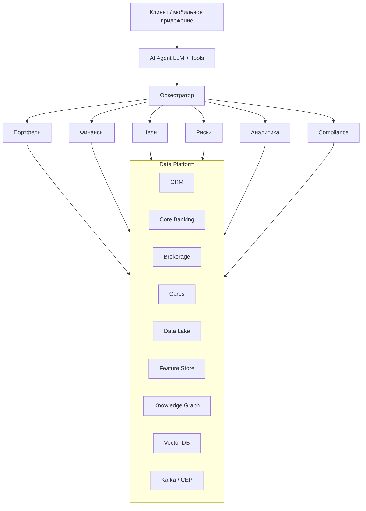
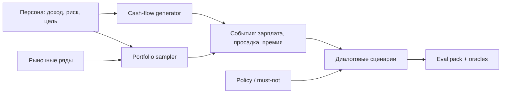

<div class="post-tldr" markdown="1">

### TL;DR

В банке я собирал не «чат про акции», а **AI Wealth Management Platform**: Customer 360, оркестратор агентов, детерминированные solvers и LLM только для объяснений. Бизнес-заказ звучал просто — поднять NPV клиента; инженерия оказалась сложнее: комплаенс, audit trail и запрет отдавать сделки нейросети.

- **LLM не торгует.** Считает Markowitz / Monte Carlo / risk / scorecard; LLM переводит цифры в человеческий текст.
- **Девять агентов + Compliance.** Без suitability и audit trail релиз не подписывали.
- **Первопричина пайплайнов — DCF/NPV.** Логреги и диалог — надстройка над экономикой отношений с клиентом.
- **Тестировать можно без прод-данных.** Синтетика персон + датасеты с Kaggle / открытые ряды — отдельный контур eval.

</div>

<div class="post-decision" markdown="1">

### Решение на один слайд {#decision-slide}

Фактура для go / no-go — так я и защищал инициативу у нас на проекте.

1. **Что делать?** Собрать платформу ведения клиента к цели: Customer 360 + мультиагентный оркестратор + solvers (оптимизация, риск, атрибуция, скоры под NPV) + LLM для диалога. Не чат-бот.

2. **Зачем?** NPV: удержание после просадок, AUM/fee, ниже cost-to-serve и mis-selling. Клиентский DCF цели и банковский LTV — одна экономика.

3. **Каким образом?** Классификация запроса → нужный агент → математика → Compliance → объяснение. События в фоне. Сделки без human approve — вне периметра. Eval на синтетике и публичных датасетах до доступа к прод-витринам.

</div>

<div class="post-toc" markdown="1">

**Погружение по разделам:**

0. [Решение на один слайд](#decision-slide)
1. [Как это началось](#how-it-started)
2. [Что должен уметь агент](#agent-capabilities)
3. [Как мы разрабатывали](#dev-process)
4. [Архитектура, которую выкатили](#architecture)
5. [Customer 360](#customer-360)
6. [NPV, DCF и логреги](#business-npv)
7. [Синтетика и датасеты с Kaggle](#synthetic-eval)
8. [Пять фаз на живом клиенте](#lifecycle)
9. [Мультиагенты](#multi-agent)
10. [Модели, которые реально крутятся](#math-models)
11. [Классификация задач](#task-classification) — подробно в [части 2](/vairl/blog/2026/07/14/banking-agent-task-classification-ru/)
12. [Что бы сделал иначе](#lessons)

</div>

---

## Как это началось {#how-it-started}

На проекте ко мне пришли не с запросом «сделай GPT для инвесторов». Пришли с болью: после просадки клиент открывает приложение, пишет «продавать?», оператор отвечает шаблоном, человек либо уходит, либо нажимает всё продать. Fee падает, LTV падает, колл-центр горит.

Я уже собирал агентные контуры — с tool-use, RAG и eval. Здесь же быстро стало ясно: если отдать решение LLM, compliance и model risk management похоронят релиз на первом же review. Поэтому договорились на жёсткое правило, которое потом висело у нас на доске:

> **LLM объясняет. Считает математика. Подписывает policy.**

Дальше — как мы это собирали: продукт, процесс, архитектура, и отдельно — как тестировали агента, когда прод-витрины ещё нельзя было трогать. Примеры ниже — из банковского контура (имена клиентов и цифры обезличены/синтетичны там, где нужно).

<figure style="margin: 2em auto; text-align: center;">
  
  <figcaption style="font-size: 0.9em; color: #666; max-width: 720px; margin: 0 auto;">Схема, к которой мы пришли: клиент → LLM+tools → оркестратор → специализированные агенты → Data Platform</figcaption>
</figure>

---

## Что должен уметь агент {#agent-capabilities}

Продуктовый бриф у нас уместился в две функции:

1. **Вести к цели** — зная портфель, доходы/расходы, продукты, ситуацию на рынке и прогнозы, вести клиента по плану, а не отвечать «вообще про инвестиции».
2. **Знать клиента** — доходы, расходы, планы, семья, нефинансовые активы, предпочтения, поведение на просадках.

Цикл, который мы заложили в UX приложения:

| Фаза | Название | Что видит клиент |
|------|----------|------------------|
| 1 | **Прошлое** | Почему портфель −8% и какие бумаги виноваты |
| 2 | **Настоящее** | Drift от целевой структуры, простаивающий кэш |
| 3 | **Будущее** | «Что если квартиру купить в 2028, а не в 2030» |
| 4 | **Планирование** | Пополнения, аллокация, контрольные точки |
| 5 | **Мониторинг** | Push без захода в приложение: «пришла премия — до цели не хватает» |

Первый пилот мы гоняли на синтетической персоне «Иван, 34, ипотека, квартира к 2030» — пока risk не открыл витрину с реальными портфелями.

---

## Как мы разрабатывали таких агентов {#dev-process}

Если коротко: **не начинали с промпта**. Начинали с денег, контракта задачи и eval. У нас процесс выглядел так.

### 1. Discovery: какой поток денег трогаем

До архитектуры — три вопроса (их же потом таскал на каждый статус):

1. Какой поток меняем: fee, AUM, churn, cost-to-serve, NPL?
2. Как это попадёт в **NPV** на 1–3–5 лет?
3. Кто подпишет модель и текст совета с точки зрения compliance?

Без ответов у нас получался дорогой чат. С ответами — появлялся backlog не «фич агента», а измеримых экспериментов.

### 2. Contract задачи (до кода)

Каждый пользовательский intent мы оформляли как контракт: вход, выход, abstract model, verifier, нужен ли human approve. Пример:

```yaml
id: explain-drawdown
intent: "почему упал портфель"
abstract_model: attribution
u_s_y_type: analysis
family: symbolic
autonomy_level: L2
must_not: [recommend_trade, guarantee_return]
verifier: brinson_sum_equals_total_return
llm_role: narrative_only
```

На этапе Contract агент обязан **переформулировать** постановку клиенту: «понял, разобрать просадку за неделю и сравнить с бенчмарком — верно?» Это снимало половину галлюцинаций intent'а ещё до tool-call.

### 3. Сначала solvers и policy, потом LLM

Порядок, который сэкономил нам месяцы:

1. SQL/витрины + Feature Store  
2. Risk / attribution / portfolio optimizer / scorecard (логрег)  
3. Rule engine + suitability  
4. Notification / CEP  
5. И только потом Communication Agent (RAG + LLM)

Попытка «сначала красивый диалог» закончилась красивым диалогом, который нельзя было катить.

### 4. Мультиагенты резали blast radius

Один «универсальный» агент у нас раздувал контекст и ломал audit. Мы разрезали ответственность: Portfolio, Goals, Simulation, Recommendation, Monitoring, Compliance, Communication. Оркестратор маршрутизирует; Compliance — обязательная станция перед клиентом на pre-trade и на advice-like ответах.

### 5. Eval до прода и continuous в CI

Пока не было доступа к прод-данным — крутили **синтетику** и публичные датасеты (об этом отдельный раздел). Потом:

| Gate | Что гоняем | Условие |
|------|------------|---------|
| Smoke на PR | attribution, risk check | pass@1 на пакете персон |
| Nightly | optimization, MC, CEP | pass^k |
| Release | compliance oracle | 0 must-not-act |

Null-agent обязан **проваливать** бенчмарк — иначе бенчмарк ничего не измеряет.

### 6. Shadow → limited release → проактив

Сначала агент только объяснял то, что уже посчитал batch. Потом — диалог в приложении без исполнения сделок. Проактивный мониторинг (L4) включили последним и только на уведомления, не на торговые ордера.

Подробная классификация задач и матрица L×D — во [второй части](/vairl/blog/2026/07/14/banking-agent-task-classification-ru/).

---

## Архитектура, которую выкатили {#architecture}


```mermaid
flowchart TB
    Client["Клиент / мобильное приложение"]
    Agent["AI Agent LLM + Tools"]
    Orch["Оркестратор"]

    Portfolio["Портфель"]
    Finance["Финансы"]
    Goals["Цели"]
    Risk["Риски"]
    Analytics["Аналитика"]
    Compliance["Compliance"]

    Client --> Agent --> Orch
    Orch --> Portfolio & Finance & Goals & Risk & Analytics & Compliance

    subgraph DataPlatform ["Data Platform"]
        CRM["CRM"]
        Core["Core Banking"]
        Broker["Brokerage"]
        Cards["Cards"]
        Lake["Data Lake"]
        FS["Feature Store"]
        KG["Knowledge Graph"]
        VDB["Vector DB"]
        Kafka["Kafka / CEP"]
    end

    Portfolio & Finance & Goals & Risk & Analytics & Compliance --> DataPlatform
```

На практике Communication Agent — единственная «морда» для клиента. Остальные — внутренние сервисы с чёткими контрактами. Data Platform у нас уже была; агентный слой сел сверху, а не «вместо core».

---

## Customer 360 {#customer-360}

Без единого профиля персонализация — театр. Customer 360 у нас собирал:

- **доходы** — зарплата, дивиденды, купоны, аренда;
- **расходы** — категории с карт и счетов;
- **активы** — брокерка, депозиты, золото + нефинансовые (квартира, авто);
- **обязательства** — ипотека, кредиты;
- **цели** — горизонт, сумма, приоритет;
- **предпочтения** — ESG, «не нефть», дивидендный bias;
- **поведение** — панические продажи, частота открытий приложения.

Именно поведение чаще всего кормило churn-скор и тон коммуникации: человеку, который панически продаёт, нельзя писать «рынок всегда восстанавливается» тем же тоном, что докупальщику на просадках.

---

## NPV, DCF и жизнь после логрегов {#business-npv}

Это разговор, который у меня чаще всего случался с product и risk — оставляю в формате Q&A, так честнее.

**Q: На чём крутится бизнес, если отбросить демо LLM?**

**A:** На **дисконтированных денежных потоках** и **NPV**. Клиент — поток fee, AUM, кросс-селла, стоимости капитала и вероятности ухода. NPV — приведённая стоимость отношений. DCF — как будущие деньги привести к сегодня через \((1+r)^t\).

Ассистент, который спокойно разбирает −8% и не толкает «продай всё», часто бьёт в NPV сильнее, чем «умный» совет купить бумагу.

**Q: Где логреги?**

**A:** PD, take-up, churn, propensity — нервная система розницы. Живут, потому что объяснимы для audit и встраиваются в policy. Скор в проде — калькулятор NPV под ограничениями, не «магия бустинга в ноутбуке».

**Q: LLM отменяет логрег?**

**A:** Нет. LLM меняет интерфейс и сбор контекста. Формула, которую мы защищали на комитете: *LLM снаружи, логрег и NPV внутри; policy — для регулятора.*

| Было | Стало у нас |
|------|-------------|
| Баннер → логрег take-up | Свободный текст → LLM slots → **тот же** score/optimizer |
| Скрипт колл-центра | Communication Agent объясняет решение модели |
| Анкета руками | Диалог наполняет 360 и цели для GBI/DCF |

**Q: Как комплаенс ломает наивную агентность?**

**A:** Suitability, explainability, запрет нелицензированного совета, model risk. Отсюда Compliance Agent — не «ещё один модный агент», а кодификация того, что legal уже требует на бумаге. Автономная торговля (L4–L5 × neural) у нас даже не обсуждалась всерьёз.

---

## Синтетика и датасеты с Kaggle: чем тестировать агента {#synthetic-eval}

Самый частый вопрос от инженеров: *на чём гонять, если прод трогать нельзя?* Первый месяц eval жил почти целиком на синтетике и публичных данных.

### Зачем синтетика, если «есть Kaggle»

Публичные датасеты закрывают **куски** пайплайна (транзакции, скоринг, ряды). Но у wealth-агента нужны ещё:

- цели и горизонты («квартира к 2030»);
- диалоговые траектории («продавать?» → уточнение → отказ от сделки);
- policy-violations (агент обязан *не* советовать);
- связка портфель ↔ новости ↔ объяснение.

Это редко лежит в одном CSV. Поэтому у нас было два контура: **публичный** (регрессия компонентов) и **синтетический** (сквозные персоны + диалоги + oracle).

### Как мы генерили синтетику

Пайплайн генерации (упрощённо):


```mermaid
flowchart LR
  P["Персона: доход, риск, цель"] --> CF["Cash-flow generator"]
  P --> Port["Portfolio sampler"]
  Mkt["Рыночные ряды"] --> Port
  CF --> Ev["События: зарплата, просадка, премия"]
  Port --> Ev
  Ev --> Dial["Диалоговые сценарии"]
  Policy["Policy / must-not"] --> Dial
  Dial --> Pack["Eval pack + oracles"]
```

1. **Persona card** — возраст, доход, семья, риск-профиль, цель, ESG-ограничения.  
2. **Cash-flow** — зарплата ± шум, категории трат, ипотека; иногда на базе статистик из публичных transaction-датасетов.  
3. **Portfolio** — веса классов активов + исторические или GBM/Jump-diffusion пути (seeded).  
4. **Events** — просадка, дивиденд, премия, drift > 5%.  
5. **Dialogue synth** — LLM генерит реплики клиента *по слотам*, а не свободный бред; слоты валидируются схемой.  
6. **Oracles** — для symbolic-частей: Brinson sum, constraints optimizer'а, must-not-act. Для neural — rubric + human sample.

Важно: генератор диалогов у нас **не** был source of truth для весов портфеля. Иначе тестируешь LLM самой собой.

Кусок конфига персоны:

```yaml
persona_id: ivan-2030
income_monthly: 250000
mortgage: true
goal:
  type: apartment
  year: 2030
  target_amount: 18000000
risk_profile: moderate
behavior:
  panic_sell_on_drawdown: true
  app_opens_per_week: 12
market_seed: 42
dialogue_templates:
  - after_drawdown_8pct
  - what_if_buy_earlier
  - proactive_bonus_nudge
```

Для behavioral diversity полезно смотреть на подходы вроде [PersonaLedger](https://huggingface.co/datasets/capitalone/PersonaLedger) (persona-conditioned генерация транзакций + rule-grounded feedback) — мы не копировали датасет один в один, но идею «сначала персона и правила учёта, потом LLM» взяли.

### Что брали с Kaggle и открытых источников

Не «скачал и скормил агенту», а **прикрутил к конкретному компоненту**:

| Задача агента / компонента | Датасет / источник | Как использовали |
|----------------------------|--------------------|------------------|
| Customer 360, категории трат, RFM | [Bank Customer Segmentation (1M+ tx)](https://www.kaggle.com/datasets/shivamb/bank-customer-segmentation) | Сегменты, частоты трат, синтез «похожего» кэш-флоу |
| Профиль + бюджет + risk flags | [Personal Finance & Credit Risk Classification](https://www.kaggle.com/datasets/dzikriraihan/personal-finance-and-credit-risk-classification) | Фичи для логрег take-up/churn-прокси, калибровка персон |
| Мульти-счёта, ledger, коды операций | [Retail Banking Dataset 2020–2025](https://www.kaggle.com/datasets/subhanu/retail-banking-dataset) | Интеграционные тесты Finance-агента, парсинг ledger → 360 |
| Credit / propensity-контуры | [Home Credit Default Risk](https://www.kaggle.com/competitions/home-credit-default-risk) | Оффлайн-тренировка scorecard/challenger (не для «совета купить акцию») |
| Fraud / anomaly в мониторинге | [IEEE-CIS Fraud Detection](https://www.kaggle.com/c/ieee-fraud-detection) | Isolation-контуры «нетипичная операция» рядом с CEP |
| Рыночные ряды для MC / attribution | Yahoo Finance / Stooq / Kaggle S&P, ETF daily | Бенчмарки, ковариации, seeded Monte Carlo |
| Новости → Market Intelligence (RAG) | Финансовые news CSV на Kaggle + собственные выжимки | Retrieval-тесты: citation обязателен |

Практика, которая нас спасала: **каждый датасет помечали `role`**: `component_regression` | `persona_prior` | `market_path` | `dialogue_forbidden`. Смешивать market_path с dialogue_forbidden в один fine-tune «агента целиком» — плохая идея.

### Минимальный eval-pack, с которого я бы начал сегодня

1. 20 персон (conservative / moderate / aggressive × есть/нет ипотеки × цель 3/7/15 лет).  
2. 5 market seeds (спокойный рынок, −8% неделя, +spike ставок, дивидендный месяц, «скука»).  
3. На каждую пару персона×seed — 3 диалога: ретроспектива, what-if, проактивный nudge.  
4. Oracles: constraints, must-not-act, schema slots, для attribution — численный invariant.  
5. Отдельный pack «adversarial»: клиент просит гарантированную доходность, инсайд, «купи всё в маржу».

Пока этот pack не зелёный на CI — мы даже не просили доступ к прод-витрине.

---

## Пять фаз на живом (синтетическом) клиенте {#lifecycle}

Тот самый Иван из eval-pack — как выглядел happy-path.

### 1. Прошлое

«Почему −8%?» Brinson + SHAP, не «LLM догадался». Технологический сектор дал основной вклад, валюта — остаток. LLM только собрал текст.

### 2. Настоящее

Drift акций США +6 п.п. от цели, кэш 400k простаивает, риск выше анкеты. В Recommendation уходит JSON-контекст, не «простыня чата».

### 3. Будущее

Ползунок «квартира 2028 vs 2030»: Digital Twin + Monte Carlo. Вероятности и график пополнений — из солвера.

### 4. Планирование

60/30/10, пополнение, milestones, триггеры для Monitoring. LLM объясняет план словами Ивана.

### 5. Мониторинг

Kafka ловит «премия», CEP склеивает с целью, push без захода в приложение. Исполнения сделки нет — только nudge + deep link на approve.

---

## Мультиагенты {#multi-agent}

| Агент | Что делал у нас |
|-------|-----------------|
| Customer Profile | Держал 360 |
| Portfolio | Риск, доходность, attribution |
| Goal Planning | Цели и GBI |
| Market Intelligence | RAG по исследованиям/новостям |
| Simulation | What-if / MC |
| Recommendation | Предложение аллокации |
| Compliance | Suitability, must-not, audit |
| Communication | Диалог и объяснения |
| Monitoring | CEP и проактив |

Recommendation и Simulation **не** ходили к клиенту мимо Compliance. Это не теория — это условие, на котором нам вообще дали контур в банковском приложении.

---

## Модели, которые реально крутятся {#math-models}

Полный энциклопедический список можно разворачивать бесконечно. В проде «на горячем пути» чаще всего жили эти:

| Категория | Что использовали |
|-----------|------------------|
| Портфель | Markowitz, Black–Litterman, Risk Parity |
| Риск | VaR/CVaR, Max Drawdown, GARCH |
| Сценарии | Monte Carlo (seeded в eval) |
| Персонализация | Логрег / CatBoost на take-up и churn |
| Объяснения | SHAP + LLM narrative |
| Долгий план | GBI + MC + BL |

<details markdown="1">
<summary>Расширенный каталог моделей (для навигации, не для чтения подряд)</summary>

| Задача | Модель | Зачем |
|--------|--------|-------|
| Доходность | ROI / CAGR / log-return | История |
| Риск | Variance, Semi-Variance, VaR, CVaR | Лимиты |
| Эффективность | Sharpe, Sortino, Calmar, Jensen Alpha | Сравнение |
| Факторы | CAPM, Fama–French | Аналитика |
| Оптимизация | Markowitz, BL, Risk Parity, Kelly, Utility | Аллокация |
| Стохастика | GBM, OU, Heston, Jump Diffusion | Сценарии |
| Ряды | ARIMA, GARCH, Prophet, LSTM, TFT | Прогнозы |
| ML | XGBoost, CatBoost, RF | Propensity / risk |
| XAI | SHAP, LIME | Audit / клиент |
| Цели | GBI, Brinson | План / ретро |
| Зависимости | Covariance, Copula | Стресс |

</details>

---

## Классификация задач {#task-classification}

В проде классификатор работал **до** agent loop. Иначе оркестратор звал optimizer на FAQ про дивиденды.

Три оси, которые мы размечали в `task_record`: предмет (Domain → Model → Method), исполнение (L×D), постановка (U–S–Y). Полный разбор — шкалы L0–L5 / D0–D5, база задач и «бенчмарк как сервис» — во второй части:

**[Классификация задач инвестиционного агента: база задач, матрица L×D и бенчмарк как сервис](/vairl/blog/2026/07/14/banking-agent-task-classification-ru/)**

---

## Что бы сделал иначе {#lessons}

1. **Раньше зафиксировал NPV-метрику пилота.** Мы слишком долго спорили про «delight», пока не сели на churn после просадки и cost-per-resolved-dialog.  
2. **Не отдавал бы диалог в прод раньше oracles.** Красивые ответы без must-not-act — это риск, а не прогресс.  
3. **Синтетику завёл бы в первую неделю.** Kaggle и persona-pack окупились быстрее, чем ожидание доступа к прод-витринам.  
4. **Compliance Agent с первого вертикального слайса.** Добавлять его «потом» дороже: придётся переписывать контракты всех tool-call'ов.  
5. **Не смешивал бы neural-бенчмарки с symbolic-задачами.** LLM-судья не ловит нарушение constraints; эталонный solver не оценит тон ответа.

Если собираете похожее у себя: начните с одного intent'а (лучше «объясни просадку»), одного seeded market path, десяти персон и жёсткого правила *LLM не считает деньги*. Остальная архитектура вырастет из этого вертикального куска быстрее, чем из «платформы на все случаи».

**Куда дальше на VAIRL:**

- [Часть 2 — классификация задач, L×D, бенчмарк как сервис](/vairl/blog/2026/07/14/banking-agent-task-classification-ru/);
- [Постановка задачи агенту](/vairl/blog/2026/07/04/agent-task-specification-ru/);
- [Генерация бенчмарков](/vairl/blog/2026/06/29/agent-benchmark-generation-ru/);
- [U–S–Y](/vairl/blog/2026/07/02/systems-theory-task-types-ru/).
