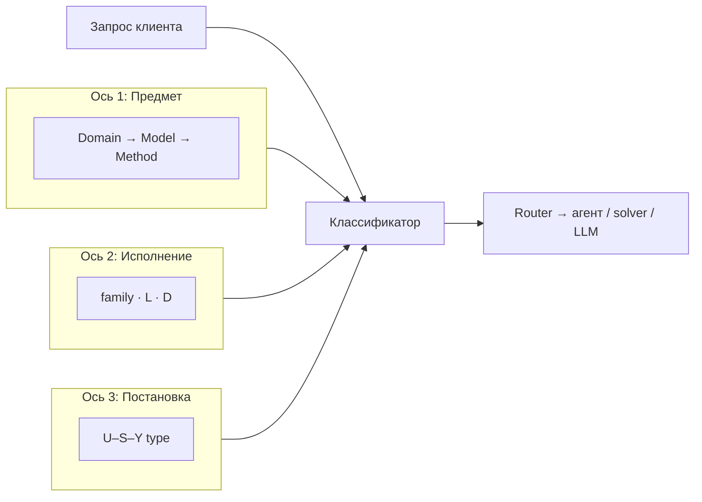
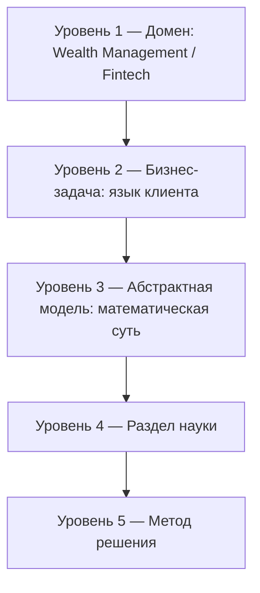
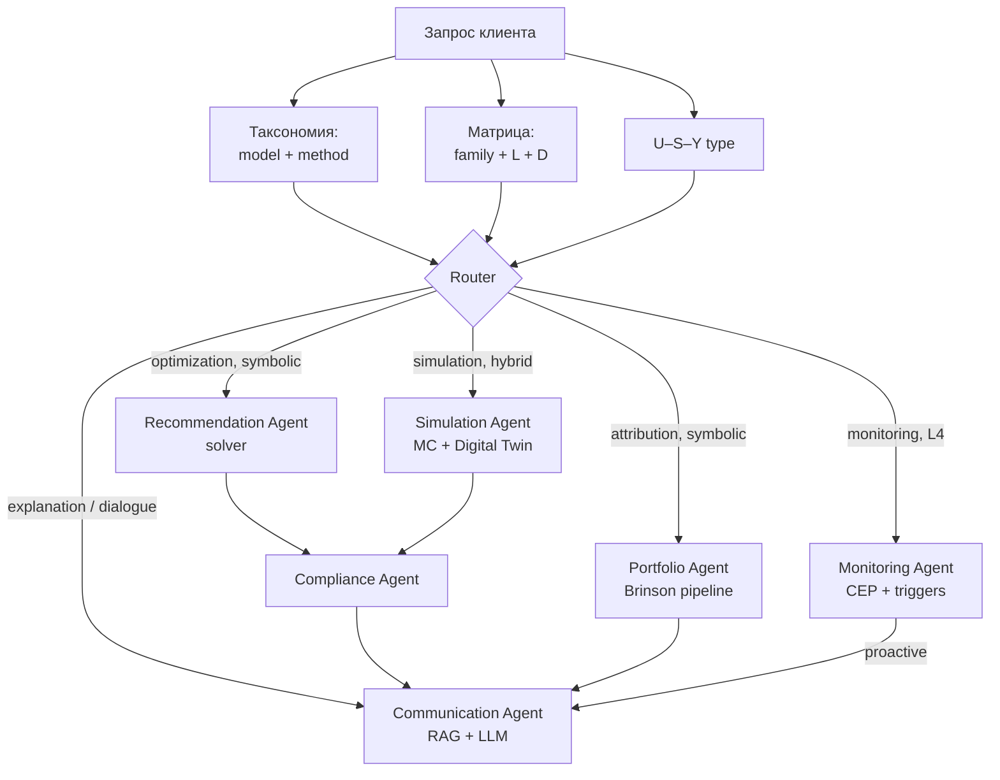

<div class="post-tldr" markdown="1">

### TL;DR

Запрос «помоги с инвестициями» — это десяток разных задач: от атрибуции просадки до push-уведомления. Прежде чем запускать agent loop, wealth-платформа классифицирует запрос тремя осями и по результату выбирает исполнителя: solver, гибридный pipeline или диалогового агента.

- **Три оси.** Таксономия отвечает «о чём задача», матрица L×D — «как исполнять и насколько автономно», U–S–Y — «что задано и что найти».
- **База задач — это данные, а не код.** Каждая задача — `task_record` с моделью, методами, уровнем автономности и compliance-полями; router читает базу, а не if-else.
- **Каждой задаче — свой бенчмарк.** Симметричная база `benchmark_record` превращает верификацию в сервис: smoke на PR, nightly regression, release-gate по compliance-оракулу.
- **Зона риска — L4–L5 × neural.** Автономная торговля без human approve в банке запрещена; сделки живут в L2–L3 × symbolic/hybrid.

</div>

<div class="post-toc" markdown="1">

**Погружение по разделам:**

1. [Три оси классификации](#three-axes) — зачем классифицировать до agent loop
2. [Таксономия: от домена к методу](#taxonomy) — пять уровней и каталог задач по фазам
3. [Матрица L × D](#ld-matrix) — шкалы автономности и детерминизма, зоны риска
4. [U–S–Y: постановка](#usy) — анализ, синтез, идентификация, управление
5. [База задач и решений](#task-db) — task_record и маршрутизация
6. [Бенчмарк как сервис](#benchmark-service) — benchmark_record, схемы верификации, CI-гейты
7. [Типичные ошибки](#mistakes) — чего не делать

</div>

*Это вторая часть разбора банковского AI-ассистента. Первая — [«Девять агентов и ни одного решения от LLM»](/vairl/blog/2026/07/13/banking-investor-ai-agent-ru/): архитектура платформы, Customer 360, пять фаз цикла и математические модели.*

Иван из первой части пишет ассистенту: «помоги с инвестициями». Что это — просьба объяснить просадку, пересчитать портфель, смоделировать покупку квартиры или вопрос про дивиденды? Без классификатора оркестратор либо отправит всё в LLM (дорого и рискованно), либо вызовет portfolio optimizer там, где нужен только RAG.

---

## Три оси классификации {#three-axes}

Разметка типовых задач AI Wealth Management Platform тремя осями VAIRL:

| Ось | Классификатор | Вопрос |
|-----|---------------|--------|
| **1. Предмет** | Пятиуровневая таксономия (Domain → Model → Method) | *О чём* задача, к какой модели относится? |
| **2. Исполнение** | Матрица L × D (автономность × детерминизм) | *Как* решать: автономность и детерминизм? |
| **3. Постановка** | [U–S–Y](/vairl/blog/2026/07/02/systems-theory-task-types-ru/) | *Что* задано, *что* найти? |



Router wealth-платформы работает **до** agent loop: сначала классификация, потом выбор Portfolio Agent, Simulation Agent или Communication Agent с нужным pipeline.

---

## Таксономия: от домена к методу {#taxonomy}

Иерархия сжимает запрос по лестнице абстракций — одна запись «mean-variance optimization + convex solver» обслуживает и ребалансировку портфеля, и план накоплений на пенсию.



**Домен** здесь почти всегда `wealth_management` или `retail_banking` — от него зависят compliance-политики (MiFID II, suitability — регуляторная проверка, что продукт подходит профилю клиента), набор tools и RAG-корпус.

**Бизнес-задача** — формулировка клиента: «почему упал портфель», «хватит ли на квартиру», «предложи ребалансировку».

**Абстрактная модель** — канонический тип: attribution, convex optimization, Monte Carlo, CEP, knapsack (распределение свободного кэша), classification (риск-профиль), explanation generation.

**Раздел науки** — portfolio theory, financial econometrics, operations research, stochastic processes.

**Метод** — конкретный инструмент: Brinson, Markowitz, Kafka+CEP, RAG+LLM.

### Каталог задач по фазам жизненного цикла

Каждая из пяти фаз платформы порождает свой набор задач с разной природой:

| Фаза | Бизнес-задача (пример) | Абстрактная модель | Метод (primary) |
|------|------------------------|-------------------|-----------------|
| **1. Ретроспектива** | «Почему портфель вырос на 12%?» | Attribution / decomposition | Brinson Attribution + SHAP |
| **1. Ретроспектива** | «Какие решения были ошибочными?» | Counterfactual analysis | Counterfactual explanations |
| **2. Диагностика** | «Соответствует ли портфель риск-профилю?» | Constraint validation | Risk Engine + rule check |
| **2. Диагностика** | «Где отклонение от целевой структуры?» | Drift detection | Covariance + threshold rules |
| **2. Диагностика** | «Сколько свободного кэша?» | Cash flow aggregation | SQL + Feature Store |
| **3. Прогнозирование** | «Что если куплю квартиру через 3 года?» | Monte Carlo simulation | Digital Twin + MC |
| **3. Прогнозирование** | «Как изменятся доходы при инфляции 15%?» | Scenario analysis | Macro scenarios + VAR |
| **3. Прогнозирование** | «Когда достигну цели по накоплениям?» | Goal reach probability | GBI + Monte Carlo |
| **4. Планирование** | «Сформируй план на пенсию» | Convex optimization | Markowitz / Black–Litterman |
| **4. Планирование** | «Куда вложить 500 000 ₽?» | Knapsack / allocation | Portfolio Optimizer + constraints |
| **4. Планирование** | «Объясни план простым языком» | Explanation generation | LLM + structured facts |
| **5. Мониторинг** | «Отклонение > 5% от целевой структуры» | Complex event processing | Kafka + CEP + triggers |
| **5. Мониторинг** | «Достигнута цель накоплений» | State transition / milestone | Rule engine |
| **5. Мониторинг** | «Персонализированное уведомление» | NL generation | LLM + client context |

Обратите внимание на **many-to-one**: «план на пенсию» и «распределение свободного кэша» сходятся к одной абстрактной модели — **convex optimization с constraints** — но различаются доменными ограничениями и горизонтом.

### Сквозные цепочки: три примера

**Пример 1 — Ретроспектива (symbolic)**

> **Домен:** Wealth Management → **Бизнес-задача:** объяснить просадку портфеля за квартал → **Модель:** attribution analysis → **Раздел науки:** financial econometrics → **Метод:** Brinson Attribution + benchmark compare.

**Пример 2 — Планирование (hybrid)**

> **Домен:** Wealth Management → **Бизнес-задача:** составить план накоплений на квартиру → **Модель:** goal-based investing + convex optimization → **Раздел науки:** operations research, portfolio theory → **Метод:** GBI pipeline → Markowitz solver → LLM explain.

**Пример 3 — Коммуникация (neural)**

> **Домен:** Wealth Management → **Бизнес-задача:** ответить «стоит ли сейчас докупать?» → **Модель:** explanation generation + retrieval → **Раздел науки:** NLP → **Метод:** RAG (аналитика + портфель) → LLM → Compliance verify.

Цепочки 1 и 2 имеют **проверяемый ответ** (числа, constraints). Цепочка 3 — субъективная интерпретация, но с жёстким compliance-слоем на выходе.

---

## Матрица L × D: как исполнять {#ld-matrix}

Таксономия отвечает «о чём задача». Матрица L × D отвечает на два других вопроса: **насколько автономно** исполнять (вертикаль L) и **насколько детерминирован** движок (горизонталь D).

### Вертикаль: автономность L0–L5

| Уровень | Роль системы | Кто инициирует шаги | Human-in-the-loop |
|---------|--------------|---------------------|-------------------|
| **L0** | Нет агента | Человек или cron по жёсткому сценарию | Каждый шаг |
| **L1** | Советник | Человек решает сам | Каждое действие |
| **L2** | Workflow | Цепочка по триггеру | На исключениях |
| **L3** | Tool-agent | LLM выбирает tools в рамках сессии | Approve плана / diff |
| **L4** | Проактивный агент | Cron, heartbeat, webhook без промпта | Необратимые действия |
| **L5** | Долгая автономия | Бизнес-процесс неделями | Только audit / kill switch |

Чем выше L, тем жёстче должны быть guardrails: символические проверки, sandbox, approval gates.

### Горизонталь: детерминированность D0–D5

Слева — повторяемость (один вход → один выход), справа — сэмплирование (один промпт → распределение ответов). В базе хранится число `determinism_score ∈ [0, 1]` и полоса:

| Band | Score | Название | Движок | Replay в eval |
|------|-------|----------|--------|---------------|
| **D5** | 1.00 | Formal | SAT/SMT, proof | Bit-exact |
| **D4** | 0.90 | Exact algorithm | DP, simplex, CP-SAT | Bit-exact |
| **D3** | 0.75 | Seeded stochastic | Monte Carlo с fixed seed | Seed-fixed |
| **D2** | 0.55 | Neurosymbolic | LLM → solver → verifier | Schema exact |
| **D1** | 0.25 | Low-temp neural | LLM temp=0, constrained JSON | Approximate |
| **D0** | 0.05 | Generative neural | temp > 0, multi-sample | Distribution match |

Каждая задача получает поле `computation_family` — к какой семье она принадлежит **по природе**, а не по текущей реализации: `symbolic` (D ≥ 0.75), `hybrid` (0.30–0.85), `neural` (D ≤ 0.40). Symbolic-задача, по ошибке отданная чистому LLM, — типовой источник риска.

### Wealth-задачи на матрице

| | Symbolic (D ≥ 0.75) | Hybrid (0.30–0.85) | Neural (D ≤ 0.40) |
|---|---------------------|--------------------|--------------------|
| **L0–L2** | Brinson batch, cron-ребаланс | Событие → rule → CRM | — |
| **L3** | Tool-agent: SQL → Risk Engine | LLM parse intent → optimizer → verify | Диалог + RAG |
| **L4–L5** | Monitoring Agent + CEP | Проактивный rebalance + approve | Проактивные push-уведомления |

Размещение типовых задач с координатами:

| Задача | L | D | `computation_family` | Pipeline |
|--------|---|---|------------------------|----------|
| Brinson Attribution за квартал | L0–L2 | 0.95 | symbolic | SQL → attribution engine → report |
| Проверка риск-профиля | L2 | 0.90 | symbolic | Feature Store → rule engine → enum |
| Portfolio optimization | L2–L3 | 0.85 | symbolic | Constraints → convex solver → audit log |
| Monte Carlo «что если» | L3 | 0.75 | hybrid | LLM parse scenario → MC engine → charts |
| Объяснение рекомендации | L3 | 0.35 | hybrid | SHAP facts → LLM narrative → Compliance |
| Диалог «почему упал рынок?» | L3 | 0.20 | neural | RAG → LLM → citation check |
| Фоновый мониторинг drift | L4 | 0.90 | symbolic | Kafka → CEP → trigger → notify |
| Проактивный rebalance | L4 | 0.80 | hybrid | Monitoring → optimizer → **human approve** → execute |

**Зона риска** — правый верхний угол (L4–L5 × neural): проактивная торговля без human approve. В банках допускается только с audit log, dry-run и kill switch. Инвестиционные **решения** (сделки) почти всегда остаются в зоне L2–L3 × symbolic/hybrid.

Паттерн «LLM classify → Switch по enum → L0-действия» хорошо ложится на wealth: LLM понимает intent («хочу меньше риска»), rule engine мапит на enum `risk_profile: conservative`, дальше — детерминированный optimizer без LLM.

---

## U–S–Y: что задано, что найти {#usy}

[Третья ось](/vairl/blog/2026/07/02/systems-theory-task-types-ru/) ортогональна первым двум — фиксирует постановку:

| U–S–Y тип | Задано | Найти | Wealth-пример |
|-----------|--------|-------|---------------|
| **Анализ** | U + S | Y | Портфель + рынок за Q1 → доходность и attribution |
| **Синтез** | U + Y | S | Цель «квартира 2030» + бюджет → инвестиционный план (S) |
| **Идентификация** | S + Y | U | Факт просадки −8% → какие события (U) её вызвали |
| **Управление** | S + Y(t) | U(t) | Целевая траектория накоплений → пополнения и rebalance |

| Фаза цикла | Доминирующий U–S–Y тип |
|------------|------------------------|
| Ретроспектива | Анализ + идентификация |
| Диагностика | Анализ |
| Прогнозирование | Анализ (forward simulation) |
| Планирование | **Синтез** |
| Мониторинг | Управление + идентификация (отклонения) |

На этапе **Contract** ([постановка задачи агента](/vairl/blog/2026/07/04/agent-task-specification-ru/)) Communication Agent переформулирует постановку — не только Y («целевая доходность 8%»), но и `abstract_model`: «понимаю, это задача goal-based investing с горизонтом 15 лет — верно?»

---

## База задач и решений {#task-db}

Классификация — это не if-else в коде оркестратора, а **данные**. Каждая размеченная задача — запись `task_record` в базе; router читает базу и подбирает исполнителя. Так знания переиспользуются: новая формулировка клиента маппится на уже размеченную абстрактную модель, а не порождает новый ad-hoc pipeline.

```yaml
id: task-wm-rebalance-001
domain: wealth_management
business_problem: "Ребалансировка портфеля при drift > 5%"
abstract_model: convex_optimization
disciplines: [portfolio_theory, operations_research]
methods: [markowitz, black_litterman]

# Ось 2: исполнение
computation_family: hybrid
autonomy_level: L4
determinism_score: 0.82
determinism_band: D3
execution_pipeline:
  - cep: drift_detect          # symbolic
  - optimizer: portfolio       # symbolic
  - compliance: suitability    # symbolic
  - llm: client_notification   # neural
  - human: approve_trade       # gate

# Ось 3: постановка
u_s_y_type: control
lifecycle_phase: monitoring

# Связь с платформой
assigned_agent: recommendation_agent
compliance_required: true
regulatory_framework: [mifid_ii, cb_rf_suitability]
```

**Правила нормализации базы:**

1. Бизнес-задача → модель: **many-to-one** (много формулировок, одна суть).
2. Модель ↔ метод: **many-to-many с рангом** (Markowitz для стандартного профиля, Black–Litterman при наличии прогнозов).
3. Домен не дублирует модель — только контекст, constraints и регуляторику.
4. `computation_family` описывает природу задачи; фактические L и D — выбранную реализацию.

### Маршрутизация: задача → агент → pipeline

Сводная таблица для оркестратора:

| Классификация | Агент | Pipeline | Verifier |
|---------------|-------|----------|----------|
| `attribution` · symbolic · L≤2 | Portfolio Agent | Brinson engine | Benchmark diff = 0 |
| `convex_optimization` · symbolic | Recommendation Agent | Markowitz / BL solver | Constraints + MiFID rules |
| `monte_carlo` · hybrid · L3 | Simulation Agent | LLM slots → MC → report | Schema + statistical sanity |
| `cep_monitoring` · symbolic · L4 | Monitoring Agent | Kafka → rules → trigger | State diff oracle |
| `explanation` · hybrid · L3 | Communication Agent | SHAP/RAG → LLM → Compliance | Compliance Agent + citation |
| `dialogue` · neural · L3 | Communication Agent | RAG → LLM | Rubric + must-not-advise-oracle |
| любая · pre-trade | Compliance Agent | Rule engine | Must-not-act oracle |



---

## Бенчмарк как сервис {#benchmark-service}

База задач без базы проверок — половина системы. Принцип симметрии: **каждой ячейке матрицы задач соответствует допустимое семейство схем верификации**. Symbolic-задачу проверяет эталонный solver, hybrid — декомпозиция по стадиям pipeline, neural — rubric и compliance-оракул. Получается второй каталог — `benchmark_record` — и верификация превращается в сервис, который дергают CI и regression-раннеры.

```yaml
id: bench-wm-rebalance-oracle-v1
name: "Rebalance optimizer regression"
schema: optimal_compare            # сравнение с эталонным solver
measurement_level: E2E

# Привязка к задачам
abstract_models: [convex_optimization]
computation_families: [symbolic, hybrid]
autonomy_levels: [L2, L3, L4]

environment:
  type: sandbox
  reset: deterministic
  seed: 42

verifier:
  type: optimal_compare
  reference_solver: cvxpy
  tolerance: 0.001

metrics:
  primary: task_success
  secondary: [objective_gap, latency_ms, token_cost]
  reliability: pass_k              # k=5 для L3+

linked_tasks: [task-wm-rebalance-001]
frozen: true
```

**Декомпозиция для hybrid.** Если pipeline задачи — `[llm_extract, optimizer, compliance, llm_notify]`, бенчмарк содержит sub-scorer на каждую стадию: schema-check для LLM-извлечения, optimal compare для солвера, must-not-act oracle для compliance, rubric для уведомления. Итоговый success = AND всех sub-scores — иначе агент «обходит» solver галлюцинацией в отчёте.

### Схемы верификации по типам задач

| `abstract_model` | Capability | Схема верификации | Пример бенчмарка |
|------------------|------------|-------------------|------------------|
| `convex_optimization` | optimize | Optimal compare | Портфель vs OR-tools эталон |
| `attribution` | analyze | Constraint check | Brinson sum = total return |
| `monte_carlo` | simulate | Seeded stochastic | Fixed seed → CI bounds |
| `explanation` | search + generate | Rubric + compliance oracle | Must-not-advise violations = 0 |
| `cep_monitoring` | analyze | State diff | Trigger fires on injected event |

### Сводная матрица соответствия

| | Symbolic bench | Hybrid bench | Neural bench |
|--|----------------|--------------|--------------|
| **Symbolic task** | ✅ идеал | ⚠️ избыточно | ❌ антипаттерн |
| **Hybrid task** | ⚠️ только solver-часть | ✅ идеал (decomposed) | ❌ недостаточно |
| **Neural task** | ❌ нет ground truth | ⚠️ только schema-часть | ✅ идеал |

Диагональ — целевая зона. Вне диагонали бенчмарк либо бесполезен, либо вводит в заблуждение: LLM-судья не заметит нарушение constraints, а эталонный solver не оценит качество текста.

### Gates в CI

Сервис бенчмарков подключается к CI wealth-платформы тремя гейтами:

| Gate | Задачи | Условие |
|------|--------|---------|
| Smoke (каждый PR) | attribution, risk check | pass@1 на 10 клиентских профилях |
| Nightly | optimization, MC, CEP | pass^k, полный regression pack |
| Release | compliance oracle | 0 must-not-act violations |

Плюс calibration-проверка: null-agent (агент, который ничего не делает) обязан провалить каждый бенчмарк — иначе бенчмарк ничего не измеряет. Подробнее про генерацию и верификацию — в [обзоре генерации бенчмарков](/vairl/blog/2026/06/29/agent-benchmark-generation-ru/).

---

## Типичные ошибки {#mistakes}

| Ошибка | Почему опасно | Как избежать |
|--------|---------------|--------------|
| Отдать optimization чистому LLM | Галлюцинация весов, нарушение constraints | `family=symbolic` → solver, LLM только explain |
| Схлопнуть «объясни» и «оптимизируй» | Один pipeline для разных моделей | Разные `abstract_model`, разные агенты |
| L4 monitoring без approve на trade | Автономная сделка без контроля | Trade execution → L2 + human gate |
| Игнорировать domain compliance | Один solver, разная регуляторика | `domain` → policy layer поверх router |
| Классифицировать только LLM | Неверная модель → неверный solver | LLM propose + lookup + rule verify |
| Neural-бенчмарк для symbolic-задачи | LLM-судья пропустит нарушение constraints | Матрица соответствия задача → бенчмарк |

Классификатор — **первый шаг control loop** wealth-платформы. Без него мультиагентная архитектура превращается в «один LLM на всё» — дорого, рискованно и не проходит regulatory review. А без симметричной базы бенчмарков нельзя доказать регулятору (и себе), что router и агенты работают как задумано.

**Куда дальше на VAIRL:**

- [Девять агентов и ни одного решения от LLM](/vairl/blog/2026/07/13/banking-investor-ai-agent-ru/) — первая часть: архитектура платформы;
- [Типы задач в теории систем (U–S–Y)](/vairl/blog/2026/07/02/systems-theory-task-types-ru/) — откуда берётся третья ось;
- [Постановка задачи агенту](/vairl/blog/2026/07/04/agent-task-specification-ru/) — Contract-этап и restate постановки;
- [Генерация бенчмарков для агентов](/vairl/blog/2026/06/29/agent-benchmark-generation-ru/) — как строить верификацию.
