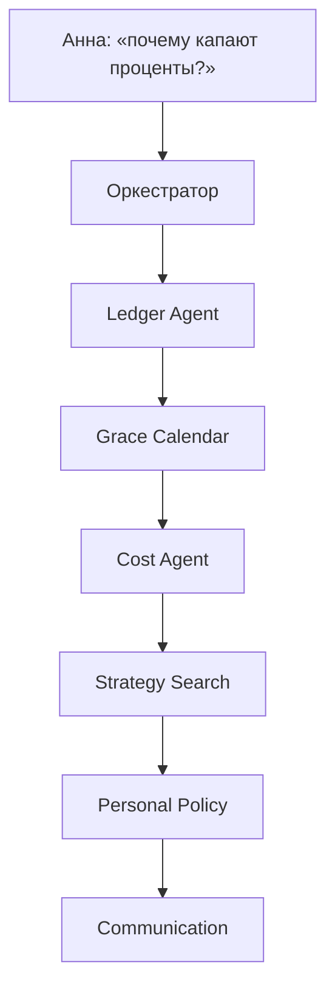

<div class="post-tldr" markdown="1">

### TL;DR

Это **живой кейс** к статье про [агента на стороне клиента](/vairl/blog/2026/07/13/banking-investor-ai-agent-ru/): не портфель акций, а кредитная карта с льготным периодом. Условия сняты с [Банки.ру](https://www.banki.ru/products/creditcards/) (карточки продуктов), сведены к учебной модели и прогнаны через симуляцию.

- **СберКарта:** до **120 дней** грейса (месяц покупок + ~90 дней на возврат), ставка в витрине от **~49.8%**, min payment до **10%**.
- **Т-Банк Платинум:** до **55 дней** на покупки, до **120 дней** на рефинансирование других карт; ставка в модели **~29.9%+**, min до **8–14%**.
- **Ловушка:** минимальный платёж ≠ сохранение грейса. Платите «как удобно» — и \(CF\) клиента уходит в проценты.
- **Агенты** не «советуют в чате»: Ledger → Grace Calendar → Cost → Strategy search → Policy → объяснение. Objective — **минимизировать client cost** (проценты + комиссии), не take-up банка.
- **Входы:** учебные **PDF-выписки** → парсер → ledger; выходы симуляции — **SVG time-series** (вектор для Jekyll).

</div>

<div class="post-decision" markdown="1">

### Важно

Модели **упрощены**. Реальный расчёт грейса, ПСК (*full cost of credit*) и даты платежа смотрите в тарифе банка и выписке. Цифры ниже — для демонстрации **логики агентов**, не индивидуальная рекомендация. Снимок условий: [`assets/data/banki-credit-cards-sber-tbank-2026-08.json`](/vairl/assets/data/banki-credit-cards-sber-tbank-2026-08.json) (дата съёма: 2026-08-04).

</div>

<div class="post-toc" markdown="1">

**Погружение:**

1. [Зачем этот кейс](#why)
2. [Что скачали с Банки.ру](#banki)
3. [Модели грейса](#models)
4. [PDF-выписки → Ledger Agent](#pdf)
5. [Персона и временная динамика трат](#persona)
6. [Симуляция политик](#sim)
7. [Временные графики (SVG)](#charts)
8. [Как агенты ищут стратегию](#agents)
9. [Рефинансирование / balance transfer](#refinance)
10. [Код и воспроизведение](#code)
11. [Связь с частью 1](#link)

</div>

---

## Зачем этот кейс {#why}

В [части 1](/vairl/blog/2026/07/13/banking-investor-ai-agent-ru/) конфликт NPV банка и клиента виден на fee брокерки. На **кредитной карте** он ещё жёстче:

| Событие | Банк | Клиент |
|---------|------|--------|
| Клиент уложился в грейс | мало % (часто 0) | выигрыш |
| Клиент сорвал грейс / живёт на минималке | поток процентов ↑ | \(NPV_{client}\) ↓↓ |
| Снятие наличных | комиссия + % сразу | худший \(CF\) |
| Рефинанс на 120 дней | банк-донор забирает AUM долга | шанс снова поймать 0% |

Клиентский агент обязан уметь **календарь грейса**, а не только «ваш платёж 8 000 ₽».

---

## Что скачали с Банки.ру {#banki}

Публичные карточки продуктов (агрегатор; перед решением сверяйте сайт банка):

| Продукт | Карточка | Льготный период (витрина) | Ставка (витрина) | Min payment |
|---------|----------|--------------------------|------------------|-------------|
| Кредитная СберКарта | [card/8481](https://www.banki.ru/products/creditcards/card/8481/) | до **120 дней**; новый период с 1-го числа, ~4 месяца на покупки месяца | от **49.8%** до 59.8%; ПСК 48.816–58.320% | до **10%** долга + проценты |
| Платинум (оформление на Банки.ру) | [card/675](https://www.banki.ru/products/creditcards/card/675/) | **55 дней** на покупки/переводы в сервисах; **120** (до 180 с Pro) на рефинанс | от **29.9%** до 61.9%; ПСК 29.855–61.999% | до **14%**, мин. 600 ₽ |
| Платинум | [card/8813](https://www.banki.ru/products/creditcards/card/8813/) | **55** на покупки; **120** на рефинанс других карт | витрина шире (покупки / снятие раздельно) | до **8%**, мин. 600 ₽ |

Дополнительно по витрине: снятие наличных у Сбера **5,9% + 590 ₽**; у Т-Банка порядка **2,9–4,9% + фикс** — в грейс обычно **не** входит, проценты с первого дня.

Официальные пояснения грейса (для сверки механики): [Сбер — как работает беспроцентный период](https://www.sberbank.ru/ru/person/blog/kak-rabotaet-besprocentnyi-period-po-kreditnoi-karte), [Т-Банк — grace period](https://www.tbank.ru/bank/help/credit-cards/tinkoff-platinum/how-to-use-a-credit-card/grace-period/).

---

## Модели грейса {#models}

Агенту нужна не HTML-страница, а **исполняемая модель**. Учебные правила:

### Сбер (упрощение «120 дней»)

```text
grace_days(purchase_day_in_month) = (30 − day) + 90
```

Покупка 1-го → ~120 дней; покупка 30-го → ~91 день. Грейс на **покупки**; cash — сразу в «дорогой» слой.

### Т-Банк (упрощение «до 55 дней»)

```text
grace_days(purchase_day_in_cycle) = (30 − day) + 25
```

Расчётный период + окно до платежа. Отдельно: **balance transfer / рефинанс** → до **120** дней грейса (по витрине Банки.ру).

### Общее для обеих моделей

1. Пока \(t \le \text{grace\_end}\) и долг по корзине погашен вовремя — ставка 0 на эту корзину.  
2. Минимальный платёж **не** равен «грейс жив».  
3. После срыва — \(r_{\mathrm{day}} = APR / 365\), капитализация в учебной модели ежедневная.  
4. Платежи гасят сначала **внегрейсовые** корзины (дороже), потом ближайший `grace_end`.

В коде это `CardModel` + `Position` в [`scripts/credit_card_grace_case_sim.py`](https://github.com/evgeniy-borisov/vairl/blob/main/scripts/credit_card_grace_case_sim.py).

---

## PDF-выписки → Ledger Agent {#pdf}

Реальный контур клиента начинается не с YAML персоны, а с **файла выписки**. В кейсе — синтетические PDF (не документы банка), с **стабильными маркерами** для парсера:

| Маркер | Смысл |
|--------|--------|
| `BANK:` / `CARD:` | какой продукт / календарь грейса подключить |
| `STATEMENT_PERIOD:` | границы расчётного периода |
| `PAYMENT_DUE:` / `GRACE_PAYMENT:` / `MIN_PAYMENT:` | даты и суммы из «шапки» |
| `APR_PURCHASES:` | ставка модели для Cost Agent |
| `=== OPERATIONS ===` | строки `DATE KIND AMOUNT DESCRIPTION` |

Файлы в репозитории:

- [anna-month1-sber.pdf](/vairl/assets/data/credit-card-statements/anna-month1-sber.pdf)
- [anna-month1-tbank.pdf](/vairl/assets/data/credit-card-statements/anna-month1-tbank.pdf)
- рядом `.parsed.json` и `.ledger.json` — выход Ledger Agent

Пайплайн:

```text
PDF (PyMuPDF generate / банк export)
  → pypdf extract_text
  → regex markers
  → StatementMeta + operations[]
  → relative-day ledger
  → grace sim / charts
```

```bash
python scripts/credit_card_statement_pdf.py generate
python scripts/credit_card_statement_pdf.py parse \
  --pdf assets/data/credit-card-statements/anna-month1-sber.pdf
```

Фрагмент парсера:

```python
def parse_statement_pdf(pdf_path: Path) -> dict:
    text = extract_text(pdf_path)  # pypdf
    # BANK:, PAYMENT_DUE:, блок OPERATIONS → meta + ops
    ...
```

Почему **PDF**, а не сразу CSV: в жизни клиент чаще тащит именно PDF/скан из ЛК. Агент обязан уметь текст слой; OCR — следующий слой (вне демо). Контракт маркеров отделяет «как банк сверстал» от «что симулятор ест».

На выписке Сбера за месяц 1 парсер поднимает: `grace_payment = 120 000`, `payment_due = 2026-04-30`, три покупки → ledger с `day` 3/10/20 относительно начала периода.

---

## Персона и временная динамика трат {#persona}

**Анна**, зарплата 120 000 ₽ 5-го числа, стартовый кэш 20 000 ₽.

| День | Событие |
|------|---------|
| 3 | Покупка мебели **80 000 ₽** кредиткой |
| каждый месяц, 10-е и 20-е | «жизнь» **25k + 15k** |
| горизонт | **180 дней** (6 циклов) |


Две карты — два календаря. На Сбере у Анны больше «воздуха» до первого процента; на Т-Банке окно короче, зато ниже модельная APR и есть BT на 120 дней.

---

## Симуляция политик {#sim}

Strategy Agent перебирает политики (один и тот же ledger):

| Политика | Поведение |
|----------|-----------|
| `min_trap` | в платёжные дни только минималка |
| `grace_keeper` | к дате платежа закрывать корзины с близким `grace_end` |
| `payday_clear` | в зарплату гасить долг, сколько позволяет кэш |
| `cash_then_min` | снять 40k наличными на старте + дальше минималка |

Прогон (`python scripts/credit_card_grace_case_sim.py`), APR в модели: Сбер **49.8%**, Т-Банк **29.9%** (нижняя граница витрины для покупок):

| Карта | Политика | Client cost (%% + fees) | Долг на день 180 |
|-------|----------|-------------------------|------------------|
| Сбер | `payday_clear` | **0** | 40 000 |
| Сбер | `grace_keeper` | **158** | 160 000 |
| Сбер | `min_trap` | **5 614** | 240 017 |
| Сбер | `cash_then_min` | **14 321** (из них fees 2 950) | 269 792 |
| Т-Банк | `payday_clear` | **0** | 40 000 |
| Т-Банк | `grace_keeper` | **222** | 40 000 |
| Т-Банк | `min_trap` | **14 698** | 241 900 |
| Т-Банк | `cash_then_min` | **22 216** | 271 486 |

Что видно сразу:

1. **Зарплатное гашение** обнуляет проценты в обеих моделях — это и есть «клиентский NPV» в миниатюре.  
2. **Минималка** на коротком грейсе (Т-Банк) при тех же тратах наказывает сильнее: проценты стартуют раньше, долг успевает «нарасти».  
3. **Наличные** — отдельный удар: комиссия сразу + APR без грейса.  
4. `grace_keeper` держит cost около нуля, но не заменяет дисциплину зарплаты, если траты > свободного кэша.

Банковский ассистент часто пушит «внесите минимальный платёж — всё в порядке». Клиентский — считает **разницу cost** между `min_trap` и `payday_clear` и показывает её в рублях.

---

## Временные графики (SVG) {#charts}

Таблицы дают итог на день 180. Агенту и читателю нужна **динамика**. Формат для статического Jekyll — **SVG** (вектор, без JS, тот же подход, что у зарплатных распределений на VAIRL): `matplotlib` → `.svg` в `assets/images/`.

Симулятор пишет дневной ряд (`run_daily`): `debt`, `debt_under_grace`, `debt_accruing`, `client_cost_cum`, …

### Долг по политикам

<figure style="margin: 1.5em auto; text-align: center;">
  
  <figcaption style="font-size: 0.9em; color: #666;">Сбер: длинный грейс — «воздух» дольше, но min_trap всё равно раздувает долг</figcaption>
</figure>

<figure style="margin: 1.5em auto; text-align: center;">
  
  <figcaption style="font-size: 0.9em; color: #666;">Т-Банк: короткий грейс — раньше расходятся кривые min_trap и payday_clear</figcaption>
</figure>

### Накопленный client cost

<figure style="margin: 1.5em auto; text-align: center;">
  
</figure>

<figure style="margin: 1.5em auto; text-align: center;">
  
  <figcaption style="font-size: 0.9em; color: #666;">Cost = проценты + комиссии; payday_clear ≈ 0, cash_then_min — худший хвост</figcaption>
</figure>

### Когда долг уже «вне грейса»

<figure style="margin: 1.5em auto; text-align: center;">
  
</figure>

<figure style="margin: 1.5em auto; text-align: center;">
  
  <figcaption style="font-size: 0.9em; color: #666;">Зелёный — ещё под грейсом; красный — уже капает APR. На коротком календаре красная зона появляется раньше</figcaption>
</figure>

### Один ledger — два банка (min_trap)

<figure style="margin: 1.5em auto; text-align: center;">
  
</figure>

Пересборка графиков:

```bash
python scripts/generate_credit_card_grace_charts.py
```

Почему не Plotly/HTML-виджет: пост должен открываться на GitHub Pages без рантайма; SVG кэшируется, печатается, масштабируется. Интерактив — отдельный Streamlit/dashboard слой, не блог.

---

## Как агенты ищут стратегию {#agents}



| Агент | Метод | В этом кейсе |
|-------|-------|--------------|
| **Ledger** | PDF / open banking → ops | маркеры выписки → `purchase` / `cash` / `payment` |
| **Grace Calendar** | детерминированный календарь | считает `grace_end` по модели карты |
| **Cost** | дневной ряд + сумма %% | `client_cost = interest + fees` |
| **Strategy Search** | перебор политик + what-if | `min_trap` … `payday_clear`, BT |
| **Personal Policy** | `must_not` | не рекомендовать снятие наличных «для кэшбэка»; не обещать 0% без календаря |
| **Simulation** | `run_daily` 30–180 дней | кривые долга / cost → SVG |
| **Communication** | LLM *только* narrative | «грейс кончается …; на графике красная зона с дня N» |

Контракт задачи (как в части 1):

```yaml
id: credit-card-grace-distress
intent: "капают проценты / что делать"
abstract_model: grace_calendar + cashflow_sim
objective: client_cost_min
family: symbolic
must_not: [upsell_bank_product, recommend_cash_advance, guarantee_zero_apr]
verifier: interest_matches_apr_outside_grace
llm_role: narrative_only
```

Поиск стратегии — не RL из коробки, а **явный enumerate** политик + оценка Cost Agent. Это тот же принцип: *считает математика, подписывает policy, объясняет LLM*.

---

## Рефинансирование / balance transfer {#refinance}

По витрине Т-Банка на Банки.ру: до **120 дней** грейса на погашение кредитов в других банках (до 180 с Pro — в партнёрской карточке).

Учебный what-if: долг **150 000 ₽** уже вне грейса на Сбере @ 49.8% → перенос под BT 120 дней:

\[
150\,000 \times \frac{0{,}498}{365} \times 120 \approx 24\,559\ \text{₽}
\]

столько процентов *можно* не заплатить за окно BT, **если** успеть погасить внутри нового грейса и если операция реально попадает под тариф «перевод баланса». Агент обязан проверить:

1. комиссию/условия BT;  
2. новый `grace_end`;  
3. запрет снова уйти в минималку на новой карте;  
4. что это не upsell «открой ещё одну карту ради бонуса банку».

---

## Код и воспроизведение {#code}

```bash
# 1) условия с Банки.ру (снимок)
cat assets/data/banki-credit-cards-sber-tbank-2026-08.json

# 2) PDF-выписки + parse
python scripts/credit_card_statement_pdf.py generate
python scripts/credit_card_statement_pdf.py parse \
  --pdf assets/data/credit-card-statements/anna-month1-sber.pdf

# 3) симуляция политик
python scripts/credit_card_grace_case_sim.py

# 4) SVG time-series
python scripts/generate_credit_card_grace_charts.py
```

Зависимости скриптов: `pymupdf`, `pypdf`, `matplotlib` (уже типичный scientific stack).

Фрагмент ранжирования стратегий:

```python
def agent_rank(card: CardModel) -> list[dict]:
    ledger = persona_spending()
    common = dict(horizon=180, salary=120_000, payday_offset=5, start_cash=20_000)
    rows = [
        run(card, ledger, policy=p, **common)
        for p in ("min_trap", "grace_keeper", "payday_clear", "cash_then_min")
    ]
    return sorted(rows, key=lambda r: (r["client_cost"], r["final_debt"]))
```

Дальше по лестнице: OCR сканов, несколько карт в одном personal vault, CEP «до grace_end 5 дней», eval «агент не предложил cash advance».

---

## Связь с частью 1 {#link}

| Часть 1 | Этот кейс |
|---------|-----------|
| \(NPV_{bank}\) vs \(NPV_{client}\) | %% карты = доход банка и cost клиента |
| Fee / cost слой в архитектуре | Grace Calendar + Cost Agent |
| Оркестратор + `must_not` | запрет cash advance и пустых обещаний 0% |
| Eval на тарифах | сценарии `min_trap` vs `payday_clear` |
| Код: PV → Monte Carlo → orch | PDF ledger → календарь грейса → SVG ряды |

**Вывод кейса:** кредитка с длинным маркетинговым «до 120 дней» не спасает, если агент (или человек) оптимизирует «не получить штраф за просрочку» вместо «не потерять грейс». Клиентский агент измеряет второе — и показывает это на временном графике, а не только в push «внесите минимум».

Продолжение линии: [часть 1 — DCF/NPV и сторона клиента](/vairl/blog/2026/07/13/banking-investor-ai-agent-ru/) · [часть 2 — классификация задач](/vairl/blog/2026/07/14/banking-agent-task-classification-ru/).
