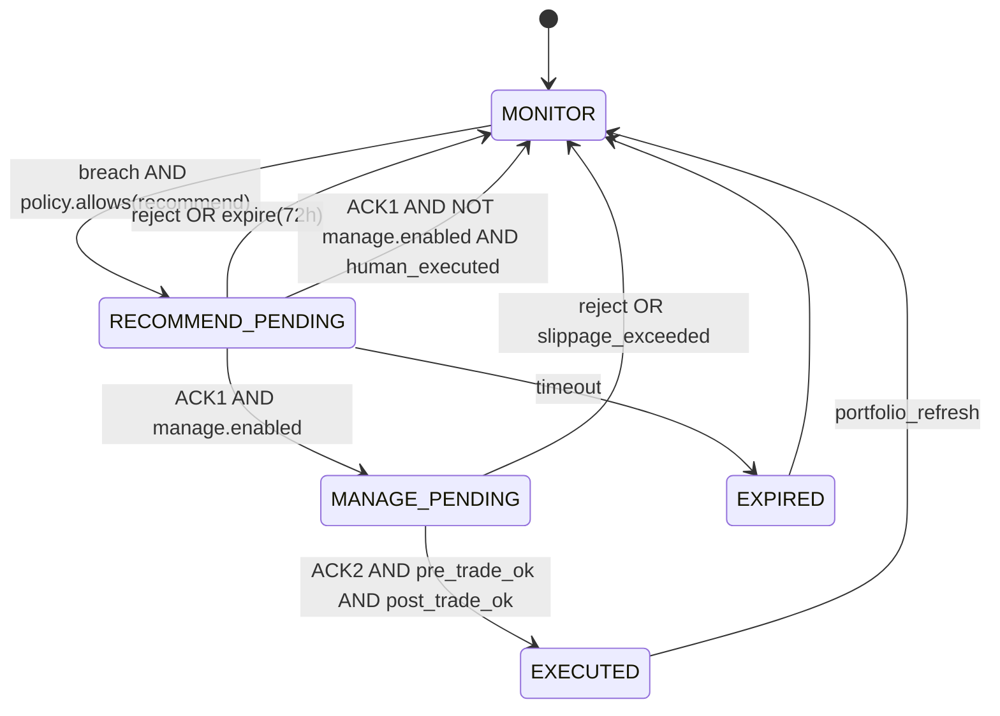

<div class="post-decision" markdown="1">

**Disclaimer.** Учебный кейс; не инвестиционная рекомендация. Персона и веса — синтетика. Ссылки на методы — для воспроизводимости архитектуры, не для торговых сигналов.

**Контекст серии:** [часть 1 — DCF/NPV, девять агентов, solvers](/vairl/blog/2026/07/13/banking-investor-ai-agent-ru/#nine-agents) · [методы нейросимволического контура](/vairl/blog/2026/07/18/neurosymbolic-methods-banking-agents-ru/) · [классификация задач L×D](/vairl/blog/2026/07/14/banking-agent-task-classification-ru/) · [кейс грейса (аналог cost-солвера)](/vairl/blog/2026/07/15/banking-credit-card-grace-case-ru/).

</div>

---

## Аннотация {#abstract}

Описан **equity sleeve** (*не* суверенные облигации ОФЗ) в клиентской мультиагентной системе из [части 1](/vairl/blog/2026/07/13/banking-investor-ai-agent-ru/): objective — \(NPV_{client}\), LLM — только narrative. Задача рукава: контроль концентрации, fee drag и налоговых издержек при фиксированном горизонте. Введён протокол автономии **Monitor → Recommend → Manage** с обязательным ACK (*acknowledgement*) человека на шагах Recommend и Manage. Для каждого вычислительного блока указан метод и первоисточник; decision loop задан как конечный автомат с верификаторами, без эвристик «на усмотрение модели».

---

## 1. Связь с архитектурой девяти агентов {#architecture}

В [части 1](/vairl/blog/2026/07/13/banking-investor-ai-agent-ru/#nine-agents) зафиксирован принцип: **решения принимают solvers и policy, не LLM**. Базовые роли (сокращённо «девять агентов» в [классификации задач](/vairl/blog/2026/07/14/banking-agent-task-classification-ru/)):

| Роль (часть 1) | Функция | В equity-кейсе |
|----------------|---------|----------------|
| Profile | Customer 360, мультибанк | брокерский CSV + policy YAML |
| Portfolio | риск/доходность после издержек | веса эмитента/сектора |
| Goal | GBI, вероятность цели | горизонт 6 лет, `risk_budget_vol_ann` |
| **Cost / Fee** | PV комиссий и налогов | `EST_FEE`, `EST_TAX` на шаге |
| Simulation | what-if | сценарий trim vs бездействие |
| Recommendation | план под \(NPV_{client}\) | ≤1 шаг / сутки при `high` breach |
| Personal Policy | `must_not`, лимиты | `max_issuer_weight`, blacklist |
| Communication | narrative без upsell | текст ACK, не ордер |
| Monitoring | рынок + тарифы + цели | коды алертов §4 |
| Dashboard | визуализация артефактов solvers | Streamlit / p5 (опционально) |
| Discipline | nudge + ACK | Telegram / календарь / email |

Equity-рукав **не** смешивается с ОФЗ: отдельный `sleeve`, отдельные лимиты (концентрация vs дюрация). См. сравнение классов активов в §2.

---

## 2. Постановка задачи {#problem}

**Вход:** нормализованные позиции \(w_i\) по инструментам equity-рукава, тариф брокера, налоговые лоты, policy \(P\).

**Objective (клиентский):**

$$
\max \; NPV_{client} = PV(\text{goal path}) - PV(\text{fees}) - PV(\text{taxes}) - \lambda \cdot \text{RiskPenalty}
$$

где RiskPenalty — нарушения лимитов концентрации ([Markowitz, 1952](#refs); [Choueifaty & Coignard, 2008](#refs) — risk budgeting).

**Ограничения:** \(w_i \leq w^{\max}_{issuer}\), \(w_s \leq w^{\max}_{sector}\), оборот \(\leq \tau_{month}\), blacklist инструментов.

**Выход по режиму** (§5): журнал алертов (Monitor), структурированный `recommend_step` (Recommend), broker ticket или checklist (Manage).

---

## 3. Синтетическая персона (benchmark) {#persona}

| ID | Параметр | Значение |
|----|----------|----------|
| `persona_eq_01` | горизонт | 6 лет |
| | `risk_budget_vol_ann` | 0.18 |
| | `max_issuer_weight` | 0.15 |
| | `max_sector_weight` | 0.20 |
| | `max_turnover_month` | 0.10 |

Срез портфеля (учебный):

| instrument | class | weight | breach |
|------------|-------|--------|--------|
| BLUE1 | equity | 0.27 | `LIMIT_ISSUER` |
| BLUE2 | equity | 0.14 | — |
| SECT_OIL | sector ETF | 0.18 | near `LIMIT_SECTOR` |
| ETF_WIDE | broad ETF | 0.22 | — |
| GROWTH_SM | mid/small | 0.09 | — |
| CASH_EQ | cash | 0.10 | — |

---

## 4. Таблица методов и ссылок {#methods}

Каждый блок пайплайна привязан к методу из литературы или стандарту индустрии. LLM **не** входит в hot path.

| Блок | Метод | Где используется | Ссылка |
|------|-------|------------------|--------|
| Нормализация позиций | ledger reconciliation | Profile / Portfolio | [часть 1, Customer 360](/vairl/blog/2026/07/13/banking-investor-ai-agent-ru/#nine-agents) |
| Веса и концентрация | sum-to-one, issuer/sector aggregation | Risk / Limits | [Markowitz, 1952](#refs) |
| Лимиты риска | linear constraints on weights | Personal Policy | [Grinold & Kahn, 1999](#refs) |
| Drift vs benchmark | cumulative return difference | Monitoring (`DRIFT_BENCH`) | [Brinson et al., 1986/1991](#refs) |
| Fee drag | PV комиссий / turnover cost | Cost / Fee | [часть 1, fee-drag](/vairl/blog/2026/07/13/banking-investor-ai-agent-ru/#nine-agents) |
| Налог шага | lot-based gain/loss, tax-aware sell | Cost / Fee (`TAX_HARVEST`) | [Constantinides, 1983](#refs) |
| Ребаланс trim | constrained weight projection | Recommendation | [Markowitz, 1952](#refs); [DeMiguel et al., 2009](#refs) |
| What-if шага | deterministic before/after weights + cost | Simulation | [часть 1, Simulation agent](/vairl/blog/2026/07/13/banking-investor-ai-agent-ru/#nine-agents) |
| Вероятность цели (фон) | Monte Carlo terminal wealth | Goal (не hot path equity trim) | [Merton, 1969](#refs); [часть 1, MC](/vairl/blog/2026/07/13/banking-investor-ai-agent-ru/#nine-agents) |
| Классификация задачи | L×D router | Оркестратор | [часть 2, L×D](/vairl/blog/2026/07/14/banking-agent-task-classification-ru/) |
| Контракт задачи | YAML `objective` + `must_not` + `verifier` | Personal Policy | [постановка задачи](/vairl/blog/2026/07/04/agent-task-specification-ru/) |
| Объяснение | LLM narrative-only | Communication | [часть 1, `llm_role: narrative_only`](/vairl/blog/2026/07/13/banking-investor-ai-agent-ru/#nine-agents) |
| Исполнение | human-in-the-loop ACK | Discipline / Manage | [Parasuraman et al., 2000](#refs) |
| Визуализация | time series + event tape | Dashboard | [кейс грейса, Dashboard](/vairl/blog/2026/07/15/banking-credit-card-grace-case-ru/#dashboard-discipline) |

---

## 5. Протокол принятия решений {#decision}

Размытые формулировки («агент советует», «умный мониторинг») заменены **конечным автоматом**. Состояния: `MONITOR`, `RECOMMEND_PENDING`, `MANAGE_PENDING`, `EXECUTED`, `EXPIRED`.



### 5.1. Monitor

**Триггер:** cron / webhook / запрос пользователя.  
**Действие:** вычислить алерты §6; записать `alert_journal`; **не** создавать ордер.  
**Верификатор:** `sum(weights) ≈ 1`, источник цен документирован.

### 5.2. Recommend

**Триггер:** `severity ≥ medium` и нет открытого `RECOMMEND_PENDING` на рукаве.  
**Действие:** Cost Agent считает пару \((\text{cost}_{action}, \text{cost}_{inaction})\); Recommendation Agent выдаёт **ровно один** `recommend_step` (см. §7).  
**Верификатор:** шаг не нарушает `must_not`; `EST_FEE` и `EST_TAX` присутствуют.  
**Правило частоты:** не более одного `high`-шага / сутки / рукав.

### 5.3. Manage

**Триггер:** `ACK1` + `manage.enabled=true` + `pre_trade_ok`.  
**Действие:** Execution Adapter формирует ордер или checklist; при `notional > dual_ack_threshold` — **ACK2**.  
**Верификатор:** post-trade веса удовлетворяют \(P\); проскальзывание ≤ порога; иначе `MANAGE_PENDING → MONITOR` без дожима.

### 5.4. Роль LLM

Только Communication Agent: перефразирование `recommend_step` для ACK. Запрещено: генерация весов, изменение `objective`, скрытие `EST_TAX` / `EST_FEE`.

---

## 6. Таксономия алертов (Monitor) {#alerts}

| code | severity | predicate | default transition |
|------|----------|-----------|-------------------|
| `LIMIT_ISSUER` | high | \(w_i > w^{\max}_{issuer}\) | → Recommend (trim) |
| `LIMIT_SECTOR` | medium | \(w_s \geq 0.9 \cdot w^{\max}_{sector}\) | observe / soft trim |
| `DRIFT_BENCH` | medium | \(|R_{sleeve}-R_{bench}| > \delta\) за 90d | optional rebalance |
| `FEE_DRAG` | medium | fees/AUM > fee_budget | reduce turnover |
| `CORP_EVENT` | info | calendar event ∈ {ex-date, …} | calendar only |
| `LIQUIDITY` | high | spread/volume ∉ band | block large orders |
| `TAX_HARVEST` | low | harvestable loss > threshold | Recommend w/ tax calc |

Predicate — **символический** (сравнение скаляров), не вывод LLM.

---

## 7. Формат шага Recommend {#recommend}

```text
STEP_ID: eq-2026-07-17-trim-blue1
MODE: recommend
TRIGGER: LIMIT_ISSUER (BLUE1 0.27 > 0.15)
ACTION: sell BLUE1 Δw=0.12 → buy ETF_WIDE
EST_FEE: 0.0005 × notional
EST_TAX: <lot_calc>
COST_INACTION: concentration_risk @ λ
COST_ACTION: EST_FEE + EST_TAX
VERIFIER: post_weights satisfy P
EXPIRES: 72h
```

Cost Agent обязан вернуть **обе** компоненты `COST_INACTION` и `COST_ACTION` — иначе verifier отклоняет шаг (аналог `verifier: interest_matches_apr` в [кейсе грейса](/vairl/blog/2026/07/15/banking-credit-card-grace-case-ru/#agents)).

---

## 8. Policy (фрагмент) {#policy}

```yaml
sleeve: equities_not_ofz
objective: client_goal_npv
horizon_years: 6
risk_budget_vol_ann: 0.18
max_issuer_weight: 0.15
max_sector_weight: 0.20
max_turnover_month: 0.10
modes_allowed: [monitor, recommend]
manage:
  enabled: false
  dual_ack_above_pct: 0.05
must_not: [upsell_bank_product, auto_trade_on_news, hide_fees]
llm_role: narrative_only
```

---

## 9. Ограничения и угрозы валидности {#limitations}

| Угроза | Митигация |
|--------|-----------|
| Look-ahead в ценах | только T+0 на момент Monitor |
| Неверный lot для налога | verifier на согласованность с брокерским отчётом |
| LLM подменяет solver | `llm_role: narrative_only`, ордер только из ACK'd struct |
| Конфликт с \(NPV_{bank}\) | client-side vault; банк — execution tool ([часть 1 §client-side](/vairl/blog/2026/07/13/banking-investor-ai-agent-ru/#why-client)) |
| Переобучение алертов | eval на синтетике + null-agent ([бенчмарки](/vairl/blog/2026/06/29/agent-benchmark-generation-ru/)) |

---

## 10. Вывод {#conclusion}

Equity-рукав (не ОФЗ) встраивается в ту же мультиагентную схему, что и [кейс грейса](/vairl/blog/2026/07/15/banking-credit-card-grace-case-ru/): solvers и policy в hot path, LLM — narrative, Discipline — ACK. Отличие — predicate алертов (концентрация, Brinson drift, fee drag) вместо `grace_end`. Протокол §5 делает режимы Monitor / Recommend / Manage **проверяемыми**, а таблица §4 — **цитируемой**.

---

## Литература и ссылки {#refs}

| ID | Источник |
|----|----------|
| Markowitz, 1952 | Markowitz H. Portfolio Selection. *Journal of Finance*, 7(1), 77–91. |
| Brinson et al., 1986 | Brinson G., Hood L., Beebower G. [Determinants of Portfolio Performance](https://doi.org/10.2469/faj.v42.n4.39). *Financial Analysts Journal*, 42(4), 39–44. |
| Brinson et al., 1991 | Brinson G., Singer B., Beebower G. [Determinants of Portfolio Performance II](https://doi.org/10.2469/faj.v47.n3.40). *Financial Analysts Journal*, 47(3), 40–48. |
| Grinold & Kahn, 1999 | Grinold R., Kahn R. *Active Portfolio Management*. McGraw-Hill. |
| Choueifaty & Coignard, 2008 | Toward Maximum Diversification. *Journal of Portfolio Management*, 35(1), 40–51. |
| DeMiguel et al., 2009 | Optimal Versus Naive Diversification. *Review of Financial Studies*, 22(5), 1915–1953. |
| Constantinides, 1983 | [Capital Market Equilibrium with Personal Tax](https://doi.org/10.2307/1912150). *Econometrica*, 51(3), 611–636. |
| Merton, 1969 | Lifetime Portfolio Selection under Uncertainty. *Review of Economics and Statistics*, 51(3), 247–257. |
| Parasuraman et al., 2000 | Parasuraman R., Sheridan T., Wickens C. [A Model for Types and Levels of Human Interaction with Automation](https://doi.org/10.1109/3468.844354). *IEEE Transactions on Systems, Man, and Cybernetics—Part A*, 30(3), 286–297. |
| VAIRL methods | [Методы нейросимволических banking-агентов](/vairl/blog/2026/07/18/neurosymbolic-methods-banking-agents-ru/). |
| VAIRL part 1 | [Инвестиционный агент на стороне клиента](/vairl/blog/2026/07/13/banking-investor-ai-agent-ru/) — DCF/NPV, мультиагенты, MC. |
| VAIRL part 2 | [Классификация задач L×D](/vairl/blog/2026/07/14/banking-agent-task-classification-ru/). |
| VAIRL grace case | [Кредитка, грейс, solvers](/vairl/blog/2026/07/15/banking-credit-card-grace-case-ru/). |
| Task spec | [Постановка задачи агенту](/vairl/blog/2026/07/04/agent-task-specification-ru/). |
