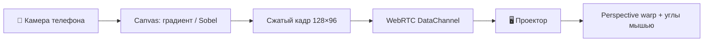

Нужен AR-подобный оверлей на проектор **без Unity и без установки приложения**? **Proof of Concept:** телефон смотрит на объект через камеру, строит **теплокарту градиента яркости** (или бинарные **контуры Sobel**) и в реальном времени передаёт кадр на ноутбук с проектором. На экране — **перспективная подгонка**: четыре угла тянутся мышью, чтобы совместить наложение с физической поверхностью.

Связь — **WebRTC data channel** через [PeerJS](https://peerjs.com/) (сигнализация в облаке, без своего сервера). Подходит для демо в аудитории: QR на экране проектора, телефон сканирует и подключается.

---

## Архитектура



| Компонент | Роль |
|-----------|------|
| Телефон (`?role=phone`) | `getUserMedia`, обработка кадра, ~15 fps |
| Проектор (`?role=projector`) | Приём кадров, отрисовка, drag углов |
| PeerJS | Сигнализация + P2P между браузерами |
| Комната | 6-символьный ID в URL; QR для телефона |

**Почему WebRTC, а не WebSocket:** для PoC на статическом Jekyll-сайте не нужен бэкенд. После рукопожатия кадры идут **напрямую** телефон ↔ проектор. Data channel с `reliable: true` и `serialization: 'binary'` — бинарные `ArrayBuffer` доходят целиком; для live-градиента это важнее, чем экономия на потерянных пакетах.

**Почему не одна страница на обоих:** разные UI — на телефоне превью камеры и кнопка «Старт», на проекторе полноэкранный чёрный холст и ручки углов.

---

## Как запустить

1. На ноутбуке с проектором откройте **[полноэкранное демо](/vairl/camera-projector-poc.html?role=projector&network=lan)** (или встроенный виджет ниже).
2. Выберите **режим сети** в боковой панели:
   - **Локальная сеть** — ноутбук и телефон в одной Wi‑Fi (аудитория, домашний роутер). Прямой WebRTC P2P.
   - **VPN / интернет** — устройства в разных сетях, корпоративный VPN, мобильный интернет. WebRTC через TURN + запасной WebSocket relay.
3. Дождитесь появления **локального IP** (если браузер разрешил WebRTC) и QR с кодом комнаты.
4. На телефоне отсканируйте QR — в ссылке уже зашит `network=lan` или `network=vpn`.
5. На телефоне — **Старт** (разрешите камеру). По умолчанию режим **«Градиент (теплокарта)»**.
6. На проекторе **тяните углы** синей рамки, пока картинка не ляжет на нужную поверхность.

Кнопка «На весь экран» разворачивает холст проектора, не боковую панель с QR.

Режимы на телефоне:

| Режим | Что видно на проекторе |
|-------|------------------------|
| **Градиент (теплокарта)** — по умолчанию | Цвет = направление ∇I, яркость = \|∇I\| |
| Контуры (Sobel) | Бинарные границы объектов |

---

## Интерактив (режим проектора)

<div id="camera-projector-sync-demo" class="camera-projector-sync-widget" data-role="projector" data-phone-page="{{ '/camera-projector-poc.html' | relative_url }}">
  <div class="cps-panel cps-panel-projector">
    <header class="cps-header">
      <p class="cps-lead">Отсканируйте QR — на телефоне откроется <code>camera-projector-poc.html</code>. Углы сохраняются в <code>localStorage</code> для комнаты.</p>
    </header>
    <div class="cps-projector-layout">
      <aside class="cps-sidebar">
        <p class="cps-label">Комната</p>
        <p class="cps-room-id">—</p>
        <p class="cps-label">Режим сети</p>
        <div class="cps-network-switch" role="radiogroup" aria-label="Режим сети">
          <label class="cps-switch-opt">
            <input type="radio" name="cps-network" value="lan" checked>
            <span>Локальная сеть</span>
          </label>
          <label class="cps-switch-opt">
            <input type="radio" name="cps-network" value="vpn">
            <span>VPN / интернет</span>
          </label>
        </div>
        <div class="cps-lan-panel">
          <p class="cps-local-ips">Определяем IP…</p>
          <p class="cps-hint">Ноутбук и телефон в одной Wi‑Fi. Прямой WebRTC без relay.</p>
        </div>
        <div class="cps-vpn-panel" hidden>
          <p class="cps-label">WebSocket relay</p>
          <input type="text" class="cps-relay-url" data-cps-relay-url placeholder="ws://IP:8765" aria-label="URL WebSocket relay">
          <p class="cps-hint">При VPN: <code>npm install ws</code> → <code>node scripts/cps-ws-relay.js</code></p>
        </div>
        <canvas class="cps-qr" width="160" height="160" aria-label="QR для телефона"></canvas>
        <p class="cps-label">Ссылка для телефона</p>
        <a class="cps-join-link" href="#" target="_blank" rel="noopener">—</a>
        <p class="cps-channel" aria-live="polite"></p>
        <div class="cps-toolbar">
          <button type="button" data-cps-reset-corners>Сброс углов</button>
          <button type="button" data-cps-fullscreen>На весь экран</button>
        </div>
        <p class="cps-status" aria-live="polite">Загрузка…</p>
      </aside>
      <div class="cps-canvas-wrap">
        <canvas class="cps-projector-canvas"></canvas>
      </div>
    </div>
  </div>
</div>

<script src="{{ '/assets/js/camera-projector-sync.js' | relative_url }}"></script>

Полноэкранно (удобно для проектора): [camera-projector-poc.html]({{ '/camera-projector-poc.html' | relative_url }}?role=projector&network=lan).

---

## Режимы соединения: что вообще бывает

Браузерный «телефон → проектор» — это не один протокол, а **стек слоёв**. В PoC явно разделены два сценария переключателем; ниже — полная карта вариантов, которые встречаются в таких системах.

### Слои стека

| Слой | Задача | В PoC |
|------|--------|-------|
| **Сигнализация** | Обмен SDP/ICE, «знакомство» пиров | PeerJS cloud (`0.peerjs.com`) |
| **NAT traversal** | Пробить firewall, найти маршрут | STUN (LAN), STUN+TURN (VPN) |
| **Транспорт данных** | Доставка кадров | WebRTC DataChannel; fallback — WebSocket relay |
| **Семантика** | Что именно шлём | Бинарные кадры 128×96, ~15 fps |

Сигнализация идёт через интернет (PeerJS), но **сами кадры после рукопожатия** в идеале не проходят через облако — только P2P или ваш relay.

### Вариант A — локальная сеть (режим по умолчанию)

**Условие:** ноутбук и телефон в одной подсети Wi‑Fi (типичная аудитория).

```
Телефон ──host candidate 192.168.x.x──► Ноутбук
         (STUN только для определения внешнего IP)
```

- ICE: Google STUN, **без TURN** — трафик остаётся в LAN.
- Задержка минимальна (часто &lt; 50 ms).
- На панели показывается **локальный IP** устройства (через ICE gathering), чтобы убедиться, что оба в одной сети.
- Если не коннектится: гостевой Wi‑Fi с **AP isolation**, firewall на ноутбуке — тогда переключите **VPN / интернет**.

### Вариант B — VPN / разные сети (второй переключатель)

**Условие:** корпоративный VPN, телефон на LTE, устройства за symmetric NAT.

```
Телефон ──► TURN relay (Metered Open Relay) ──► Ноутбук
     или
Телефон ──► ws://ноутбук:8765 (cps-ws-relay) ──► Ноутбук
```

1. **WebRTC + публичный TURN** — кадры идут через relay-провайдера (в демо — Metered Open Relay).
2. **WebSocket relay на ноутбуке** — `node scripts/cps-ws-relay.js`; оба клиента стучатся на `ws://IP-ноутбука:8765`. Удобно, когда TURN заблокирован, но VPN пропускает исходящий WS на ваш IP.

Порядок в коде: сначала WebRTC+TURN, при неудаче — WS relay (если URL указан).

### Другие варианты (не в PoC, но в экосистеме)

| Вариант | Когда | Плюсы / минусы |
|---------|-------|----------------|
| **Свой PeerServer** | Нельзя зависеть от `0.peerjs.com` | Полный контроль сигнализации; нужен хостинг |
| **Сигнализация через WebSocket** | Custom signaling без PeerJS | Гибко; писать SDP/ICE вручную |
| **MQTT / SSE / long-poll** | IoT, слабые клиенты | Просто; выше задержка, не P2P |
| **WebTransport / QUIC** | Низкая задержка, datagrams | Современно; поддержка браузеров ещё растёт |
| **Локальный WS relay в LAN** | P2P не проходит, но relay на той же Wi‑Fi | Кадры не уходят в интернет; нужен процесс на ноутбуке |
| **Облачный медиа-сервер** | Много зрителей, запись | SFU (Janus, mediasoup); избыточно для 1:1 кадров |
| **Нативное приложение** | Нужен UDP без ограничений браузера | Максимум контроля; установка на телефон |

Для **статического Jekyll-сайта** разумный компромисс: PeerJS cloud + LAN P2P + TURN + опциональный локальный WS relay — без своего бэкенда в обычном сценарии.

### Сравнение двух режимов PoC

| | Локальная сеть | VPN / интернет |
|--|----------------|----------------|
| Переключатель | «Локальная сеть» | «VPN / интернет» |
| URL | `network=lan` | `network=vpn` |
| ICE | STUN only | STUN + TURN |
| Fallback | — | WebSocket relay |
| IP на панели | Да (192.168.x.x) | Да + поле `ws://…` |
| Типичный кейс | Проектор в аудитории | Удалённое демо, VPN |

---

## Обработка на телефоне

Кадр с камеры масштабируется до **128×96**, переводится в grayscale (средняя яркость пикселей), затем:

- **Градиент (по умолчанию)** — из ∂I/∂x и ∂I/∂y строится цветная теплокарта;
- **Sobel** — magnitude градиента, порог отсекает слабые края → бинарные контуры.

Кадр упаковывается в `ArrayBuffer` (~37 KB для RGB-градиента) и шлётся по data channel ~**15 раз/с**. На проекторе — `ImageData` и **bilinear warp** на четырёх углах (сетка 20×20 аффинных патчей).

---

## Ограничения PoC

- Нужен **HTTPS** (или localhost) для камеры и WebRTC.
- **PeerJS cloud** (`0.peerjs.com`) — внешняя зависимость для сигнализации; кадры через него не идут.
- **Режим сети** выбирайте **до** сканирования QR; переключатель обновляет ссылку и пересоздаёт Peer на проекторе.
- **Локальный IP** виден только если браузер разрешил ICE; на iOS иногда список короче.
- Задержка: LAN ~50–150 ms; VPN/TURN/relay — 100–500 ms и выше.
- Нет автокалибровки — только ручной warp.
- Один телефон на комнату.

---

## Куда развивать

- **ArUco / AprilTag** на проекторе для автоматической гомографии.
- **Обратный канал**: проектор рисует паттерн, телефон оценивает pose.
- **Closed loop**: контуры сравниваются с целевым силуэтом, телефон подсказывает сдвиг.
- Свой signaling-сервер на edge (Cloudflare Workers / WebSocket).

---

## Итог

| Что | Вывод |
|-----|--------|
| Режимы | **LAN** — прямой P2P; **VPN** — TURN + WS relay |
| Сигнализация | PeerJS cloud только для «знакомства» браузеров |
| Данные | P2P data channel (или relay), бинарные кадры 128×96, ~15 fps |
| Калибровка | Ручной perspective warp четырьмя углами мышью |
| Сценарий | Живое демо: выбрать сеть → QR → камера → overlay |

---

*PoC для статьи VAIRL · WebRTC + Canvas · без установки приложений.*
